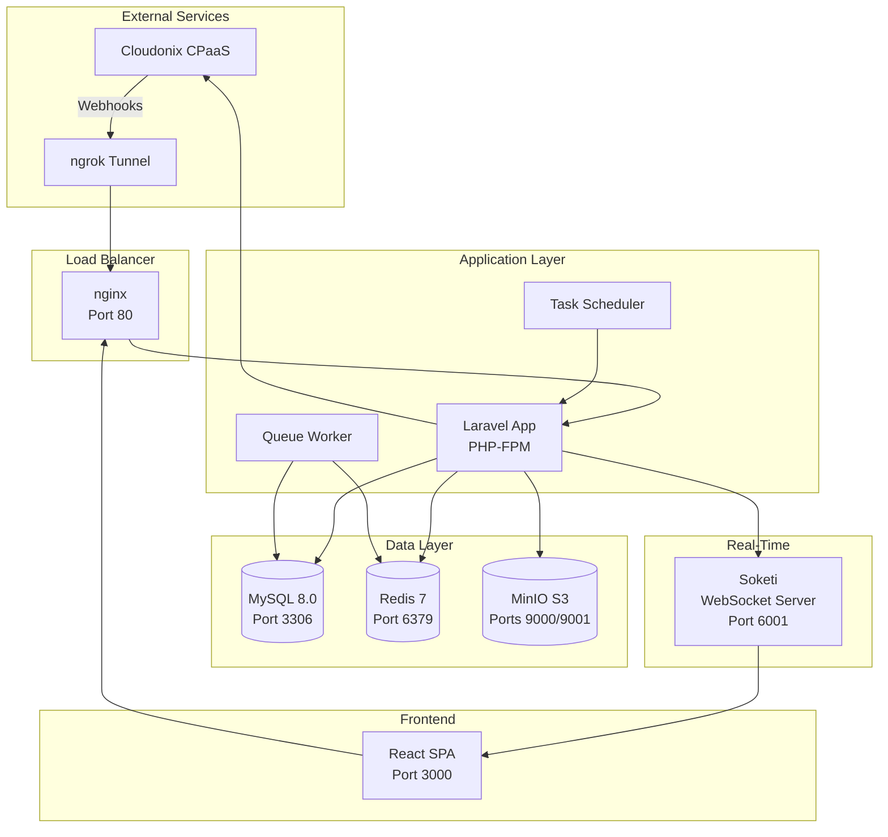
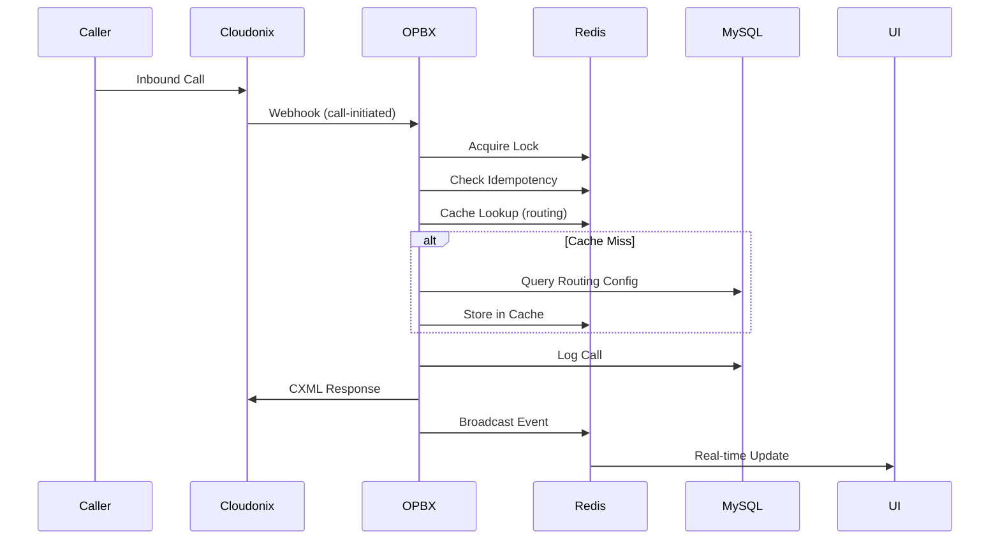

# OPBX - Open Source Business PBX

[](LICENSE)
[](https://laravel.com)
[](https://reactjs.org)
[](https://docs.docker.com/compose/)

A modern, containerized business PBX application built on top of the [Cloudonix CPaaS](https://cloudonix.com) platform. OPBX provides enterprise-grade call routing, ring groups, IVR menus, business hours management, and real-time call monitoring — all without the complexity of managing SIP infrastructure.

---

## Table of Contents

- [Features](#features)
- [Architecture](#architecture)
- [Built With](#built-with)
- [Installation](#installation)
- [Configuration](#configuration)
- [Security & Monitoring](#security--monitoring)
- [API Reference](#api-reference)
- [Testing](#testing)
- [Contributing](#contributing)
- [Credits](#credits)
- [License](#license)

---

## Features

### Call Routing & Management
- **Direct Extension Calling**: Extension-to-extension dialing with SIP URI generation
- **Outbound Calling**: E.164 international dialing with extension-type based permissions
- **Ring Groups**: Distribute calls with simultaneous, round-robin, or sequential strategies
- **IVR Menus**: Interactive voice menus with DTMF input and configurable destinations
- **Business Hours**: Time-based routing with weekly schedules and holiday exceptions
- **AI Assistant Integration**: Route calls to AI-powered voice assistants

### Real-Time Monitoring
- **Live Call Dashboard**: Real-time call presence via WebSockets
- **Call Detail Records (CDR)**: Complete call history with search, filtering, and CSV export
- **Call Statistics**: Volume, duration, and disposition metrics

### Performance & Reliability
- **Redis Caching Layer**: 50-90% faster routing lookups with automatic cache invalidation
- **Idempotent Webhooks**: Redis-based deduplication prevents duplicate processing
- **Distributed Locking**: Prevents race conditions on concurrent calls
- **Queue Workers**: Async job processing for non-blocking operations

### Multi-Tenant Architecture
- **Organization Isolation**: Complete data separation between tenants
- **Role-Based Access Control (RBAC)**:
  - **Owner**: Full organization control
  - **PBX Admin**: Manage users, extensions, ring groups, business hours
  - **PBX User**: Access own extension and basic features
  - **Reporter**: Read-only access to reports and call logs

---

## Architecture

OPBX separates concerns into distinct planes for scalability and maintainability.

### High-Level Architecture



### Inbound Call Flow



### Control Plane vs Execution Plane

| Aspect | Control Plane | Execution Plane |
|--------|---------------|-----------------|
| **Purpose** | Configuration management | Real-time call processing |
| **Components** | REST API, React SPA | Webhooks, Queue Workers |
| **Data Store** | MySQL (source of truth) | Redis (cache, locks, state) |
| **Latency** | Standard web latency | Sub-100ms response required |

---

## Built With

### Backend
| Technology | Version | Purpose |
|------------|---------|---------|
| [Laravel](https://laravel.com) | 12 | PHP application framework |
| [PHP](https://php.net) | 8.4+ | Server-side language |
| [MySQL](https://mysql.com) | 8.0 | Relational database |
| [Redis](https://redis.io) | 7 | Cache, queues, sessions |
| [Laravel Sanctum](https://laravel.com/docs/sanctum) | - | API authentication |

### Frontend
| Technology | Version | Purpose |
|------------|---------|---------|
| [React](https://reactjs.org) | 18 | UI framework |
| [TypeScript](https://typescriptlang.org) | 5 | Type-safe JavaScript |
| [Vite](https://vitejs.dev) | - | Build tool |
| [Tailwind CSS](https://tailwindcss.com) | 3 | Utility-first CSS |
| [Radix UI](https://radix-ui.com) | - | Accessible components |
| [React Query](https://tanstack.com/query) | - | Server state management |

### Infrastructure
| Technology | Purpose |
|------------|---------|
| [Docker](https://docker.com) | Containerization |
| [nginx](https://nginx.org) | Web server / reverse proxy |
| [Soketi](https://soketi.app) | WebSocket server (Laravel Echo compatible) |
| [MinIO](https://min.io) | S3-compatible object storage for recordings |
| [ngrok](https://ngrok.com) | Webhook tunneling for local development |

---

## Installation

### Prerequisites

- **Docker** (20.10+) and **Docker Compose** (2.0+)
- **Cloudonix CPaaS Account**: [Sign up at cloudonix.com](https://cloudonix.com)
- **ngrok Account** (for local development): [Get authtoken](https://dashboard.ngrok.com/get-started/your-authtoken)

### Quick Start

1. **Clone the repository**
   ```bash
   git clone https://github.com/greenfieldtech-nirs/opbx.cloudonix.com.git
   cd opbx.cloudonix.com
   ```

2. **Configure environment**
   ```bash
   cp .env.example .env
   ```

   Edit `.env` with your settings:
   ```env
   # Cloudonix API
   CLOUDONIX_API_TOKEN=your_api_token_here
   
   # ngrok (for local development)
   NGROK_AUTHTOKEN=your_ngrok_authtoken_here
   
   # Redis password (recommended for production)
   REDIS_PASSWORD=your_redis_password
   ```

3. **Start all services**
   ```bash
   docker compose up -d
   ```

4. **Initialize the application**
   ```bash
   docker compose exec app php artisan key:generate
   docker compose exec app php artisan migrate --seed
   ```

5. **Access the application**
   - **Frontend**: http://localhost:3000
   - **API**: http://localhost/api/v1
   - **ngrok Dashboard**: http://localhost:4040
   - **MinIO Console**: http://localhost:9001

### Docker Services

| Service | Description | Port |
|---------|-------------|------|
| `frontend` | React SPA (Vite dev server) | 3000 |
| `nginx` | Web server / API gateway | 80 |
| `app` | Laravel PHP-FPM application | - |
| `queue-worker` | Laravel queue processor | - |
| `scheduler` | Laravel cron scheduler | - |
| `mysql` | MySQL 8.0 database | 3306 |
| `redis` | Redis 7 cache/queue | 6379 |
| `minio` | S3-compatible storage | 9000, 9001 |
| `soketi` | WebSocket server | 6001 |
| `ngrok` | Webhook tunnel | 4040 |

### Default Credentials

After running `migrate --seed`, the following admin user is created:

- **Email**: `admin@example.com`
- **Password**: `password`

> ⚠️ **Change these credentials immediately in production!**

---

## Configuration

### Environment Variables

See `.env.example` for all available configuration options. Key variables:

| Variable | Description |
|----------|-------------|
| `CLOUDONIX_API_TOKEN` | Cloudonix API authentication token |
| `WEBHOOK_BASE_URL` | Public URL for webhooks (ngrok URL for local dev) |
| `REDIS_PASSWORD` | Redis authentication password |
| `DB_PASSWORD` | MySQL database password |

### Cloudonix Webhook Configuration

Configure these webhook URLs in your Cloudonix portal:

| Event | URL |
|-------|-----|
| Call Initiated | `{WEBHOOK_BASE_URL}/voice/route` |
| IVR Input | `{WEBHOOK_BASE_URL}/voice/ivr-input` |
| CDR | `{WEBHOOK_BASE_URL}/webhooks/cloudonix/cdr` |
| Session Update | `{WEBHOOK_BASE_URL}/webhooks/cloudonix/session-update` |

---

## Security & Monitoring

### Security Features

- **Multi-Tenant Isolation**: Global query scopes enforce organization boundaries
- **RBAC Authorization**: Policy-based access control at all layers
- **API Authentication**: Laravel Sanctum with token rotation
- **Webhook Security**: HMAC signature verification + idempotency
- **Rate Limiting**: Configurable per-endpoint limits
- **Security Headers**: CSP, HSTS, X-Frame-Options, and more

### Monitoring

**Health Check Endpoint:**
```bash
curl http://localhost/health
```

**Application Logs:**
```bash
docker compose logs -f app
```

**Queue Monitoring:**
```bash
docker compose exec app php artisan queue:monitor
```

**Cache Statistics:**
```bash
docker compose exec redis redis-cli -a $REDIS_PASSWORD INFO stats
```

For detailed security implementation, see [`docs/architecture/security-implementation.md`](docs/architecture/security-implementation.md).

---

## API Reference

### Authentication

```bash
# Login
curl -X POST http://localhost/api/v1/auth/login \
  -H "Content-Type: application/json" \
  -d '{"email": "admin@example.com", "password": "password"}'

# Use token in subsequent requests
curl http://localhost/api/v1/extensions \
  -H "Authorization: Bearer YOUR_TOKEN"
```

### Key Endpoints

| Method | Endpoint | Description |
|--------|----------|-------------|
| `GET` | `/api/v1/extensions` | List extensions |
| `POST` | `/api/v1/extensions` | Create extension |
| `GET` | `/api/v1/ring-groups` | List ring groups |
| `GET` | `/api/v1/business-hours` | List schedules |
| `GET` | `/api/v1/call-logs` | List call records |
| `GET` | `/api/v1/phone-numbers` | List DIDs |

For complete API documentation, see [`docs/architecture/api-webhooks.md`](docs/architecture/api-webhooks.md).

---

## Testing

### Run All Tests

```bash
docker compose exec app php artisan test
```

### Test Suites

```bash
# Unit tests
docker compose exec app php artisan test --testsuite=Unit

# Feature tests
docker compose exec app php artisan test --testsuite=Feature

# Specific test file
docker compose exec app php artisan test tests/Feature/RingGroupControllerTest.php
```

### Test Coverage

- **100+ tests** covering all major features
- Cache system, voice routing, security, webhook processing
- Multi-tenancy and RBAC verification

---

## Contributing

We welcome contributions from the community! Here's how to get started:

### Development Setup

1. Fork the repository
2. Clone your fork locally
3. Follow the [Installation](#installation) instructions
4. Create a feature branch: `git checkout -b feature/your-feature-name`

### Guidelines

- **Code Style**: Follow PSR-12 for PHP and ESLint/Prettier for TypeScript
- **Testing**: Add tests for new features and bug fixes
- **Documentation**: Update relevant docs for any changes
- **Commits**: Use conventional commit messages (`feat:`, `fix:`, `docs:`, etc.)

### Pull Request Process

1. Ensure all tests pass: `docker compose exec app php artisan test`
2. Update `CHANGELOG.md` with your changes
3. Open a PR with a clear description of changes
4. Address any review feedback

### Reporting Issues

- Use GitHub Issues for bug reports and feature requests
- Include steps to reproduce for bugs
- Check existing issues before creating new ones

---

## Credits

### Created By

- **Nir Simionovich** ([@greenfieldtech-nirs](https://github.com/greenfieldtech-nirs)) - Lead Developer

### Built With Support From

- [Cloudonix](https://cloudonix.com) - CPaaS platform powering all telephony
- [Laravel](https://laravel.com) - PHP application framework
- The open source community

### Special Thanks

- All contributors who have helped improve this project
- The Laravel, React, and Docker communities for their excellent documentation

---

## License

This project is licensed under the **MIT License**.

```
MIT License

Copyright (c) 2025-2026 Nir Simionovich / Greenfield Technologies Ltd.

Permission is hereby granted, free of charge, to any person obtaining a copy
of this software and associated documentation files (the "Software"), to deal
in the Software without restriction, including without limitation the rights
to use, copy, modify, merge, publish, distribute, sublicense, and/or sell
copies of the Software, and to permit persons to whom the Software is
furnished to do so, subject to the following conditions:

The above copyright notice and this permission notice shall be included in all
copies or substantial portions of the Software.

THE SOFTWARE IS PROVIDED "AS IS", WITHOUT WARRANTY OF ANY KIND, EXPRESS OR
IMPLIED, INCLUDING BUT NOT LIMITED TO THE WARRANTIES OF MERCHANTABILITY,
FITNESS FOR A PARTICULAR PURPOSE AND NONINFRINGEMENT. IN NO EVENT SHALL THE
AUTHORS OR COPYRIGHT HOLDERS BE LIABLE FOR ANY CLAIM, DAMAGES OR OTHER
LIABILITY, WHETHER IN AN ACTION OF CONTRACT, TORT OR OTHERWISE, ARISING FROM,
OUT OF OR IN CONNECTION WITH THE SOFTWARE OR THE USE OR OTHER DEALINGS IN THE
SOFTWARE.
```

---

## Documentation

Additional documentation is available in the `docs/` directory:

- [Architecture Overview](docs/architecture/architecture-overview.md)
- [Security Implementation](docs/architecture/security-implementation.md)
- [Database Schema](docs/architecture/database-schema.md)
- [API & Webhooks](docs/architecture/api-webhooks.md)
- [Docker Setup](docs/architecture/docker-setup.md)
- [WebSocket Integration](docs/architecture/realtime-websockets.md)

---

<p align="center">
  Made with ❤️ by <a href="https://github.com/greenfieldtech-nirs">Greenfield Technologies</a>
</p>
