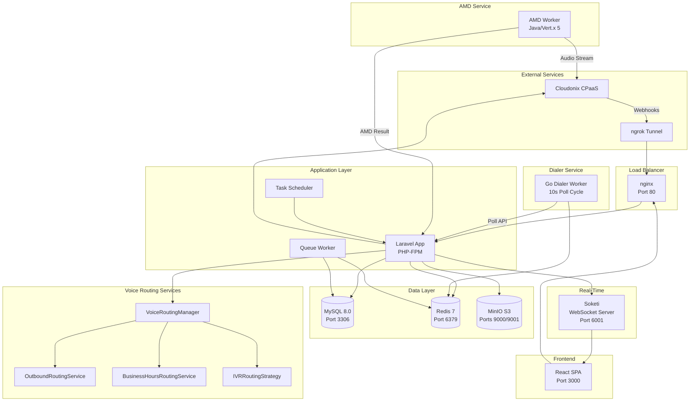
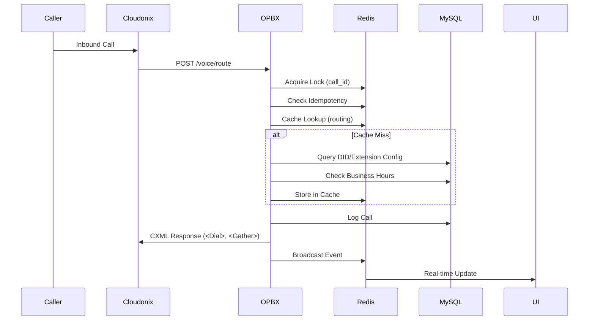
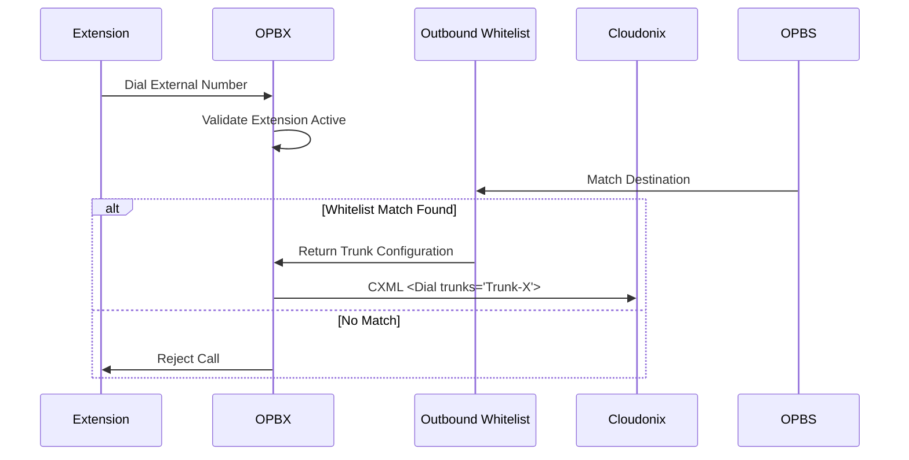

# OPBX - Open Source Business PBX

[](LICENSE)
[](https://laravel.com)
[](https://reactjs.org)
[](https://docs.docker.com/compose/)

A modern, containerized business PBX application built on top of the [Cloudonix CPaaS](https://cloudonix.com) platform. OPBX provides enterprise-grade call routing, ring groups, IVR menus, business hours management, AI assistant integration, automated outbound dialing, and real-time call monitoring — all without the complexity of managing SIP infrastructure.

> **Documentation**: [User Guide](https://developers.cloudonix.com/opbx) | [REST API Reference](https://developers.cloudonix.com/opbxRestOpenAPI)

---

## Table of Contents

- [Features](#features)
- [Architecture](#architecture)
- [Built With](#built-with)
- [Installation](#installation)
- [Configuration](#configuration)
- [Security & Monitoring](#security--monitoring)
- [API Reference](#api-reference)
- [Testing](#testing)
- [Contributing](#contributing)
- [Credits](#credits)
- [License](#license)

---

## Features

### Call Routing & Management
- **Direct Extension Calling**: Extension-to-extension dialing with SIP URI generation
- **Outbound Calling**: E.164 international dialing with whitelist-based trunk routing
- **Ring Groups**: Distribute calls with simultaneous, round-robin, or sequential strategies
- **IVR Menus**: Interactive voice menus with DTMF input, TTS, and configurable destinations
- **Business Hours**: Time-based routing with weekly schedules, holiday exceptions, and public holiday import
- **AI Assistant Integration**: Route calls to 17 AI-powered voice providers via SIP or WebSocket
- **AI Load Balancers**: Distribute calls across multiple AI assistants with round-robin, priority, or percentage strategies and automatic failover
- **Conference Rooms**: Multi-party conference calls with PIN protection, recording, and host waiting

### Auto Dialer (Outbound Campaigns)
- **Campaign Management**: Create, schedule, and monitor outbound calling campaigns
- **Distribution Lists**: CSV-based phone number lists with validation and versioning
- **Rate Limiting**: Concurrent Active Calls (CAC, 1-50) + Calls Per Second (CPS, 1-5) for precise call pacing
- **Answering Machine Detection**: Java/Vert.x 5 AMD worker with ML + energy-based tone detection for voicemail beep detection
- **Caller ID Pooling**: Multi-DID caller ID rotation with round-robin, random, and LRU strategies
- **Real-Time Monitor**: Command-center dashboard with bird's-eye campaign cards and drill-down views
- **Go Dialer Worker**: Dedicated microservice for rate-limited call execution with Redis-based CAC counters
- **Campaign Scheduling**: Weekly calendar with per-day time ranges, timezone support, and date ranges

### Phone Number Management
- **DID Management**: Full support for Direct Inward Dialing numbers in E.164 format
- **Flexible Routing**: Route DIDs to extensions, ring groups, IVR menus, AI assistants, conference rooms, AI load balancers, or business hours schedules
- **Outbound Whitelist**: Control outbound calling with country/prefix-based rules and trunk selection
- **Inbound Blacklist**: Block unwanted callers with exact, prefix, or wildcard matching and configurable rejection strategies

### Real-Time Monitoring
- **Live Call Dashboard**: Real-time call presence via WebSockets with automatic stale record cleanup
- **Auto Dialer Monitor**: Real-time campaign monitoring with active calls, disposition pie charts, and KPI cards
- **Call Detail Records (CDR)**: Complete call history with search, filtering, and streaming CSV export
- **Call Statistics**: Volume, duration, and disposition metrics
- **Call Notifications**: Webhook-based notifications for call events with SSRF protection and retry logic

### Performance & Reliability
- **Redis Caching Layer**: 50-90% faster routing lookups with automatic cache invalidation
- **Idempotent Webhooks**: Redis-based deduplication prevents duplicate processing
- **Distributed Locking**: Prevents race conditions on concurrent calls
- **Queue Workers**: Async job processing for non-blocking operations
- **Service Architecture**: Modular voice routing with dedicated services for outbound, business hours, and IVR handling
- **CAC Counter Reconciliation**: Self-healing Redis counters for the auto dialer worker
- **Circuit Breaker**: Fault tolerance for Cloudonix API calls with automatic fallback
- **Resilient Cache**: Graceful degradation from Redis to database when Redis is unavailable

### Multi-Tenant Architecture
- **Organization Isolation**: Complete data separation between tenants via global query scopes
- **Role-Based Access Control (RBAC)**:
  - **Owner**: Full organization control
  - **PBX Admin**: Manage users, extensions, ring groups, business hours, campaigns
  - **PBX User**: Access own extension and basic features
  - **Reporter**: Read-only access to reports and call logs
- **Platform Management**: Cross-tenant administration for service providers hosting multiple organizations

---

## Architecture

OPBX separates concerns into distinct planes for scalability and maintainability.

### High-Level Architecture


```mermaid
graph TB
    subgraph "External Services"
        CX[Cloudonix CPaaS]
        NGROK[ngrok Tunnel]
    end

    subgraph "Frontend"
        REACT[React SPA<br/>Port 3000]
    end

    subgraph "Load Balancer"
        NGINX[nginx<br/>Port 80]
    end

    subgraph "Application Layer"
        APP[Laravel App<br/>PHP-FPM]
        QUEUE[Queue Worker]
        SCHEDULER[Task Scheduler]
    end

    subgraph "Dialer Service"
        GOWORKER[Go Dialer Worker<br/>10s Poll Cycle]
    end

    subgraph "AMD Service"
        AMD[AMD Worker<br/>Java/Vert.x 5]
    end

    subgraph "Voice Routing Services"
        VRM[VoiceRoutingManager]
        ORS[OutboundRoutingService]
        BHRS[BusinessHoursRoutingService]
        IVR[IVRRoutingStrategy]
    end

    subgraph "Data Layer"
        MYSQL[(MySQL 8.0<br/>Port 3306)]
        REDIS[(Redis 7<br/>Port 6379)]
        MINIO[(MinIO S3<br/>Ports 9000/9001)]
    end

    subgraph "Real-Time"
        SOKETI[Soketi<br/>WebSocket Server<br/>Port 6001]
    end

    CX -->|Webhooks| NGROK
    NGROK --> NGINX
    REACT --> NGINX
    NGINX --> APP
    APP --> VRM
    VRM --> ORS
    VRM --> BHRS
    VRM --> IVR
    APP --> MYSQL
    APP --> REDIS
    APP --> MINIO
    APP --> SOKETI
    APP --> CX
    GOWORKER -->|Poll API| APP
    GOWORKER --> REDIS
    AMD -->|Audio Stream| CX
    AMD -->|AMD Result| APP
    QUEUE --> REDIS
    QUEUE --> MYSQL
    SCHEDULER --> APP
    SOKETI --> REACT
```

### Inbound Call Flow


```mermaid
sequenceDiagram
    participant Caller
    participant Cloudonix
    participant OPBX
    participant Redis
    participant MySQL
    participant UI

    Caller->>Cloudonix: Inbound Call
    Cloudonix->>OPBX: POST /voice/route
    OPBX->>Redis: Acquire Lock (call_id)
    OPBX->>Redis: Check Idempotency
    OPBX->>Redis: Cache Lookup (routing)
    alt Cache Miss
        OPBX->>MySQL: Query DID/Extension Config
        OPBX->>MySQL: Check Business Hours
        OPBX->>Redis: Store in Cache
    end
    OPBX->>MySQL: Log Call
    OPBX->>Cloudonix: CXML Response (<Dial>, <Gather>)
    OPBX->>Redis: Broadcast Event
    Redis->>UI: Real-time Update
```

### Outbound Call Flow


```mermaid
sequenceDiagram
    participant Ext as Extension
    participant OPBX
    participant OW as Outbound Whitelist
    participant CX as Cloudonix

    Ext->>OPBX: Dial External Number
    OPBX->>OPBX: Validate Extension Active
    OPBS->>OW: Match Destination
    alt Whitelist Match Found
        OW->>OPBX: Return Trunk Configuration
        OPBX->>CX: CXML <Dial trunks="Trunk-X">
    else No Match
        OPBX->>Ext: Reject Call
    end
```

### Control Plane vs Execution Plane

| Aspect | Control Plane | Execution Plane |
|--------|---------------|-----------------|
| **Purpose** | Configuration management | Real-time call processing |
| **Components** | REST API, React SPA | Webhooks, Queue Workers |
| **Data Store** | MySQL (source of truth) | Redis (cache, locks, state) |
| **Latency** | Standard web latency | Sub-100ms response required |

---

## Built With

### Backend
| Technology | Version | Purpose |
|------------|---------|---------|
| [Laravel](https://laravel.com) | 12 | PHP application framework |
| [PHP](https://php.net) | 8.4+ | Server-side language |
| [Go](https://go.dev) | 1.21+ | Dialer worker microservice |
| [MySQL](https://mysql.com) | 8.0 | Relational database |
| [Redis](https://redis.io) | 7 | Cache, queues, CAC counters |
| [Laravel Sanctum](https://laravel.com/docs/sanctum) | - | API authentication |

### Frontend
| Technology | Version | Purpose |
|------------|---------|---------|
| [React](https://reactjs.org) | 18 | UI framework |
| [TypeScript](https://typescriptlang.org) | 5 | Type-safe JavaScript |
| [Vite](https://vitejs.dev) | - | Build tool |
| [Tailwind CSS](https://tailwindcss.com) | 3 | Utility-first CSS |
| [Radix UI](https://radix-ui.com) | - | Accessible components |
| [React Query](https://tanstack.com/query) | - | Server state management |

### Infrastructure
| Technology | Purpose |
|------------|---------|
| [Docker](https://docker.com) | Containerization |
| [nginx](https://nginx.org) | Web server / reverse proxy |
| [Soketi](https://soketi.app) | WebSocket server (Laravel Echo compatible) |
| [MinIO](https://min.io) | S3-compatible object storage for recordings |
| [ngrok](https://ngrok.com) | Webhook tunneling for local development |

---

## Installation

### Prerequisites

- **Docker** (20.10+) and **Docker Compose** (2.0+)
- **Cloudonix CPaaS Account**: [Sign up at cloudonix.com](https://cloudonix.com)
- **ngrok Account** (for local development): [Get authtoken](https://dashboard.ngrok.com/get-started/your-authtoken)

### Quick Start

1. **Clone the repository**
   ```bash
   git clone https://github.com/greenfieldtech-nirs/opbx.cloudonix.com.git
   cd opbx.cloudonix.com
   ```

2. **Copy configuration files**
   ```bash
   cp docker-compose.yml.example docker-compose.yml
   cp .env.example .env
   ```
   > The `docker-compose.yml` file is ignored by git so you can customize it for your environment without affecting the repository.

   Edit `.env` with your settings:
   ```env
   # ngrok (for local development)
   NGROK_AUTHTOKEN=your_ngrok_authtoken_here
   
   # Redis password (recommended for production)
   REDIS_PASSWORD=your_redis_password
   
   # MySQL
   DB_ROOT_PASSWORD=rootsecret
   DB_DATABASE=opbx
   DB_USERNAME=opbx
   DB_PASSWORD=secret
   ```

3. **Start all services**
   ```bash
   docker compose up -d
   ```

4. **Initialize the application**
   ```bash
   docker compose exec app php artisan key:generate
   docker compose exec app php artisan migrate --seed
   ```

5. **Access the application**
   - **Frontend**: http://localhost:3000
   - **API**: http://localhost/api/v1
   - **ngrok Dashboard**: http://localhost:4040
   - **MinIO Console**: http://localhost:9001

### ⚠️ Database Persistence

MySQL data is stored in a Docker named volume (`mysql_data`) that **survives container restarts and recreation**. However, it **will be deleted** if you run:

```bash
# NEVER run this unless you want to erase all data!
docker compose down -v
```

**Always backup before major changes:**
```bash
# Create a backup
./scripts/backup-database.sh

# Restore from backup (if needed)
./scripts/restore-database.sh backups/opbx-daily.sql.gz
```

See [docs/DATABASE-PERSISTENCE.md](docs/DATABASE-PERSISTENCE.md) for full details.

### Docker Services

| Service | Description | Port |
|---------|-------------|------|
| `frontend` | React SPA (Vite dev server) | 3000 |
| `nginx` | Web server / API gateway | 80 |
| `app` | Laravel PHP-FPM application | - |
| `queue-worker` | Laravel queue processor | - |
| `scheduler` | Laravel cron scheduler | - |
| `dialer-worker` | Go auto-dialer worker | 8181 |
| `amd-worker` | Java/Vert.x AMD worker | - |
| `mcp-server` | MCP server for AI agents ([docs](mcp-server/README.md)) | 8080 |
| `mysql` | MySQL 8.0 database | 3306 |
| `redis` | Redis 7 cache/queue/CAC | 6379 |
| `minio` | S3-compatible storage | 9000, 9001 |
| `soketi` | WebSocket server | 6001 |
| `ngrok` | Webhook tunnel | 4040 |

### Default Credentials

After running `migrate --seed`, the following admin user is created:

- **Email**: `admin@example.com`
- **Password**: `password`

> ⚠️ **Change these credentials immediately in production!**

---

## Configuration

### Environment Variables

See `.env.example` for all available configuration options. Key variables:

| Variable | Description |
|----------|-------------|
| `REDIS_PASSWORD` | Redis authentication password |
| `DB_PASSWORD` | MySQL database password |
| `NGROK_AUTHTOKEN` | ngrok authentication token |

### Cloudonix Webhook Configuration

Webhooks are configured per-organization in **Settings → Cloudonix** in the admin UI. Configure these webhook URLs in your Cloudonix portal (replace `{YOUR_WEBHOOK_URL}` with your organization's webhook base URL):

| Event | URL |
|-------|-----|
| Voice Application | `{YOUR_WEBHOOK_URL}/api/voice/route` |
| IVR Input | `{YOUR_WEBHOOK_URL}/api/voice/ivr-input` |
| CDR | `{YOUR_WEBHOOK_URL}/api/webhooks/cloudonix/cdr` |
| Session Update | `{YOUR_WEBHOOK_URL}/api/webhooks/cloudonix/session-update` |
| Call Status | `{YOUR_WEBHOOK_URL}/api/webhooks/cloudonix/call-status` |

---

## Security & Monitoring

### Security Features

- **Multi-Tenant Isolation**: Global query scopes enforce organization boundaries
- **RBAC Authorization**: Policy-based access control at all layers
- **API Authentication**: Laravel Sanctum with token rotation
- **Webhook Security**: 
  - HMAC signature verification for CDR/status webhooks
  - Bearer token authentication for voice routing
  - Idempotency protection against duplicate processing
- **Rate Limiting**: Configurable per-endpoint limits
- **Security Headers**: CSP, HSTS, X-Frame-Options, and more
- **API Key Masking**: Cloudonix API keys are encrypted and masked in API responses

### Monitoring

**Health Check Endpoint:**
```bash
curl http://localhost/health
```

**Application Logs:**
```bash
docker compose logs -f app
```

**Queue Monitoring:**
```bash
docker compose exec app php artisan queue:monitor
```

**Cache Statistics:**
```bash
docker compose exec redis redis-cli -a $REDIS_PASSWORD INFO stats
```

**Cleanup Stale Session Updates:**
```bash
# Dry run to see what would be cleaned
docker compose exec app php artisan session-updates:cleanup --hours=2 --dry-run

# Actually clean stale records
docker compose exec app php artisan session-updates:cleanup --hours=2
```

For detailed security implementation, see [`docs/architecture/security-implementation.md`](docs/architecture/security-implementation.md).

---

## API Reference

### Authentication

```bash
# Login
curl -X POST http://localhost/api/v1/auth/login \
  -H "Content-Type: application/json" \
  -d '{"email": "admin@example.com", "password": "password"}'

# Response: {"token": "YOUR_TOKEN", "user": {...}}

# Use token in subsequent requests
curl http://localhost/api/v1/extensions \
  -H "Authorization: Bearer YOUR_TOKEN"
```

#### Scoped API Keys

Organization Owners can issue long-lived, revocable **scoped API keys** (prefixed `opbxk_`) for
integrations and automation. Each key carries its own per-resource `read`/`write` permission set,
which is the sole authorization gate for requests made with it — independent of the user role model.
The plaintext value is shown only once at creation.

#### MCP Server (AI Agents)

OPBX includes an optional [MCP server](mcp-server/README.md) (`mcp-server` compose service) that
exposes a curated, safety-gated [Model Context Protocol](https://modelcontextprotocol.io) interface
over the REST API — letting AI agents manage extensions, routing, campaigns, and configuration
audits with role-based access and confirmation-gated destructive operations.

```bash
# Create a key (Owner session token). The plaintext key is returned ONCE.
curl -X POST http://localhost/api/v1/api-keys \
  -H "Authorization: Bearer YOUR_TOKEN" \
  -H "Content-Type: application/json" \
  -d '{
    "name": "CI deploy key",
    "permissions": [
      {"resource": "business-hours", "level": "read"},
      {"resource": "extensions", "level": "write"}
    ]
  }'

# Response: {"data": {...}, "key": "opbxk_XXXXXXXX..."}

# Use the key like any other bearer token
curl http://localhost/api/v1/business-hours \
  -H "Authorization: Bearer opbxk_XXXXXXXX..."
```

See the [API Keys module guide](docs/opbx-userguide/modules/api-keys.mdx) for details.

### Extensions

```bash
# List extensions
curl http://localhost/api/v1/extensions \
  -H "Authorization: Bearer YOUR_TOKEN"

# Create extension
curl -X POST http://localhost/api/v1/extensions \
  -H "Authorization: Bearer YOUR_TOKEN" \
  -H "Content-Type: application/json" \
  -d '{
    "extension_number": "1001",
    "type": "user",
    "name": "John Doe",
    "user_id": 1
  }'

# Update extension routing
curl -X PUT http://localhost/api/v1/extensions/1001 \
  -H "Authorization: Bearer YOUR_TOKEN" \
  -H "Content-Type: application/json" \
  -d '{
    "call_forwarding_enabled": true,
    "configuration": {
      "forwarding_number": "+1234567890"
    }
  }'
```

### Phone Numbers (DIDs)

```bash
# List phone numbers
curl http://localhost/api/v1/phone-numbers \
  -H "Authorization: Bearer YOUR_TOKEN"

# Create with extension routing
curl -X POST http://localhost/api/v1/phone-numbers \
  -H "Authorization: Bearer YOUR_TOKEN" \
  -H "Content-Type: application/json" \
  -d '{
    "phone_number": "+12125551234",
    "friendly_name": "Main Line",
    "routing_type": "extension",
    "routing_config": {"extension_id": "1"}
  }'

# Route to AI Assistant
curl -X PUT http://localhost/api/v1/phone-numbers/1 \
  -H "Authorization: Bearer YOUR_TOKEN" \
  -H "Content-Type: application/json" \
  -d '{
    "routing_type": "ai_assistant",
    "routing_config": {"ai_assistant_id": "5"}
  }'

# Route to IVR Menu
curl -X PUT http://localhost/api/v1/phone-numbers/1 \
  -H "Authorization: Bearer YOUR_TOKEN" \
  -H "Content-Type: application/json" \
  -d '{
    "routing_type": "ivr_menu",
    "routing_config": {"ivr_menu_id": "3"}
  }'
```

### Outbound Whitelist

```bash
# Create whitelist entry for US calls via Trunk-1
curl -X POST http://localhost/api/v1/outbound-whitelist \
  -H "Authorization: Bearer YOUR_TOKEN" \
  -H "Content-Type: application/json" \
  -d '{
    "name": "US Calls",
    "destination_country": "US",
    "destination_prefix": "1212",
    "outbound_trunk_name": "Trunk-1"
  }'
```

### AI Assistant Load Balancers

```bash
# Create ALB with fallback
curl -X POST http://localhost/api/v1/ai-assistant-load-balancers \
  -H "Authorization: Bearer YOUR_TOKEN" \
  -H "Content-Type: application/json" \
  -d '{
    "name": "Customer Service LB",
    "strategy": "round_robin",
    "fallback_action": "extension",
    "fallback_config": {"extension_id": "1"},
    "members": [
      {"ai_assistant_id": 1, "weight": 50},
      {"ai_assistant_id": 2, "weight": 50}
    ]
  }'
```

### Live Calls

```bash
# Get active calls
curl http://localhost/api/v1/session-updates/active \
  -H "Authorization: Bearer YOUR_TOKEN"

# Get active call statistics
curl http://localhost/api/v1/session-updates/active/stats \
  -H "Authorization: Bearer YOUR_TOKEN"

# Disconnect a session
curl -X DELETE http://localhost/api/v1/session-updates/12345/disconnect \
  -H "Authorization: Bearer YOUR_TOKEN"
```

### Key Endpoints

| Method | Endpoint | Description |
|--------|----------|-------------|
| `GET` | `/api/v1/extensions` | List extensions |
| `POST` | `/api/v1/extensions` | Create extension |
| `GET` | `/api/v1/ring-groups` | List ring groups |
| `POST` | `/api/v1/ring-groups` | Create ring group |
| `GET` | `/api/v1/business-hours` | List schedules |
| `POST` | `/api/v1/business-hours` | Create schedule |
| `GET` | `/api/v1/ivr-menus` | List IVR menus |
| `POST` | `/api/v1/ivr-menus` | Create IVR menu |
| `GET` | `/api/v1/phone-numbers` | List DIDs |
| `POST` | `/api/v1/phone-numbers` | Create DID |
| `GET` | `/api/v1/ai-assistants` | List AI assistants |
| `GET` | `/api/v1/ai-assistant-load-balancers` | List AI load balancers |
| `GET` | `/api/v1/auto-dialer-campaigns` | List auto-dialer campaigns |
| `POST` | `/api/v1/auto-dialer-campaigns` | Create campaign |
| `PATCH` | `/api/v1/auto-dialer-campaigns/{id}/start` | Start campaign |
| `PATCH` | `/api/v1/auto-dialer-campaigns/{id}/pause` | Pause campaign |
| `GET` | `/api/v1/auto-dialer-campaigns/monitor/summary` | Real-time monitor |
| `GET` | `/api/v1/auto-dialer-campaigns/lists` | List distribution lists |
| `GET` | `/api/v1/call-detail-records` | List CDR records |
| `GET` | `/api/v1/session-updates/active` | Active calls |
| `GET` | `/api/v1/settings/cloudonix` | Get Cloudonix settings |

For the complete REST API reference (162 endpoints), see the [OpenAPI specification](docs/opbx-openapi/openapi.yaml).

---

## Testing

### Run All Tests

```bash
./run-tests.sh                             # All tests (runs inside Docker)
./run-tests.sh --filter=TestClassName      # Single test class
```

### Frontend

```bash
cd frontend && npm run build               # Production build
cd frontend && npm run lint                # ESLint
cd frontend && npm run type-check          # TypeScript check
```

### Code Quality

```bash
vendor/bin/pint                            # PHP lint (PSR-12)
vendor/bin/pint --dirty                    # Lint changed files only
```

### Go Worker

```bash
cd dialer-worker && docker compose build dialer-worker   # Build
```

---

## Contributing

We welcome contributions from the community! Here's how to get started:

### Development Setup

1. Fork the repository
2. Clone your fork locally
3. Follow the [Installation](#installation) instructions
4. Create a feature branch: `git checkout -b feature/your-feature-name`

### Guidelines

- **Code Style**: Follow PSR-12 for PHP and ESLint/Prettier for TypeScript
- **Testing**: Add tests for new features and bug fixes
- **Documentation**: Update relevant docs for any changes
- **Commits**: Use conventional commit messages (`feat:`, `fix:`, `docs:`, etc.)

### Pull Request Process

1. Ensure all tests pass: `docker compose exec app php artisan test`
2. Run code quality checks: `vendor/bin/pint` and frontend linting
3. Update `CHANGELOG.md` with your changes
4. Open a PR with a clear description of changes
5. Address any review feedback

### Reporting Issues

- Use GitHub Issues for bug reports and feature requests
- Include steps to reproduce for bugs
- Check existing issues before creating new ones

---

## Credits

### Created By

- **Nir Simionovich** ([@greenfieldtech-nirs](https://github.com/greenfieldtech-nirs)) - Lead Architect

### Created Using

- **Claude Code** ([@claudecode](https://claude.com/product/claude-code)) - Backend Developer
- **Grok Code Fast 1** ([@grokcode](https://x.ai/news/grok-code-fast-1)) - Frontend Developer
- **Google Gemini** ([@gemini](https://gemini.google.com/app)) - Code Reviewer and Expert Debugger
- **Google Antigravity** ([@antigravity](https://antigravity.google.com/app))
- **OpenCode** ([@opencode](https://opencode.ai/))

### Built With Support From

- [Cloudonix](https://cloudonix.com) - CPaaS platform powering all telephony
- [Laravel](https://laravel.com) - PHP application framework
- The open source community

### Special Thanks

- All contributors who have helped improve this project
- The Laravel, React, and Docker communities for their excellent documentation

---

## License

This project is licensed under the **MIT License**.

```
MIT License

Copyright (c) 2025-2026 Nir Simionovich / Greenfield Technologies Ltd.

Permission is hereby granted, free of charge, to any person obtaining a copy
of this software and associated documentation files (the "Software"), to deal
in the Software without restriction, including without limitation the rights
to use, copy, modify, merge, publish, distribute, sublicense, and/or sell
copies of the Software, and to permit persons to whom the Software is
furnished to do so, subject to the following conditions:

The above copyright notice and this permission notice shall be included in all
copies or substantial portions of the Software.

THE SOFTWARE IS PROVIDED "AS IS", WITHOUT WARRANTY OF ANY KIND, EXPRESS OR
IMPLIED, INCLUDING BUT NOT LIMITED TO THE WARRANTIES OF MERCHANTABILITY,
FITNESS FOR A PARTICULAR PURPOSE AND NONINFRINGEMENT. IN NO EVENT SHALL THE
AUTHORS OR COPYRIGHT HOLDERS BE LIABLE FOR ANY CLAIM, DAMAGES OR OTHER
LIABILITY, WHETHER IN AN ACTION OF CONTRACT, TORT OR OTHERWISE, ARISING FROM,
OUT OF OR IN CONNECTION WITH THE SOFTWARE OR THE USE OR OTHER DEALINGS IN THE
SOFTWARE.
```

---

## Documentation

### User & Admin Guides
Comprehensive Docusaurus-compatible documentation (30 pages):
- [User Guide](docs/opbx-userguide/) — Installation, modules, call routing, AI assistants, auto dialer, administration

### API Reference
- [OpenAPI 3.1.0 Specification](docs/opbx-openapi/openapi.yaml) — 162 endpoints, multi-file spec
- [REST API (online)](https://developers.cloudonix.com/opbxRestOpenAPI) — Interactive API explorer

### Architecture
- [Architecture Overview](docs/architecture/architecture-overview.md)
- [Security Implementation](docs/architecture/security-implementation.md)
- [Database Schema](docs/architecture/database-schema.md)
- [Docker Setup](docs/architecture/docker-setup.md)

### Module Documentation
- [Backend (Laravel)](app/) — API controllers, models, services, middleware
- [Frontend (React)](frontend/) — React SPA with TypeScript, TanStack Query, shadcn/ui
- [Dialer Worker (Go)](dialer-worker/) — Auto-dialer campaign execution microservice
- [AMD Worker (Java)](amd-worker/) — Stream-based voicemail detection microservice
- [Docker Infrastructure](docker/) — Docker Compose stack, Nginx, PHP-FPM configs
- [Tests](tests/) — PHPUnit test suite with feature, unit, and integration tests

### Feature Specifications
- [Auto Dialer Worker v2.0](docs/specifications/auto-dialer-worker-v2.md)
- [CPS Parameter](docs/specifications/auto-dialer-cps-parameter.md)
- [Real-Time Monitor](docs/specifications/auto-dialer-realtime-monitor.md)

---

## Recent Updates

### Auto Dialer & Real-Time Monitor (Latest)
- Auto Dialer campaign management with scheduling, AMD, and retry logic
- Go-based dialer worker with 10-second poll cycle and Redis CAC counters
- CPS (Calls Per Second) parameter for independent rate control (1-5 calls/sec)
- Caller ID pooling with multi-DID rotation (round-robin, random, LRU strategies)
- Real-time monitor with card-row campaign view, drill-down KPIs, and disposition pie charts
- Distribution list management with CSV upload, validation, and versioning
- Comprehensive documentation: 30-page user guide + OpenAPI spec (162 endpoints)

### AMD Worker (Answering Machine Detection)
- Java/Vert.x 5 microservice for stream-based voicemail detection
- ML-based beep detection (ONNX Runtime) + energy-based tone detection
- WebSocket audio streaming from Cloudonix `<Start><Stream>` CXML verb
- Automatic action execution (HANGUP, CONTINUE, URL redirect) based on detection result
- AMD results stored in Cloudonix session profile and displayed in Call Logs

### Call Notifications
- Webhook notifications for call events (initiated, answered, ended, etc.)
- Per-organization configuration with event filtering
- SSRF protection, rate limiting, and retry with exponential backoff
- Delivery audit logging with request/response capture

### UI/UX Improvements
- Campaign Manager with status toggle, archive workflow, and edit gating
- Distribution Lists page aligned with Campaign Manager layout
- Full timezone selector (65+ timezones grouped by region)
- Weekly calendar schedule with `expandHeight` for full visibility

### Bug Fixes & Reliability
- Redis key prefix mismatch resolved (prefix-free `dialer` connection)
- CDR session token path fixed (`session.token` not `session_token`)
- OrganizationScope bypass for webhook handlers
- Duplicate call prevention via `sync.Map` concurrency guard
- Stale session cleanup on campaign pause
- AMD mode mapping corrected (`Enabled` to `Enable`)
- WebSocket URL placeholder substitution fixed

<p align="center">
  Made with ❤️ by <a href="https://github.com/greenfieldtech-nirs">Greenfield Technologies</a>&nbsp;&nbsp;Empowered by <a href="https://developers.cloudonix.com">Cloudonix</a>
</p>
