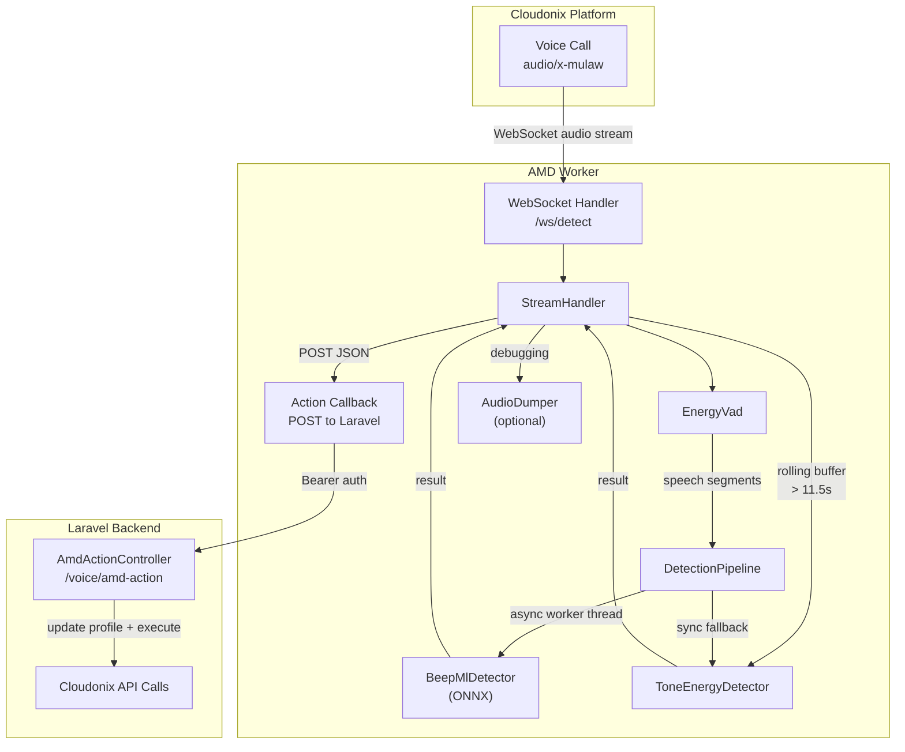
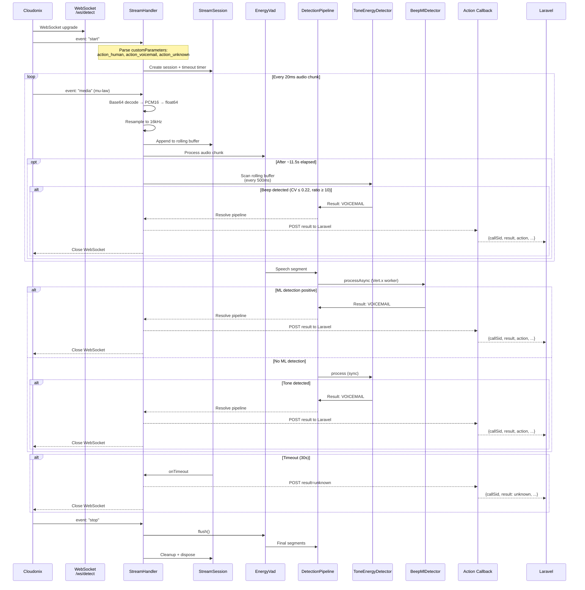

# AMD Worker

The **AMD (Answering Machine Detection) Worker** is a Java/Vert.x service that analyzes real-time audio streams from Cloudonix to detect whether a call reached a human or a voicemail system, then posts the result to Laravel for action execution.

## Architecture Overview



## Components

### Entry Point

| Class | Purpose |
|-------|---------|
| `Main` | Application bootstrap. Sets slf4j log level from `AMD_LOG_LEVEL` env var before creating any logger. |
| `Config` | Reads all configuration from environment variables. No hardcoded secrets. |

### WebSocket Streaming

| Class | Purpose |
|-------|---------|
| `AmdWorkerVerticle` | Vert.x verticle. Sets up WebSocket server, HTTP health endpoint, loads ONNX model, wires `StreamHandler`. |
| `StreamHandler` | Handles WebSocket lifecycle: connection auth, `start`/`media`/`stop` events, routes audio to VAD + detectors, posts results to Laravel callback. |
| `StreamSession` | Per-stream state machine. Holds VAD, detection pipeline, timeout timer, rolling audio buffer (capped at 5s), action options from customParameters. |
| `StreamMessage` | Jackson DTO for Cloudonix WebSocket events. Full Javadoc per Cloudonix docs. |

### Audio Processing

| Class | Purpose |
|-------|---------|
| `AudioDecoder` | Decodes Base64 mu-law payloads into PCM16 and then double-precision float arrays (-1..1). Base64 size limit: 1 MiB. |
| `AudioResampler` | Linear resampler. Converts audio from stream sample rate (usually 8000 Hz) to 16000 Hz for detectors. |
| `EnergyVad` | Energy-based Voice Activity Detector. Chunks continuous audio into speech/silence segments with configurable min/max clip durations. |
| `AudioDumper` | Optional WAV file dump for debugging. Writes per-call audio to disk with path traversal protection. |
| `AudioMath` | Shared audio math utilities (RMS, energy calculations). |

### Feature Extraction

| Class | Purpose |
|-------|---------|
| `EnergyAnalyzer` | FFT-based energy band analysis. Computes total energy, target band energy, spectral purity ratio, and peak concentration. |
| `MfccExtractor` | MFCC (Mel-Frequency Cepstral Coefficients) extraction for the ML model. Uses Hamming window, mel filterbank, DCT. |

### Detection

| Class | Purpose |
|-------|---------|
| `DetectionPipeline` | Chains detectors sequentially. Runs ML detector asynchronously on Vert.x worker threads, then falls back to energy-based detection. |
| `BeepMlDetector` | ONNX-based ML detector. Extracts MFCC features and runs inference via ONNX Runtime. |
| `ToneEnergyDetector` | Energy-based tone detector. Looks for sustained 400ms+ tones in the 300-1000 Hz band with stable amplitude (CV ≤ 0.22) and high spectral purity (ratio ≥ 10.0). |
| `Detector` | Interface for all detection algorithms. |
| `DetectionResult` | Immutable result record: detector name, result type, confidence, reason, timestamp. |
| `ResultType` | Enum: `VOICEMAIL`, `HUMAN`, `UNKNOWN`. |

### ML Model

| Class | Purpose |
|-------|---------|
| `OnnxModel` | Wrapper around ONNX Runtime. Loads `.onnx` model, creates input tensors, runs inference, returns prediction. |

### Metrics

| Class | Purpose |
|-------|---------|
| `MetricsService` | Thread-safe metrics tracker. Active streams, detection counts by type, average detection time, total errors, uptime. Exposed via `/health` HTTP endpoint. |

## Data Flow



## Action Callback

When a detection decision is reached, the worker POSTs the result to Laravel:

```
POST http://nginx/api/voice/amd-action
Authorization: Bearer {AMD_WORKER_API_TOKEN}
Content-Type: application/json

{
  "callSid": "...",
  "streamSid": "...",
  "session": "...",
  "result": "voicemail|human|unknown",
  "action": "https://...|HANGUP|CONTINUE",
  "confidence": 0.9,
  "detectionTimeMs": 13487,
  "reason": "Tone detected in 300-1000Hz for 400ms (cv=0.214 ratio=81.4)"
}
```

The callback is **fire-and-forget**: the WebSocket is closed immediately after the POST is initiated, regardless of success or failure.

## Action Options

Cloudonix passes action configuration via `<Parameter>` elements in the CXML `<Stream>` verb:

```xml
<Stream url="wss://.../ws/amd/detect" track="outbound">
    <Parameter name="action_voicemail" value="HANGUP" />
    <Parameter name="action_human" value="https://example.com/human-handler" />
    <Parameter name="action_unknown" value="CONTINUE" />
</Stream>
```

Available values:
- **URL** (`https://...`) — Switch voice application via Cloudonix API
- **`HANGUP`** — Disconnect session via Cloudonix API
- **`CONTINUE`** — Close WebSocket, take no further action

Default behavior (when no options provided):
- Voicemail detected → `HANGUP`
- Human or Unknown → `CONTINUE`

## Security Model

### Authentication

The WebSocket endpoint supports optional Bearer token authentication via the `Authorization` header:

```bash
AMD_WORKER_API_TOKEN=your-secret-token
```

When configured, every WebSocket upgrade request must include:
```
Authorization: Bearer <your-secret-token>
```

Token comparison uses constant-time equality to prevent timing attacks.

**Note:** Auth check is currently commented out for development. Re-enable before production.

### Input Validation

| Layer | Protection |
|-------|------------|
| **Base64 payload size** | Rejected if decoded size would exceed 1 MiB (`AudioDecoder`) |
| **WAV dump filename** | `callSid` and `streamSid` sanitized; path traversal blocked via `Path.startsWith()` check (`AudioDumper`) |
| **JSON parsing** | Parse errors logged with truncated preview; null messages rejected (`StreamMessage`) |
| **Max concurrent streams** | Hard limit enforced; excess connections rejected with 1013 (`StreamHandler`) |
| **Duplicate streams** | `ConcurrentHashMap.putIfAbsent()` — first connection wins (`StreamHandler`) |

### Memory Safety

- Rolling audio buffer in `StreamSession` is capped at 5 seconds (~80 KB per stream at 16 kHz)
- Base64 decoder rejects oversized payloads before decoding
- VAD segments are clipped to max 3 seconds to prevent unbounded segment growth

## Configuration

All configuration is via environment variables:

| Variable | Default | Description |
|----------|---------|-------------|
| `AMD_WEBSOCKET_PORT` | `8082` | WebSocket server port for audio streams |
| `AMD_HTTP_PORT` | `8083` | HTTP health/metrics port |
| `AMD_MODEL_PATH` | `./models/beep_detector.onnx` | Path to ONNX model file |
| `AMD_MAX_CONCURRENT_STREAMS` | `100` | Maximum simultaneous audio streams |
| `AMD_DEFAULT_TIMEOUT_SECONDS` | `30` | Detection timeout (was 45s) |
| `AMD_DETECTORS` | `beep_ml,tone_energy` | Comma-separated detector list |
| `AMD_DUMP_AUDIO` | `false` | Enable WAV file dumping for debugging |
| `AMD_DUMP_AUDIO_PATH` | `/tmp/amd-dumps` | Directory for audio dumps |
| `AMD_ACTION_CALLBACK_URL` | `http://nginx/api/voice/amd-action` | Laravel callback URL |
| `AMD_WORKER_API_TOKEN` | *(empty)* | Bearer token for callback auth |
| `AMD_LOG_LEVEL` | `info` | SLF4J log level |

## Health Endpoint

```bash
curl http://localhost:8083/health
```

Response:
```json
{
  "status": "healthy",
  "model_loaded": true,
  "active_streams": 3,
  "max_streams": 100,
  "total_detections": 42,
  "detection_breakdown": {
    "voicemail": 30,
    "human": 10,
    "unknown": 2
  },
  "avg_detection_time_ms": 12500,
  "errors_total": 0,
  "uptime_seconds": 3600
}
```

## Building

```bash
cd amd-worker
mvn package -DskipTests -B
```

Produces `target/amd-worker-1.0.0.jar`.

## Running

```bash
java -jar target/amd-worker-1.0.0.jar
```

Or via Docker Compose:
```bash
docker compose up -d amd-worker
```

## Testing

### Offline Tone Detection

Validate detector parameters against saved WAV dumps:

```bash
cd amd-worker
mvn test-compile
mvn -Dexec.mainClass="com.cloudonix.opbx.amd.detector.OfflineToneTest" \
    -Dexec.classpathScope=test exec:java
```

This scans all WAV files in `../volumes/amd-dumps/` and reports detected beep positions.

### Live Test

Place a call that connects to the AMD worker via Cloudonix, then watch logs:

```bash
docker compose logs -f amd-worker
```

Look for:
```
DECISION: VOICEMAIL ... detector=tone_energy ...
Sending AMD action callback to nginx:80/api/voice/amd-action ...
AMD action callback sent status=200
```

## File Structure

```
amd-worker/
├── Dockerfile
├── pom.xml
├── README.md
├── models/
│   └── beep_detector.onnx
└── src/
    ├── main/java/com/cloudonix/opbx/amd/
    │   ├── Main.java
    │   ├── Config.java
    │   ├── audio/
    │   │   ├── AudioDecoder.java
    │   │   ├── AudioDumper.java
    │   │   ├── AudioMath.java
    │   │   ├── AudioResampler.java
    │   │   └── EnergyVad.java
    │   ├── detector/
    │   │   ├── BeepMlDetector.java
    │   │   ├── DetectionPipeline.java
    │   │   ├── DetectionResult.java
    │   │   ├── Detector.java
    │   │   ├── ResultType.java
    │   │   └── ToneEnergyDetector.java
    │   ├── feature/
    │   │   ├── EnergyAnalyzer.java
    │   │   └── MfccExtractor.java
    │   ├── metrics/
    │   │   └── MetricsService.java
    │   ├── model/
    │   │   └── OnnxModel.java
    │   ├── stream/
    │   │   ├── StreamHandler.java
    │   │   ├── StreamMessage.java
    │   │   └── StreamSession.java
    │   └── worker/
    │       └── AmdWorkerVerticle.java
    └── test/java/com/cloudonix/opbx/amd/detector/
        ├── OfflineToneTest.java
        ├── AnalyzeAllBeeps.java
        ├── CompareBeepCharacteristics.java
        └── AnalyzeFalsePositive.java
```

## Notes

- The worker is **stateless** — all per-call state lives in `StreamSession` and is destroyed on WebSocket close.
- The `ToneEnergyDetector` is **stateless**; a single instance is reused across all streams.
- The `BeepMlDetector` requires the ONNX model to be loaded; if loading fails, the pipeline gracefully falls back to tone detection only.
- Audio dumps are **disabled by default** and should only be enabled for debugging.
- The action callback is **fire-and-forget**: the WebSocket closes immediately after initiating the POST. Laravel handles the Cloudonix API calls asynchronously.
