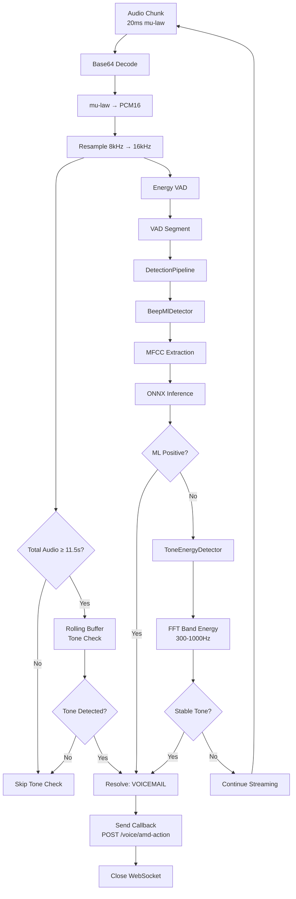
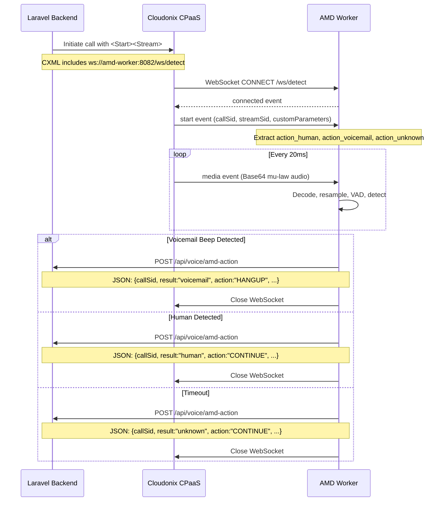

# AMD Worker

A Java/Vert.x 5 microservice for real-time Answering Machine Detection (AMD) using stream-based audio analysis. The service receives live audio streams from Cloudonix CPaaS via WebSocket, analyzes the audio for voicemail beep tones using ML and energy-based detectors, and posts detection results back to the OpBX Laravel backend.

---

## Table of Contents

- [Overview](#overview)
- [Architecture](#architecture)
- [Technology Stack](#technology-stack)
- [Directory Structure](#directory-structure)
- [Build Instructions](#build-instructions)
- [Configuration](#configuration)
- [Detection Pipeline](#detection-pipeline)
- [Cloudonix Integration](#cloudonix-integration)
- [Environment Variables](#environment-variables)
- [Testing](#testing)

---

## Overview

The AMD Worker solves the problem of detecting voicemail systems during outbound calls. When a call connects, the caller may reach a human or a voicemail greeting followed by a beep tone. The AMD Worker:

1. **Receives** a live audio stream from Cloudonix CPaaS via WebSocket using the `<Start><Stream>` CXML verb.
2. **Decodes** the mu-law audio into PCM and resamples to 16 kHz.
3. **Segments** audio using an energy-based Voice Activity Detector (VAD).
4. **Analyzes** segments with two complementary detectors:
   - **ML Detector (`beep_ml`)**: Uses an ONNX model with MFCC features to classify beep tones.
   - **Energy Detector (`tone_energy`)**: Uses FFT-based spectral analysis to detect stable tones in the 300–1000 Hz band.
5. **Reports** the result (`voicemail`, `human`, or `unknown`) back to the Laravel backend via HTTP POST to `/voice/amd-action`.

The service is designed for low latency, high concurrency (up to 100 concurrent streams by default), and graceful degradation if the ML model fails to load.

---

## Architecture

```mermaid
graph TB
    subgraph "Cloudonix CPaaS"
        CXML[CXML Application]
        STREAM[WebSocket Audio Stream]
    end

    subgraph "AMD Worker (Java/Vert.x 5)"
        WS[WebSocket Server<br/>port 8082]
        HTTP[HTTP Health Server<br/>port 8083]
        SH[StreamHandler]
        SS[StreamSession]
        VAD[EnergyVAD]
        DP[DetectionPipeline]
        BML[BeepMlDetector]
        TED[ToneEnergyDetector]
        CB[Callback Client]
    end

    subgraph "OpBX Backend (Laravel)"
        API[/api/voice/amd-action]
    end

    CXML -->|&lt;Start&gt;&lt;Stream&gt;| STREAM
    STREAM -->|ws://amd-worker:8082/ws/detect| WS
    WS --> SH
    SH --> SS
    SS --> VAD
    SS --> DP
    DP --> BML
    DP --> TED
    BML -->|MFCC + ONNX| ML[ONNX Model<br/>beep_detector.onnx]
    TED -->|FFT + Energy| EA[EnergyAnalyzer]
    DP --> CB
    CB -->|HTTP POST + Bearer| API
    HTTP -->|GET /health| METRICS[Metrics JSON]
```

### Key Design Decisions

| Decision | Rationale |
|----------|-----------|
| **Dual detectors** | ML provides accuracy; energy detector provides a fast, model-free fallback. |
| **Rolling buffer for tones** | Voicemail beeps often occur after silence (post-greeting), which VAD may miss. A 5-second rolling buffer enables tone detection outside VAD segments. |
| **Vert.x event loop** | Non-blocking I/O scales to hundreds of concurrent WebSocket streams on a single thread. |
| **ML runs on worker thread** | ONNX inference is CPU-bound; `vertx.executeBlocking` prevents event loop blocking. |
| **Fire-and-forget callback** | The WebSocket closes immediately after detection; the HTTP callback is best-effort. |

---

## Technology Stack

| Component | Technology | Version | Purpose |
|-----------|------------|---------|---------|
| Runtime | Java (Eclipse Temurin) | 21 | Language runtime |
| Framework | Eclipse Vert.x | 5.0.10 | Async event-driven framework |
| Serialization | Jackson | 2.19.0 | JSON parsing for stream protocol |
| ML Inference | ONNX Runtime | 1.22.0 | Run `beep_detector.onnx` model |
| FFT / DSP | JTransforms | 3.1 | Fast Fourier Transform for spectral analysis |
| Logging | SLF4J + SimpleLogger | 2.0.16 | Structured logging |
| Testing | JUnit Jupiter | 5.12.2 | Unit tests |
| Build | Apache Maven | 3.9+ | Dependency management & packaging |
| Container | Docker | — | Multi-stage build (Maven → JRE) |

---

## Directory Structure

```
amd-worker/
├── Dockerfile                          # Multi-stage Docker build
├── pom.xml                             # Maven build configuration
├── models/
│   └── beep_detector.onnx              # ONNX model for beep detection
├── scripts/                            # Helper scripts (if any)
├── src/
│   ├── main/java/com/cloudonix/opbx/amd/
│   │   ├── Main.java                   # Entry point: loads Config, deploys verticle
│   │   ├── Config.java                 # Environment-based configuration
│   │   ├── worker/
│   │   │   └── AmdWorkerVerticle.java  # Vert.x verticle: starts WS + HTTP servers
│   │   ├── stream/
│   │   │   ├── StreamHandler.java      # WebSocket lifecycle & message routing
│   │   │   ├── StreamSession.java      # Per-stream state (VAD, pipeline, buffers)
│   │   │   └── StreamMessage.java      # DTO for Cloudonix stream protocol
│   │   ├── audio/
│   │   │   ├── AudioDecoder.java       # Base64 + mu-law → PCM16 → float64
│   │   │   ├── AudioResampler.java     # Linear resampling (8 kHz → 16 kHz)
│   │   │   ├── AudioMath.java          # RMS, energy utilities
│   │   │   ├── EnergyVad.java          # Energy-based voice activity detection
│   │   │   └── AudioDumper.java        # Optional WAV dump for debugging
│   │   ├── feature/
│   │   │   ├── MfccExtractor.java      # MFCC feature extraction for ML model
│   │   │   └── EnergyAnalyzer.java     # FFT band-energy analysis
│   │   ├── detector/
│   │   │   ├── DetectionPipeline.java  # Orchestrates detectors sequentially
│   │   │   ├── BeepMlDetector.java     # ONNX-based ML detector
│   │   │   ├── ToneEnergyDetector.java # Energy/FFT-based tone detector
│   │   │   ├── Detector.java           # Detector interface
│   │   │   ├── DetectionResult.java    # Result record (type, confidence, reason)
│   │   │   └── ResultType.java         # Enum: VOICEMAIL, HUMAN, UNKNOWN
│   │   ├── model/
│   │   │   └── OnnxModel.java          # ONNX Runtime wrapper
│   │   └── metrics/
│   │       └── MetricsService.java     # Atomic metrics (streams, detections, errors)
│   └── test/java/com/cloudonix/opbx/amd/
│       └── detector/
│           ├── OfflineToneTest.java      # Offline analysis of dumped WAV files
│           ├── AnalyzeFalsePositive.java # False-positive analysis tool
│           ├── AnalyzeAllBeeps.java      # Batch beep analysis
│           ├── CompareBeepCharacteristics.java # Beep characteristic comparison
│           └── DebugToneDetector.java    # Tone detector debug utility
└── target/                             # Maven build output (gitignored)
```

---

## Build Instructions

### Prerequisites

- Java 21 JDK (Eclipse Temurin recommended)
- Apache Maven 3.9+
- Docker (optional, for containerized builds)

### Local Build

```bash
cd amd-worker

# Compile
mvn compile

# Run tests
mvn test

# Package shaded JAR (includes all dependencies)
mvn package -DskipTests -B

# Run locally
java -jar target/amd-worker-1.0.0.jar
```

### Docker Build

```bash
# Build image
docker build -t amd-worker:latest .

# Run container
docker run -p 8082:8082 -p 8083:8083 \
  -e AMD_WORKER_API_TOKEN=your-token \
  -e AMD_ACTION_CALLBACK_URL=http://host.docker.internal/api/voice/amd-action \
  amd-worker:latest
```

### Docker Compose (within OpBX stack)

The service is typically started as part of the full OpBX stack:

```bash
cd /path/to/opbx.cloudonix.com
docker compose up -d
```

> **Important:** Wait 120 seconds after a Docker Compose restart before testing, to allow all services to fully initialize.

---

## Configuration

All configuration is provided via environment variables. No secrets are hardcoded; the service fails safe if required variables are missing.

### Minimal Configuration

```bash
export AMD_WORKER_API_TOKEN="secure-random-token"
export AMD_ACTION_CALLBACK_URL="http://nginx/api/voice/amd-action"
```

### Full Configuration

```bash
export AMD_WEBSOCKET_PORT=8082
export AMD_HTTP_PORT=8083
export AMD_MODEL_PATH="./models/beep_detector.onnx"
export AMD_MAX_CONCURRENT_STREAMS=100
export AMD_DEFAULT_TIMEOUT_SECONDS=30
export AMD_DETECTORS="beep_ml,tone_energy"
export AMD_LOG_LEVEL="info"
export AMD_DUMP_AUDIO="false"
export AMD_DUMP_AUDIO_PATH="/tmp/amd-dumps"
export AMD_WORKER_API_TOKEN="your-api-token"
export AMD_ACTION_CALLBACK_URL="http://nginx/api/voice/amd-action"
```

---

## Detection Pipeline



### Pipeline Details

1. **Audio Ingestion**: Every 20 ms, a Base64-encoded mu-law audio chunk arrives.
2. **Decoding**: `AudioDecoder` converts mu-law → PCM16 → normalized float64.
3. **Resampling**: Linear resampling from 8 kHz (Cloudonix) to 16 kHz (model requirement).
4. **Rolling Buffer Check** (after ~11.5 s): A 1.5-second sliding window is analyzed by `ToneEnergyDetector` every 500 ms. This catches beeps that occur in silence (after the greeting ends).
5. **VAD Segmentation**: `EnergyVad` groups audio into speech segments (200 ms – 3 s).
6. **Detector Chain**: For each VAD segment:
   - **BeepMlDetector** runs first (async on worker thread). It extracts MFCC features and runs ONNX inference.
   - **ToneEnergyDetector** runs as fallback. It analyzes 20 ms FFT windows for a 400 ms run of stable energy in the 300–1000 Hz band with low coefficient-of-variation (CV ≤ 0.22).
7. **Resolution**: The first positive detection resolves the pipeline. The result is logged, sent via HTTP callback, and the WebSocket is closed.
8. **Timeout**: If no detection occurs within the configured timeout (default 30 s), the result is `unknown`.

---

## Cloudonix Integration



### CXML Stream Verb

The Laravel backend initiates streaming by returning CXML with a `<Stream>` verb:

```xml
<Response>
  <Start>
    <Stream url="ws://amd-worker:8082/ws/detect" track="inbound">
      <Parameter name="action_human" value="CONTINUE"/>
      <Parameter name="action_voicemail" value="HANGUP"/>
      <Parameter name="action_unknown" value="CONTINUE"/>
    </Stream>
  </Start>
</Response>
```

### Callback Payload

When a detection is made, the AMD Worker POSTs the following JSON to `AMD_ACTION_CALLBACK_URL`:

```json
{
  "callSid": "call-uuid",
  "streamSid": "stream-uuid",
  "session": "session-token",
  "result": "voicemail",
  "action": "HANGUP",
  "confidence": 0.95,
  "detectionTimeMs": 12500,
  "reason": "Beep tone detected by ML model (prediction=0)"
}
```

The `action` field is resolved from the `action_*` custom parameters, with defaults:
- `voicemail` → `HANGUP`
- `human` / `unknown` → `CONTINUE`

---

## Environment Variables

| Variable | Default | Required | Description |
|----------|---------|----------|-------------|
| `AMD_WEBSOCKET_PORT` | `8082` | No | Port for the WebSocket audio stream server |
| `AMD_HTTP_PORT` | `8083` | No | Port for the HTTP health/metrics endpoint |
| `AMD_MODEL_PATH` | `./models/beep_detector.onnx` | No | Filesystem path to the ONNX model |
| `AMD_MAX_CONCURRENT_STREAMS` | `100` | No | Maximum concurrent WebSocket connections |
| `AMD_DEFAULT_TIMEOUT_SECONDS` | `30` | No | Detection timeout per stream |
| `AMD_DETECTORS` | `beep_ml,tone_energy` | No | Comma-separated detector list |
| `AMD_LOG_LEVEL` | `info` | No | SLF4J log level (`trace`, `debug`, `info`, `warn`, `error`) |
| `AMD_DUMP_AUDIO` | `false` | No | If `true`, dumps raw audio to WAV files for debugging |
| `AMD_DUMP_AUDIO_PATH` | `/tmp/amd-dumps` | No | Directory for audio dump files |
| `AMD_WORKER_API_TOKEN` | *(empty)* | **Yes** | Bearer token for callback authentication |
| `AMD_ACTION_CALLBACK_URL` | `http://nginx/api/voice/amd-action` | No | Laravel callback endpoint URL |

### Health Endpoint

```bash
curl http://localhost:8083/health
```

Response:

```json
{
  "status": "healthy",
  "model_loaded": true,
  "active_streams": 3,
  "max_streams": 100,
  "total_detections": 42,
  "detection_breakdown": {
    "voicemail": 30,
    "human": 10,
    "unknown": 2
  },
  "avg_detection_time_ms": 12500,
  "errors_total": 0,
  "uptime_seconds": 3600
}
```

---

## Testing

### Unit Tests

```bash
cd amd-worker
mvn test
```

### Offline Analysis Tools

The `src/test/java/` directory contains diagnostic tools for analyzing dumped audio:

#### `OfflineToneTest`

Analyzes all WAV files in `../volumes/amd-dumps/` for beep tones using the same algorithm as the production `ToneEnergyDetector`.

```bash
# First, enable audio dumping
export AMD_DUMP_AUDIO=true
export AMD_DUMP_AUDIO_PATH=/path/to/dumps

# Run the tool via Maven exec plugin or IDE
mvn exec:java -Dexec.mainClass="com.cloudonix.opbx.amd.detector.OfflineToneTest"
```

Example output:

```
call_123_stream_456.wav -> duration=15.2s beeps=1 first_at_ms=12300
   BEEP start=12300ms end=12700ms cv=0.142

=== SUMMARY ===
Files with beep after 10500ms: 1/1
```

#### Other Diagnostic Tools

| Tool | Purpose |
|------|---------|
| `AnalyzeFalsePositive.java` | Investigate specific audio files that caused false positives |
| `AnalyzeAllBeeps.java` | Batch-process and summarize beep characteristics across a dataset |
| `CompareBeepCharacteristics.java` | Compare spectral features between different beep samples |
| `DebugToneDetector.java` | Step-through debugging of the tone detection algorithm |

### Integration Testing

1. Ensure the full OpBX stack is running:
   ```bash
   docker compose up -d
   ```
2. Wait 120 seconds for all services to initialize.
3. Place an outbound call through OpBX that triggers AMD.
4. Monitor logs:
   ```bash
   docker compose logs -f amd-worker
   ```
5. Verify the callback was received by the Laravel backend:
   ```bash
   docker compose logs -f app | grep amd-action
   ```

### Load Testing

To verify concurrent stream handling:

```bash
# Check active streams via health endpoint
watch -n 1 'curl -s http://localhost:8083/health | jq .active_streams'
```

The service will reject new WebSocket connections with code `1013` if `max_streams` is reached.

---

## Operational Notes

### Log Levels

Set `AMD_LOG_LEVEL=debug` to see per-chunk audio processing details. Set `AMD_LOG_LEVEL=warn` for production to reduce noise.

### Audio Dumps

Enable `AMD_DUMP_AUDIO=true` only for debugging. Each stream produces one WAV file (~1.6 MB per minute at 16 kHz mono). The dumper includes path-traversal protection and filename sanitization.

### Model Failures

If the ONNX model fails to load (e.g., file missing, architecture mismatch), the service continues operating with the energy-based detector only. This is logged as an error at startup.

### Memory Safety

- Rolling audio buffer is capped at 5 seconds (~80 KB per stream).
- Base64 payloads larger than 1 MiB are rejected.
- VAD segments are clipped at 3 seconds to prevent unbounded buffers.

---

## License

This component is part of the OpBX open-source business PBX platform. See the repository root for license details.
