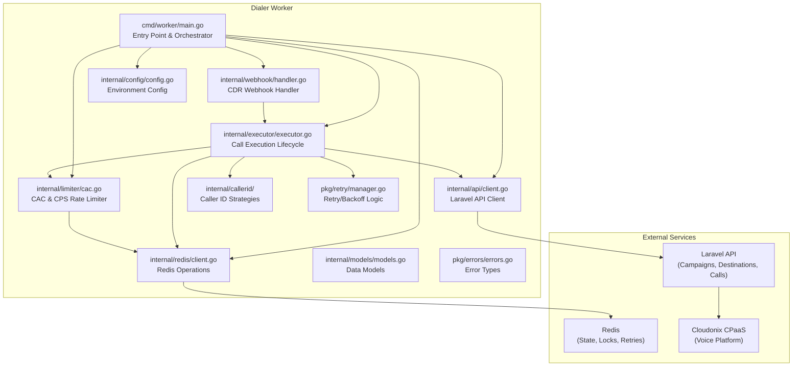
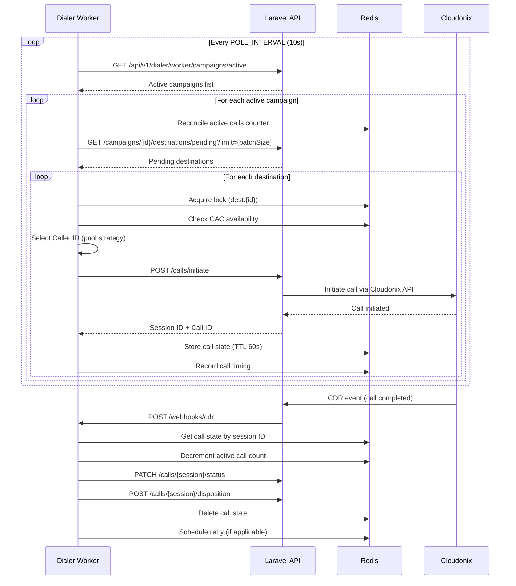

# Dialer Worker

A Go-based auto-dialer campaign execution service for the OPBX platform. This worker polls the Laravel backend for active outbound campaigns, rate-limits call initiation, and initiates calls through the Cloudonix CPaaS via a Laravel proxy.

## Overview

The Dialer Worker is a standalone microservice responsible for the outbound call execution layer of the OPBX platform. It operates autonomously by:

- **Polling** the Laravel API every 10 seconds for active dialer campaigns
- **Rate-limiting** outbound calls using Concurrent Active Calls (CAC) and Calls Per Second (CPS) limits configured per campaign
- **Initiating calls** via the Laravel API, which proxies to the Cloudonix CPaaS
- **Receiving CDR webhooks** from Laravel (relayed from Cloudonix) to update call disposition and trigger retries
- **Managing retry logic** with configurable backoff intervals for retryable dispositions (busy, no-answer, cancelled)
- **Selecting Caller IDs** from configurable pools using round-robin, random, or least-recently-used strategies

## Architecture



## Technology Stack

| Component | Technology | Version |
|-----------|-----------|---------|
| Language | Go | 1.21+ |
| HTTP Framework | Gin | v1.10.0 |
| Redis Client | go-redis | v8.11.5 |
| Build Tool | Make | - |
| Container | Docker | - |

## Directory Structure

```
dialer-worker/
├── cmd/worker/
│   └── main.go              # Application entry point (~290 lines)
│
├── internal/
│   ├── api/
│   │   └── client.go        # Laravel API HTTP client (~247 lines)
│   ├── callerid/
│   │   ├── strategy.go      # Strategy interface & factory
│   │   ├── round_robin.go   # Round-robin Caller ID selection
│   │   ├── random.go        # Random Caller ID selection
│   │   ├── lru.go           # Least-recently-used selection
│   │   └── retry_tracker.go # Tracks tried DIDs for retries
│   ├── config/
│   │   └── config.go        # Environment configuration (~131 lines)
│   ├── executor/
│   │   └── executor.go      # Call execution lifecycle (~359 lines)
│   ├── limiter/
│   │   └── cac.go           # CAC/CPS rate limiter (~168 lines)
│   ├── models/
│   │   └── models.go        # Data models & types (~184 lines)
│   ├── redis/
│   │   └── client.go        # Redis operations (~414 lines)
│   └── webhook/
│       └── handler.go       # CDR webhook handler (~111 lines)
│
├── pkg/
│   ├── errors/
│   │   └── errors.go        # Custom error types (~41 lines)
│   └── retry/
│       └── manager.go       # Retry/backoff logic (~66 lines)
│
├── .env.example             # Example environment configuration
├── Dockerfile               # Multi-stage Docker build
├── go.mod                   # Go module definition
├── go.sum                   # Go dependency checksums
├── Makefile                 # Build automation
└── README.md                # This file
```

## Build Instructions

### Prerequisites

- Go 1.21 or later
- Redis server
- Access to the Laravel API

### Local Development

```bash
# Clone and navigate to the project
cd dialer-worker

# Copy example environment file
cp .env.example .env
# Edit .env with your configuration

# Download dependencies
make deps

# Build the binary
make build

# Run the worker
make run
```

### Available Make Targets

| Target | Description |
|--------|-------------|
| `make build` | Build the `worker` binary |
| `make run` | Run the worker directly with `go run` |
| `make test` | Run all tests |
| `make test-coverage` | Run tests with HTML coverage report |
| `make clean` | Remove build artifacts and coverage files |
| `make fmt` | Format all Go code |
| `make lint` | Run `golangci-lint` |
| `make deps` | Download and tidy Go modules |
| `make docker-build` | Build Docker image |
| `make docker-run` | Run Docker container with `.env` |
| `make dev-setup` | Copy `.env.example` to `.env` |
| `make health` | Check worker health endpoint |

### Docker

```bash
# Build the Docker image
make docker-build

# Run the container
make docker-run
```

The Dockerfile uses a multi-stage build:
1. **Builder stage**: `golang:1.21-alpine` - compiles the binary
2. **Final stage**: `alpine:latest` - runs the compiled binary

## Configuration

Configuration is loaded entirely from environment variables. Copy `.env.example` to `.env` and set the required values.

### Environment Variables

| Variable | Required | Default | Description |
|----------|----------|---------|-------------|
| `LARAVEL_API_URL` | Yes | `http://localhost:8000` | Base URL of the Laravel API |
| `LARAVEL_API_TOKEN` | Yes | - | Bearer token for Laravel API authentication |
| `REDIS_HOST` | Yes | `localhost` | Redis server hostname |
| `REDIS_PORT` | Yes | `6379` | Redis server port |
| `REDIS_PASSWORD` | No | *(empty)* | Redis password |
| `REDIS_DB` | No | `0` | Redis database number |
| `WORKER_ID` | Yes | `worker-1` | Unique identifier for this worker instance |
| `POLL_INTERVAL` | No | `10s` | Interval between campaign polls |
| `HEALTH_CHECK_PORT` | Yes | `8080` | Port for health check HTTP server |
| `WEBHOOK_PORT` | Yes | `8081` | Port for CDR webhook HTTP server |
| `WEBHOOK_SECRET` | No | *(empty)* | HMAC-SHA256 secret for webhook signature verification |

### Retry Configuration (Hardcoded)

Retry intervals are fixed per the functional specification:

| Attempt | Delay |
|---------|-------|
| 1st retry | 5 minutes |
| 2nd retry | 15 minutes |
| 3rd retry | 60 minutes |
| 4th retry | 24 hours |

Maximum retries: **4**

Retryable dispositions: `busy`, `no-answer`, `cancelled`

## Call Flow



## Rate Limiting

The worker implements two complementary rate-limiting mechanisms per campaign:

### Concurrent Active Calls (CAC)

- **Definition**: Maximum number of simultaneous outbound calls allowed for a campaign
- **Range**: 1-50 concurrent calls
- **Implementation**: Atomic Redis Lua script (`IncrementIfBelow`) ensures safe counter increments across multiple worker instances
- **Self-healing**: The worker reconciles the Redis counter against actual call state keys on every poll cycle to correct drift from missed CDRs or crashes

### Calls Per Second (CPS)

- **Definition**: Maximum rate at which new calls can be initiated
- **Range**: 1-30 calls per second
- **Implementation**: Minimum interval between calls is calculated as `1000 / CPS` milliseconds. The worker sleeps for the remaining interval before initiating the next call

### Batch Size Calculation

The number of destinations fetched per poll cycle is calculated as:

```
batchSize = min(CPS × poll_interval_seconds, CAC)
```

With safety clamps:
- CPS is clamped to [1, 30]
- Poll interval defaults to 10 seconds if invalid
- Batch size is at least 1

## Redis Key Patterns

| Key Pattern | Type | Purpose | TTL |
|-------------|------|---------|-----|
| `dialer:call:{session_id}` | Hash | Call state (campaign_id, destination_id, status, started_at) | 60s (extended to persistent on "connected") |
| `dialer:cac:{campaign_id}:active` | String | Active call counter for CAC limit | No TTL |
| `dialer:campaign:{campaign_id}` | *(reserved)* | Campaign state | - |
| `dialer:worker:{worker_id}` | String | Worker heartbeat timestamp | 30s |
| `dialer:lock:{lock_key}` | String | Distributed lock (e.g., `dest:{id}`) | 30s |
| `dialer:idem:{event_id}` | String | Idempotency key for processed webhooks | 24h |
| `dialer:retry:{campaign_id}` | Sorted Set | Retry queue (score = retry timestamp, member = destination_id) | No TTL |

### Key Operations

- **Call State**: Stored as Redis Hash with `HSET` + `EXPIRE` via pipeline. TTL is removed (`PERSIST`) when call status becomes "connected" to prevent expiration before CDR arrives
- **CAC Counter**: Atomically incremented/decremented with Lua script to prevent race conditions
- **Locks**: Acquired with `SET NX EX` (set if not exists with expiry)
- **Retry Queue**: Redis Sorted Set ordered by retry timestamp; worker fetches items with `ZRangeByScore` where score <= now

## Webhook Endpoints

The worker exposes an HTTP server on `WEBHOOK_PORT` (default 8081) with the following endpoints:

| Endpoint | Method | Auth | Description |
|----------|--------|------|-------------|
| `/webhooks/cdr` | POST | HMAC-SHA256 (optional) | Receives CDR events from Laravel |
| `/webhooks/health` | GET | None | Health check returning `{"status": "healthy"}` |

### CDR Webhook Format

```json
{
  "session_id": "123456789",
  "status": "completed",
  "disposition": "answered",
  "duration": 120,
  "billsec": 115,
  "recording_url": "https://recordings.example.com/call-123.mp3",
  "completed_at": "2024-01-15T10:30:00Z"
}
```

### Webhook Signature Verification

When `WEBHOOK_SECRET` is configured, the worker verifies the `X-Webhook-Signature` header using HMAC-SHA256:

```
expected = HMAC-SHA256(webhook_secret, request_body)
```

## Caller ID Pool Strategies

When `caller_id_pool_enabled` is true on a campaign, the worker selects a Caller ID from the pool using one of three strategies:

| Strategy | Description | Redis State |
|----------|-------------|-------------|
| `round_robin` | Cycles through pool items in order | Redis counter per campaign |
| `random` | Selects a random item from the pool | None |
| `least_recently_used` | Selects the item used longest ago | Redis hash with last-used timestamps |

On retry attempts, the worker excludes already-tried DIDs to ensure a different Caller ID is used for each retry.

## API Client (Laravel)

The worker communicates exclusively with the Laravel API (no direct database access). Key endpoints:

| Endpoint | Method | Description |
|----------|--------|-------------|
| `/api/v1/dialer/worker/campaigns/active` | GET | Fetch active campaigns |
| `/api/v1/dialer/worker/campaigns/{id}/destinations/pending` | GET | Fetch pending destinations |
| `/api/v1/dialer/worker/calls/initiate` | POST | Initiate a new call |
| `/api/v1/dialer/worker/calls/{session_id}/status` | PATCH | Update call status |
| `/api/v1/dialer/worker/calls/{session_id}/disposition` | POST | Set final disposition |

### HTTP Client Configuration

The API client uses `DisableKeepAlives: true` on the HTTP transport to prevent DNS caching issues when the Laravel API is behind nginx or a load balancer.

## Error Handling

The worker defines specific error types for different failure modes:

| Error | Description |
|-------|-------------|
| `ErrCampaignNotFound` | Campaign does not exist in Laravel |
| `ErrDestinationNotFound` | Destination not found |
| `ErrSessionNotFound` | Call session not found |
| `ErrRateLimitExceeded` | Laravel returned HTTP 429 |
| `ErrCACLimitReached` | Maximum concurrent calls reached |
| `ErrCampaignNotRunnable` | Campaign status is not "active" |
| `ErrMaxRetriesExceeded` | Destination has exceeded max retry attempts |
| `ErrWebhookInvalid` | Invalid webhook payload |
| `ErrWebhookUnauthorized` | Webhook signature verification failed |
| `ErrRedisConnection` | Redis connection error |
| `ErrLaravelAPIError` | Generic Laravel API error |

### HTTP 429 Handling

When the Laravel API returns HTTP 429 (Too Many Requests), the worker:
1. Reads the `Retry-After` header (defaults to 300 seconds)
2. Returns a `RetryableError` with the retry duration
3. The caller can back off and retry

## Graceful Shutdown

The worker handles `SIGINT` and `SIGTERM` signals gracefully:

1. Stops the campaign polling loop
2. Shuts down the webhook HTTP server with a 5-second timeout
3. Waits for in-flight goroutines to complete
4. Closes the Redis connection

## Logging

The worker uses Go's structured logging (`log/slog`) with JSON output. All log entries include:

- `worker_id`: The configured worker identifier
- `campaign_id` / `campaign_name`: When processing campaigns
- `destination_id` / `phone`: When processing calls
- `session_id`: When handling CDR events
- `error`: On failure

## Development

```bash
# Format code
make fmt

# Run linter
make lint

# Run tests
make test

# Run tests with coverage
make test-coverage

# Health check
make health
```

## License

This project is part of the OPBX open-source business PBX platform.
