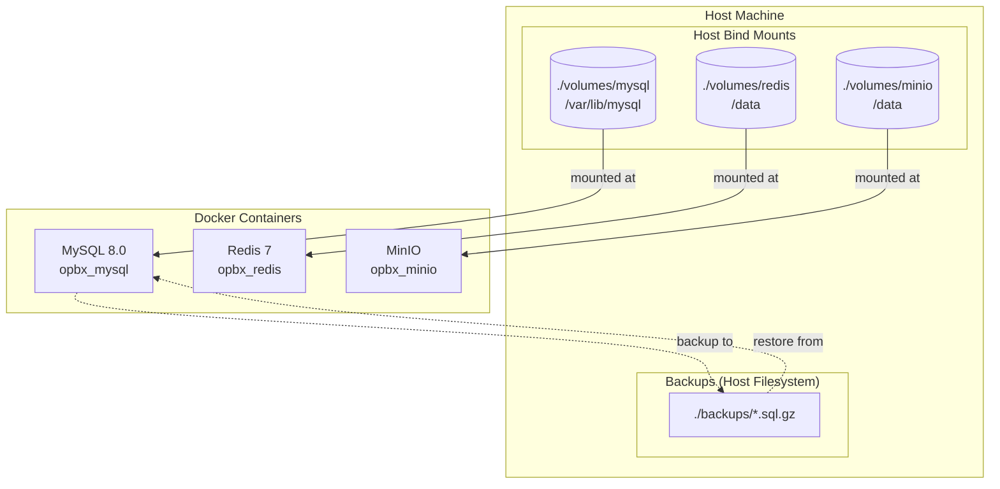

# Database Persistence Guide

This document describes how OpBX persists data in Docker and how to protect, back up, and recover that data.

## Table of Contents

1. [Overview](#overview)
2. [Persistence Architecture](#persistence-architecture)
3. [Volume Details](#volume-details)
4. [What Survives vs. What Does Not](#what-survives-vs-what-does-not)
5. [Backup Procedures](#backup-procedures)
6. [Restore Procedures](#restore-procedures)
7. [Migration Safety](#migration-safety)
8. [Troubleshooting](#troubleshooting)
9. [Disaster Recovery](#disaster-recovery)

---

## Overview

OpBX uses Docker Compose to run its services. Three services store state that must persist across container restarts, host reboots, and deployments:

| Service | Technology | Purpose |
|---------|-----------|---------|
| **MySQL** | MySQL 8.0 | Primary relational database for all application data |
| **Redis** | Redis 7 (Alpine) | Caching, queues, sessions, real-time state |
| **MinIO** | MinIO (latest) | S3-compatible object storage for call recordings and files |

Each service uses a different persistence strategy. Understanding these strategies is essential for operating OpBX in production and avoiding accidental data loss.

---

## Persistence Architecture



### Key Design Decisions

1. **MySQL, Redis, and MinIO all use host bind mounts** (`./volumes/mysql`, `./volumes/redis`, `./volumes/minio`). Bind mounts make data directly visible on the host filesystem, simplifying backups, debugging, and recovery. The `volumes/` directory is gitignored so it is never committed.

2. **Redis AOF persistence** is enabled (`--appendonly yes`) so Redis data survives normal container restarts. Treat Redis as operational cache/queue storage rather than a primary source of truth.

3. **Neither MySQL nor Redis expose ports by default**. External access is disabled unless explicitly configured via `.env` variables (`DB_EXPOSE_PORT`, `REDIS_EXPOSE_PORT`). Both remain fully accessible within the Docker network.

---

## Volume Details

### MySQL

| Attribute | Value |
|-----------|-------|
| **Image** | `mysql:8.0` |
| **Container Name** | `opbx_mysql` |
| **Volume Type** | Host bind mount |
| **Host Path** | `./volumes/mysql` |
| **Container Path** | `/var/lib/mysql` |
| **Port Exposure** | Not exposed by default (`DB_EXPOSE_PORT` is empty) |
| **Restart Policy** | `unless-stopped` |
| **Custom Config** | `docker/mysql/my.cnf` |

The bind-mounted directory stores all table data, indexes, user accounts, and schema definitions. It resides in your project directory, so it is included in normal filesystem backups (but excluded from git).

### Redis

| Attribute | Value |
|-----------|-------|
| **Image** | `redis:7-alpine` |
| **Container Name** | `opbx_redis` |
| **Volume Type** | Host bind mount |
| **Host Path** | `./volumes/redis` |
| **Container Path** | `/data` |
| **Port Exposure** | Not exposed by default (`REDIS_EXPOSE_PORT` is empty) |
| **Restart Policy** | No explicit restart policy set |
| **Persistence Mode** | AOF (Append-Only File) |

**Command-line flags**:

```yaml
command: >
  redis-server
  --appendonly yes
  --requirepass ${REDIS_PASSWORD}
  --bind 0.0.0.0
  --protected-mode yes
```

With `--appendonly yes`, Redis writes every mutating operation to an append-only file (`/data/appendonly.aof`). On restart, Redis replays this file to reconstruct the dataset. This provides durable persistence comparable to a write-ahead log.

### MinIO

| Attribute | Value |
|-----------|-------|
| **Image** | `minio/minio:latest` |
| **Container Name** | `opbx_minio` |
| **Volume Type** | Host bind mount |
| **Host Path** | `./volumes/minio` |
| **Container Path** | `/data` |
| **Port Exposure** | Not exposed by default (`MINIO_EXPOSE_PORT`, `MINIO_CONSOLE_EXPOSE_PORT` are empty) |
| **Restart Policy** | `unless-stopped` |

MinIO stores objects as regular files on disk inside the bind-mounted directory. This makes it trivial to browse, back up, or archive object data using standard host filesystem tools.

---

## Storage Responsibilities

### MySQL — Source of Truth

MySQL is the authoritative store for all durable application data:

- Organizations, users, roles, and permissions
- Extensions, DIDs, ring groups, IVR menus, business hours, conference rooms
- Call detail records (CDRs), call logs, session updates
- Auto-dialer campaigns, destinations, and call sessions
- Platform audit logs, settings, and notification configurations

### Redis — Ephemeral Runtime State

Redis supports fast, transient state. AOF persistence survives normal restarts, but Redis should not be treated as a source of truth. Redis is used for:

- Sessions (`SESSION_DRIVER=redis`)
- Job queues (`QUEUE_CONNECTION=redis`)
- Application cache (`CACHE_STORE=redis`)
- Rate-limit counters (`rate_limit:org:{id}:{type}`)
- Webhook idempotency keys (`idem:webhook:{key}`)
- Distributed locks (`lock:call:{call_id}`)
- IVR call state and dialer CAC counters (`dialer:cac:{campaign_id}:active`)

### MinIO — Object Storage

MinIO stores binary objects:

- Call recordings
- IVR prompts and announcements
- Auto-dialer audio assets

External access to recordings is gated through HMAC-signed URLs generated by the Laravel backend. See [Security](/architecture/security) for details.

---

## What Survives vs. What Does Not

### Data Survives

| Event | MySQL | Redis | MinIO |
|-------|-------|-------|-------|
| Container restart (`docker compose restart`) | Yes | Yes | Yes |
| Container recreation (`docker compose up --force-recreate`) | Yes | Yes | Yes |
| Host reboot | Yes | Yes | Yes |
| Docker daemon restart | Yes | Yes | Yes |
| `docker compose down` (without `-v`) | Yes | Yes | Yes |
| Image update / pull new version | Yes | Yes | Yes |

### Data Is Lost

| Event | MySQL | Redis | MinIO |
|-------|-------|-------|-------|
| `docker compose down -v` | **Lost** | **Lost** | **Lost** |
| `rm -rf ./volumes/mysql` | **Lost** | N/A | N/A |
| `rm -rf ./volumes/redis` | N/A | **Lost** | N/A |
| `rm -rf ./volumes/minio` | N/A | N/A | **Lost** |
| Docker Desktop "Clean / Purge Data" | **Lost** | **Lost** | **Lost** |
| Deleting the project directory | **Lost** | **Lost** | **Lost** |

> **Critical Warning**: `docker compose down -v` removes bind-mounted volumes in the current Docker Compose file. Always verify you are not using `-v` unless you explicitly intend to destroy all data.

---

## Backup Procedures

OpBX includes an automated backup script at `scripts/backup-database.sh`.

### Creating a Timestamped Backup

```bash
./scripts/backup-database.sh
```

This creates a compressed SQL dump in `./backups/opbx-backup-YYYYMMDD_HHMMSS.sql.gz` and automatically retains the last 10 timestamped backups.

### Creating a Daily Backup

```bash
./scripts/backup-database.sh daily
```

This overwrites `./backups/opbx-daily.sql.gz` with the latest dump. Suitable for cron jobs.

### Creating a Weekly Backup

```bash
./scripts/backup-database.sh weekly
```

This overwrites `./backups/opbx-weekly.sql.gz`.

### What the Backup Script Does

1. Loads environment variables from `.env`
2. Verifies the MySQL container (`opbx_mysql`) is running
3. Runs `mysqldump` with:
   - `--single-transaction` (consistent snapshot without locking)
   - `--routines` (stored procedures and functions)
   - `--triggers`
   - `--databases` (includes `CREATE DATABASE` and `USE` statements)
4. Compresses output with `gzip`
5. Verifies the backup file is non-empty
6. Prints table row counts for confirmation
7. Cleans up old timestamped backups (keeps last 10)

### Backing Up MinIO Object Storage

Because MinIO uses a host bind mount, you can back it up with standard tools:

```bash
# Full archive
tar czf minio-backup-$(date +%Y%m%d).tar.gz ./volumes/minio

# Or sync to remote storage
rsync -avz ./volumes/minio/ user@backup-server:/backups/opbx-minio/
```

### Backing Up Redis

Redis AOF files live in `./volumes/redis`. Back them up with standard tools:

```bash
# Create a tarball of the Redis data directory
tar czf redis-backup-$(date +%Y%m%d).tar.gz -C ./volumes/redis .
```

### Automated Backup Recommendations

For production environments, configure a cron job or CI/CD pipeline:

```cron
# Daily at 2:00 AM
0 2 * * * cd /path/to/opbx && ./scripts/backup-database.sh daily

# Weekly on Sundays at 3:00 AM
0 3 * * 0 cd /path/to/opbx && ./scripts/backup-database.sh weekly
```

Store backups off-site (S3, NFS, remote server) to protect against host-level failures.

---

## Restore Procedures

### Restoring MySQL from Backup

Use the provided restore script:

```bash
./scripts/restore-database.sh backups/opbx-backup-20260115_120000.sql.gz
```

The script will:
1. Verify the backup file exists
2. Verify the MySQL container is running
3. Show current database record counts
4. Prompt for confirmation (`yes` / `no`)
5. Restore the database (supports both `.sql.gz` and plain `.sql` files)
6. Verify restored data with record counts

**Manual restore** (if the script is unavailable):

```bash
# From a gzipped backup
gunzip < backups/opbx-backup-YYYYMMDD_HHMMSS.sql.gz | \
  docker compose exec -T mysql mysql -u root -p'YOUR_ROOT_PASSWORD'

# From a plain SQL file
docker compose exec -T mysql mysql -u root -p'YOUR_ROOT_PASSWORD' < backup.sql
```

### Restoring MinIO Object Storage

```bash
# Extract archive
tar xzf minio-backup-YYYYMMDD.tar.gz -C ./volumes/

# Or sync from remote
rsync -avz user@backup-server:/backups/opbx-minio/ ./volumes/minio/
```

Restart the MinIO container if it was running during the restore:

```bash
docker compose restart minio
```

### Restoring Redis

```bash
# Stop Redis
docker compose stop redis

# Extract backup into the bind mount
tar xzf redis-backup-YYYYMMDD.tar.gz -C ./volumes/redis

# Start Redis
docker compose up -d redis
```

---

## Migration Safety

### Before Major Changes

Always create a backup before:

- Running database migrations (`php artisan migrate`)
- Upgrading MySQL or Redis images
- Modifying `docker-compose.yml` volume definitions
- Switching Docker contexts or moving to a new host
- Any `docker compose down -v` operation

### Safe Migration Checklist

1. **Back up**: `./scripts/backup-database.sh`
2. **Verify backup**: `ls -lh ./backups/`
3. **Document current state**: note running container versions
4. **Apply changes**: migrate, upgrade, or reconfigure
5. **Verify application**: run smoke tests
6. **Keep backup until confirmed**: do not delete the backup immediately

### Moving to a New Host

1. On the old host:
   ```bash
   ./scripts/backup-database.sh
   tar czf minio-backup.tar.gz ./volumes/minio
   tar czf redis-backup.tar.gz -C ./volumes/redis .
   ```

2. Transfer `./backups/`, `minio-backup.tar.gz`, and `redis-backup.tar.gz` to the new host.

3. On the new host:
   ```bash
   docker compose up -d mysql redis minio
   ./scripts/restore-database.sh backups/opbx-backup-YYYYMMDD_HHMMSS.sql.gz
   tar xzf minio-backup.tar.gz -C ./volumes/
   tar xzf redis-backup.tar.gz -C ./volumes/redis
   ```

---

## Troubleshooting

### MySQL Container Fails to Start

**Symptom**: `opbx_mysql` exits immediately or loops in restart.

**Check logs**:
```bash
docker compose logs mysql
```

**Common causes**:
- **Corrupted data**: Restore from backup.
- **Permission issues**: Ensure `./volumes/mysql` is writable by the container user.
- **Port conflict**: If `DB_EXPOSE_PORT` is set, verify the port is not in use.

### Redis Data Disappears After Restart

**Symptom**: Keys are missing after container restart.

**Check AOF is enabled**:
```bash
docker compose exec redis redis-cli -a $REDIS_PASSWORD CONFIG GET appendonly
```

Expected output:
```
1) "appendonly"
2) "yes"
```

If AOF is disabled, data was stored only in memory and is lost on restart. Re-enable it in `docker-compose.yml` and restart.

### MinIO Data Not Visible

**Symptom**: Buckets or objects are missing.

**Check the bind mount**:
```bash
ls -la ./volumes/minio/
```

If the directory is empty, the bind mount may not be working. Verify the path in `docker-compose.yml` and ensure the directory exists on the host before starting MinIO.

### "Data Loss Warning" on Startup

The application runs `scripts/check-data-protection.sh` on startup. If you see:

```
╔════════════════════════════════════════════════════════════════╗
║                    ⚠️  DATA LOSS WARNING  ⚠️                    ║
╚════════════════════════════════════════════════════════════════╝
```

This means the database appears empty. Possible causes:
- First-time setup (expected)
- Previous `docker compose down -v`
- Volume directory was deleted or corrupted

**Action**: If this is unexpected, restore from backup immediately.

### Docker Volume Commands Do Not Find Volumes

Because the current compose file uses bind mounts, `docker volume ls` will not show `mysql_data` or `redis_data`. Use the host paths instead:

```bash
ls -la ./volumes/mysql
ls -la ./volumes/redis
ls -la ./volumes/minio
```

---

## Disaster Recovery

### Scenario 1: Accidental `docker compose down -v`

1. **Do not panic**. The bind-mounted directories are gone, but backups remain on the host filesystem.
2. **Verify backups exist**:
   ```bash
   ls -lh ./backups/
   ```
3. **Recreate containers**:
   ```bash
   docker compose up -d mysql redis minio
   ```
4. **Restore MySQL**:
   ```bash
   ./scripts/restore-database.sh backups/opbx-daily.sql.gz
   ```
5. **Restore MinIO** from your latest archive.
6. **Restore Redis** from your latest AOF backup (or accept loss of transient cache/queue data).
7. **Verify application functionality**.

### Scenario 2: Host Disk Failure

1. **Provision new host** or reinstall the OS.
2. **Clone the OpBX repository**.
3. **Copy backups** from off-site storage (S3, NAS, remote server) to `./backups/`.
4. **Follow the "Moving to a New Host"** procedure above.

### Scenario 3: Database Corruption

1. **Stop the MySQL container**:
   ```bash
   docker compose stop mysql
   ```
2. **Rename the corrupted bind mount** (do not delete yet):
   ```bash
   mv ./volumes/mysql ./volumes/mysql_corrupted_$(date +%Y%m%d)
   ```
3. **Start a fresh MySQL container** (creates a new empty directory).
4. **Restore from backup**:
   ```bash
   ./scripts/restore-database.sh backups/opbx-daily.sql.gz
   ```
5. **Verify data integrity**.
6. **Delete the corrupted directory** only after confirming the restore is successful.

### Scenario 4: Ransomware or Malicious Deletion

1. **Isolate the affected host** from the network.
2. **Assess backup integrity**: verify backups were not also compromised.
3. **Restore from the most recent clean backup** to a new, clean host.
4. **Rotate all credentials** (database passwords, API tokens, MinIO keys).
5. **Review access logs** and patch any vulnerabilities.

### Recovery Time Objectives (RTO) and Recovery Point Objectives (RPO)

| Service | RPO Target | RTO Target | Strategy |
|---------|-----------|-----------|----------|
| MySQL | 24 hours (daily backups) | 1 hour | Daily automated backups + manual restore |
| Redis | Best effort (AOF) | 15 minutes | AOF persistence + periodic directory backups |
| MinIO | 24 hours | 1 hour | Host bind mount + periodic `tar` archives |

For stricter RPO/RTO requirements, consider:
- **MySQL**: Binary log replication to a secondary instance
- **Redis**: Redis Sentinel or Cluster for high availability
- **MinIO**: MinIO erasure coding or bucket replication

---

## Migration and Model Notes

- All tenant models include `created_at` and `updated_at` timestamps.
- Foreign keys follow the `{singular_table}_id` convention.
- MySQL is the source of truth for schema state; run migrations with `docker compose exec app php artisan migrate`.
- Redis does not require schema migrations, but changes to key formats between application versions may temporarily coexist during rolling updates.
- MinIO bucket creation is handled by `app/Console/Commands/InitializeStorage.php` on startup when `RUN_MIGRATIONS=true`.

---

## Quick Reference

| Task | Command |
|------|---------|
| Back up database (timestamped) | `./scripts/backup-database.sh` |
| Back up database (daily) | `./scripts/backup-database.sh daily` |
| Restore database | `./scripts/restore-database.sh <file.sql.gz>` |
| Back up MinIO | `tar czf minio-backup-$(date +%Y%m%d).tar.gz ./volumes/minio` |
| Back up Redis | `tar czf redis-backup-$(date +%Y%m%d).tar.gz -C ./volumes/redis .` |
| View MySQL logs | `docker compose logs mysql` |
| View Redis logs | `docker compose logs redis` |
| Restart all services | `docker compose restart` |
| Safe shutdown (keeps data) | `docker compose down` |
| Dangerous shutdown (destroys data) | `docker compose down -v` |

---

*Last updated: 2026-06-22*
