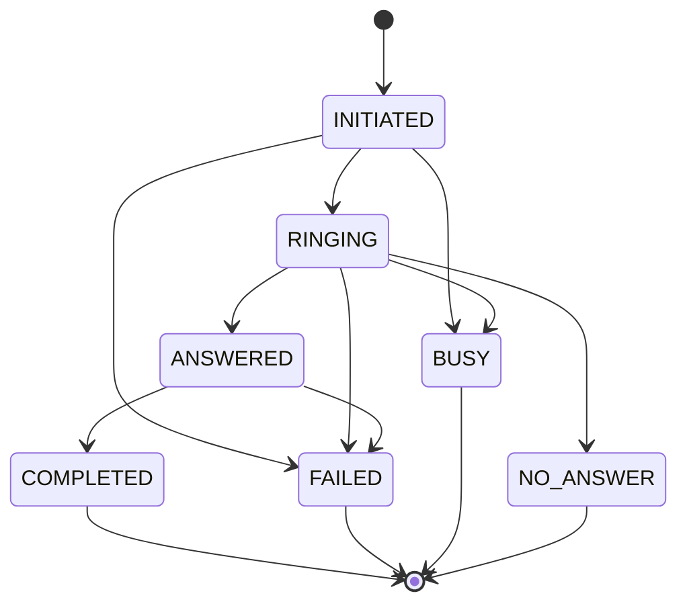

# API and Webhook Documentation

## API Architecture Overview

OpBX provides a comprehensive REST API for PBX configuration management and a webhook system for real-time call processing. The API is organized into control plane endpoints for CRUD operations and execution plane endpoints for runtime call routing.

### Authentication Methods

#### 1. Cookie-Based Authentication (SPA Frontend)
- **Method**: Laravel Sanctum HTTP-only cookies
- **Usage**: AJAX requests from React frontend
- **Security**: CSRF protection, session regeneration
- **Auto-detection**: X-Requested-With header

#### 2. Token-Based Authentication (API Clients)
- **Method**: Bearer tokens with 24-hour expiration
- **Header**: `Authorization: Bearer {token}`
- **Security**: All existing tokens revoked on login

### Rate Limiting
- **API calls**: 60 requests/minute per organization
- **Webhooks**: 100 requests/minute per organization
- **Voice routing**: 1000 requests/minute per organization
- **Auth attempts**: 5 requests/minute per user

## REST API Endpoints

### Authentication Endpoints

```http
POST   /api/v1/auth/login
POST   /api/v1/auth/logout
POST   /api/v1/auth/refresh
GET    /api/v1/auth/me
```

**Login Request:**
```json
{
  "email": "admin@company.com",
  "password": "secure_password",
  "organization_slug": "company"
}
```

**Login Response:**
```json
{
  "user": {
    "id": 1,
    "name": "Admin User",
    "email": "admin@company.com",
    "role": "owner",
    "organization": {
      "id": 1,
      "name": "Company Inc",
      "slug": "company"
    }
  }
}
```

### User Management

```http
GET    /api/v1/users
POST   /api/v1/users
GET    /api/v1/users/{id}
PUT    /api/v1/users/{id}
DELETE /api/v1/users/{id}
GET    /api/v1/users/{id}/password
PUT    /api/v1/users/{id}/reset-password
```

**Create User Request:**
```json
{
  "name": "John Doe",
  "email": "john@company.com",
  "role": "pbx_user",
  "phone": "+14155551234",
  "password": "temporary_password"
}
```

### Extension Management

```http
GET    /api/v1/extensions
POST   /api/v1/extensions
GET    /api/v1/extensions/{id}
PUT    /api/v1/extensions/{id}
DELETE /api/v1/extensions/{id}
```

**Create Extension Request:**
```json
{
  "extension_number": "1001",
  "type": "user",
  "user_id": 1,
  "password": "sip_password_123",
  "voicemail_enabled": true
}
```

**Create Conference Extension Request:**
```json
{
  "extension_number": "2001",
  "type": "conference",
  "configuration": {
    "max_participants": 10,
    "start_conference_on_enter": true,
    "mute_on_entry": false
  }
}
```

### Ring Group Management

```http
GET    /api/v1/ring-groups
POST   /api/v1/ring-groups
GET    /api/v1/ring-groups/{id}
PUT    /api/v1/ring-groups/{id}
DELETE /api/v1/ring-groups/{id}
```

**Create Ring Group Request:**
```json
{
  "name": "Sales Team",
  "description": "Main sales line",
  "strategy": "simultaneous",
  "timeout": 30,
  "members": [
    {
      "extension_id": 1,
      "priority": 1
    },
    {
      "extension_id": 2,
      "priority": 1
    }
  ]
}
```

### DID Management

```http
GET    /api/v1/phone-numbers
POST   /api/v1/phone-numbers
GET    /api/v1/phone-numbers/{id}
PUT    /api/v1/phone-numbers/{id}
DELETE /api/v1/phone-numbers/{id}
```

**Create DID Request:**
```json
{
  "phone_number": "+14155559876",
  "friendly_name": "Main Line",
  "routing_type": "ring_group",
  "routing_config": {
    "ring_group_id": 1
  }
}
```

### IVR Menu Management

```http
GET    /api/v1/ivr-menus
POST   /api/v1/ivr-menus
GET    /api/v1/ivr-menus/{id}
PUT    /api/v1/ivr-menus/{id}
DELETE /api/v1/ivr-menus/{id}
GET    /api/v1/ivr-menus/voices
```

**Create IVR Menu Request:**
```json
{
  "name": "Main Menu",
  "greeting_message": "Welcome to our company. Press 1 for sales, 2 for support.",
  "tts_voice": "en-US-Wavenet-A",
  "timeout": 5,
  "options": [
    {
      "digit": "1",
      "description": "Sales Department",
      "destination_type": "ring_group",
      "destination_id": 1
    },
    {
      "digit": "2",
      "description": "Support",
      "destination_type": "extension",
      "destination_id": 2
    }
  ]
}
```

### Business Hours Management

```http
GET    /api/v1/business-hours
POST   /api/v1/business-hours
GET    /api/v1/business-hours/{id}
PUT    /api/v1/business-hours/{id}
DELETE /api/v1/business-hours/{id}
POST   /api/v1/business-hours/{id}/duplicate
```

**Create Business Hours Schedule:**
```json
{
  "name": "Standard Hours",
  "description": "Monday-Friday 9-5",
  "timezone": "America/New_York",
  "rules": [
    {
      "day_of_week": "monday",
      "start_time": "09:00:00",
      "end_time": "17:00:00"
    },
    {
      "day_of_week": "tuesday",
      "start_time": "09:00:00",
      "end_time": "17:00:00"
    }
  ],
  "destinations": [
    {
      "type": "business_hours",
      "destination_type": "ring_group",
      "destination_id": 1
    },
    {
      "type": "after_hours",
      "destination_type": "voicemail"
    }
  ]
}
```

### Call Logs & Reporting

```http
GET    /api/v1/call-logs
GET    /api/v1/call-logs/active
GET    /api/v1/call-logs/statistics
GET    /api/v1/call-logs/{id}
GET    /api/v1/call-detail-records
GET    /api/v1/call-detail-records/statistics
GET    /api/v1/call-detail-records/{id}
```

**Call Logs Response:**
```json
{
  "data": [
    {
      "id": 1,
      "call_id": "abc123-def456",
      "direction": "inbound",
      "from_number": "+14155551234",
      "to_number": "+14155559876",
      "status": "completed",
      "duration": 120,
      "initiated_at": "2024-01-11T10:00:00Z",
      "answered_at": "2024-01-11T10:00:15Z",
      "ended_at": "2024-01-11T10:02:00Z",
      "extension": {
        "id": 1,
        "extension_number": "1001",
        "user": {
          "name": "John Doe"
        }
      }
    }
  ],
  "meta": {
    "pagination": {
      "current_page": 1,
      "per_page": 25,
      "total": 150
    }
  }
}
```

### Recording Management

```http
GET    /api/v1/recordings
GET    /api/v1/recordings/{id}
DELETE /api/v1/recordings/{id}
GET    /api/v1/recordings/{id}/download
```

### Cloudonix Settings

```http
GET    /api/v1/settings/cloudonix
PUT    /api/v1/settings/cloudonix
POST   /api/v1/settings/cloudonix/validate
POST   /api/v1/settings/cloudonix/generate-requests-key
GET    /api/v1/settings/cloudonix/outbound-trunks
```

## Webhook Endpoints

### Voice Routing Webhooks (Execution Plane)

#### Call Routing Endpoint
```http
POST   /voice/route
```
**Authentication**: Bearer token (`domain_requests_api_key`)
**Purpose**: Initial inbound call routing decisions
**Response**: CXML routing instructions

**Request Payload:**
```json
{
  "call_id": "abc123-def456-ghi789",
  "from": "+14155551234",
  "to": "+14155559876",
  "did": "+14155559876",
  "timestamp": 1703123456,
  "direction": "inbound",
  "status": "initiated",
  "organization_id": 1
}
```

**CXML Response Examples:**

**Direct Extension Routing:**
```xml
<?xml version="1.0" encoding="UTF-8"?>
<Response>
  <Dial timeout="30">
    <Sip>sip:1001@pbx.company.cloudonix.io</Sip>
  </Dial>
</Response>
```

**Ring Group Routing:**
```xml
<?xml version="1.0" encoding="UTF-8"?>
<Response>
  <Dial timeout="30">
    <Sip>sip:1001@pbx.company.cloudonix.io</Sip>
    <Sip>sip:1002@pbx.company.cloudonix.io</Sip>
    <Sip>sip:1003@pbx.company.cloudonix.io</Sip>
  </Dial>
</Response>
```

**IVR Menu:**
```xml
<?xml version="1.0" encoding="UTF-8"?>
<Response>
  <Gather action="/voice/ivr-input" timeout="5" finishOnKey="#" minDigits="1" maxDigits="1">
    <Say voice="en-US-Wavenet-A" language="en-US">Welcome to our company. Press 1 for sales, 2 for support.</Say>
  </Gather>
</Response>
```

**Conference Room:**
```xml
<?xml version="1.0" encoding="UTF-8"?>
<Response>
  <Dial timeout="30">
    <Conference startConferenceOnEnter="true" endConferenceOnExit="false" maxParticipants="10" muteOnEntry="false" announceJoinLeave="false">
      conference_room_abc123
    </Conference>
  </Dial>
</Response>
```

#### IVR Input Processing
```http
POST   /voice/ivr-input
```
**Authentication**: Bearer token
**Purpose**: Process DTMF input from IVR menus
**Response**: CXML routing based on selected option

#### Ring Group Callback
```http
POST   /callbacks/voice/ring-group-callback
```
**Authentication**: Bearer token
**Purpose**: Handle ring group completion/failure
**Response**: CXML for fallback routing

### Status Webhooks (Asynchronous)

#### Call Initiation Webhook
```http
POST   /webhooks/cloudonix/call-initiated
```
**Authentication**: HMAC-SHA256 signature
**Purpose**: Log inbound call initiation
**Response**: JSON success/error

**Payload:**
```json
{
  "call_id": "abc123-def456-ghi789",
  "from": "+14155551234",
  "to": "+14155559876",
  "did": "+14155559876",
  "timestamp": 1703123456,
  "direction": "inbound",
  "status": "initiated",
  "organization_id": 1
}
```

#### Call Status Updates
```http
POST   /webhooks/cloudonix/call-status
```
**Authentication**: HMAC-SHA256 signature
**Purpose**: Real-time call state changes
**Response**: JSON success/error

**Payload:**
```json
{
  "id": 123456789,
  "eventId": "evt_abc123",
  "domainId": 987654,
  "domain": "company.cloudonix.io",
  "subscriberId": 5551234,
  "callerId": "+14155551234",
  "destination": "+14155559876",
  "direction": "incoming",
  "status": "ringing",
  "createdAt": "2024-01-11T10:30:00Z",
  "modifiedAt": "2024-01-11T10:30:05Z",
  "callStartTime": 1704969000000,
  "callAnswerTime": null,
  "answerTime": null,
  "timeLimit": 3600,
  "vappServer": "vapp-01.cloudonix.net",
  "action": "call",
  "reason": null,
  "lastError": null,
  "callIds": ["abc123-def456"],
  "profile": {
    "custom_data": {}
  }
}
```

#### Session Updates
```http
POST   /webhooks/cloudonix/session-update
```
**Authentication**: HMAC-SHA256 signature
**Purpose**: High-frequency call monitoring
**Response**: JSON success/error

#### Call Detail Records
```http
POST   /webhooks/cloudonix/cdr
```
**Authentication**: HMAC-SHA256 or domain UUID
**Purpose**: Final call completion and billing
**Response**: JSON success/error

**Payload:**
```json
{
  "timestamp": 1703123456,
  "session": {
    "token": "session_token_123",
    "id": 123456789,
    "callStartTime": 1703123400000,
    "callEndTime": 1703123460000,
    "callAnswerTime": 1703123410000,
    "status": "completed"
  },
  "from": "+14155551234",
  "to": "+14155559876",
  "disposition": "ANSWERED",
  "duration": 60,
  "billsec": 58,
  "call_id": "abc123-def456-ghi789",
  "domain": "company.cloudonix.io",
  "subscriber": "user@company.cloudonix.io",
  "cx_trunk_id": 12345,
  "application": "voice-app-01",
  "route": "inbound-did",
  "rated_cost": 0.012,
  "approx_cost": 0.01,
  "sell_cost": 0.008,
  "vapp_server": "vapp-01.cloudonix.net",
  "recording_url": "https://storage.cloudonix.com/recordings/rec_123.mp3",
  "owner": {
    "domain": {
      "uuid": "domain-uuid-123-456-789"
    }
  }
}
```

## Webhook Authentication Details

### Voice Webhook Authentication
**Middleware**: `VerifyVoiceWebhookAuth`
**Methods** (tried in order):
1. `X-Cx-Apikey` header
2. `Authorization: Bearer {token}` header
3. Domain name lookup in `cloudonix_settings.domain_name`
4. DID/extension number lookup

**Security Features:**
- Constant-time string comparison
- Timestamp validation (5-minute window)
- Organization identification and isolation

### Status Webhook Authentication
**Middleware**: `VerifyCloudonixSignature`
**Method**: HMAC-SHA256 signature verification
**Secret**: `CLOUDONIX_WEBHOOK_SECRET` environment variable
**Header**: `X-Cloudonix-Signature: {signature}`

**Special CDR Authentication:**
- No signature required for CDRs
- Organization identified by `owner.domain.uuid`
- Matched against `cloudonix_settings.domain_uuid`

## Error Responses

### API Error Response
```json
{
  "message": "Validation failed",
  "errors": {
    "email": ["The email field is required."],
    "password": ["The password must be at least 8 characters."]
  }
}
```

### Webhook Error Response (JSON)
```json
{
  "error": "Invalid signature",
  "code": "INVALID_SIGNATURE"
}
```

### Webhook Error Response (CXML)
```xml
<?xml version="1.0" encoding="UTF-8"?>
<Response>
  <Say language="en-US">Authentication failed. Please contact support.</Say>
  <Hangup/>
</Response>
```

## Call State Machine

### Status Transitions


### State Management Features
- **Distributed Locks**: Redis-based per call_id
- **Idempotency**: Webhook deduplication with TTL
- **Atomic Updates**: Database transactions
- **Cache Invalidation**: Automatic cleanup

## CXML Builder Patterns

### Common Operations
```php
// Direct extension dial
CxmlBuilder::dialExtension('sip:1001@domain', 30);

// Ring group
CxmlBuilder::dialRingGroup(['sip:1001@domain', 'sip:1002@domain'], 30);

// Voicemail
CxmlBuilder::sendToVoicemail('/webhooks/voicemail-processed');

// IVR gather
CxmlBuilder::gatherInput('/voice/ivr-input', 'Press 1 for sales...', 5);

// Conference
CxmlBuilder::joinConference('conf_123', 10, true, false);
```

### Error Handling
```php
// Authentication failure
CxmlBuilder::error('Authentication failed', 401);

// Busy signal
CxmlBuilder::busy('All agents are busy. Please try again later.');

// Unavailable
CxmlBuilder::unavailable('The extension is currently unavailable.');
```

## API Response Patterns

### Paginated Response
```json
{
  "data": [...],
  "meta": {
    "pagination": {
      "current_page": 1,
      "per_page": 25,
      "total": 150,
      "last_page": 6,
      "from": 1,
      "to": 25
    }
  },
  "links": {
    "first": "https://api.example.com/users?page=1",
    "last": "https://api.example.com/users?page=6",
    "prev": null,
    "next": "https://api.example.com/users?page=2"
  }
}
```

### Resource Response
```json
{
  "data": {
    "id": 1,
    "name": "John Doe",
    "email": "john@example.com",
    "created_at": "2024-01-11T10:00:00Z",
    "updated_at": "2024-01-11T10:00:00Z"
  }
}
```

### Statistics Response
```json
{
  "total_calls": 1250,
  "answered_calls": 1100,
  "average_duration": 180,
  "total_duration": 225000,
  "by_hour": [
    {"hour": "09", "calls": 45},
    {"hour": "10", "calls": 67}
  ],
  "by_day": [
    {"date": "2024-01-11", "calls": 120},
    {"date": "2024-01-10", "calls": 98}
  ]
}
```

This API provides comprehensive PBX management capabilities with secure authentication, real-time webhook processing, and robust error handling suitable for production business environments.