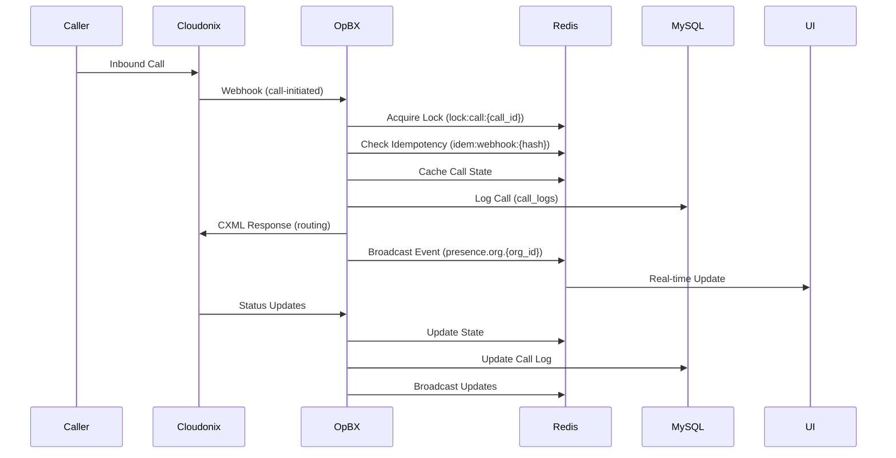
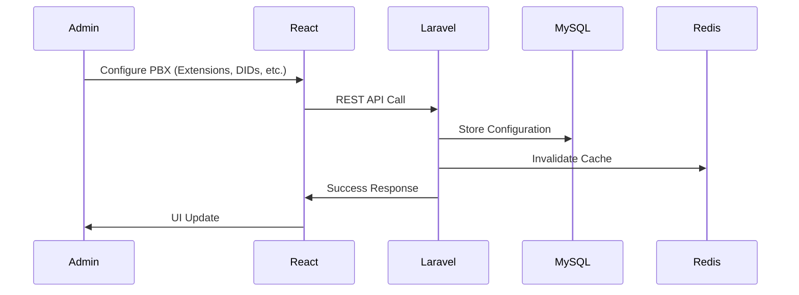

# OpBX Architecture Overview

## System Architecture

OpBX (Open Source PBX) is a containerized business PBX application built on top of the Cloudonix CPaaS platform. It provides enterprise-grade call routing, ring groups, business hours management, and real-time call monitoring without managing SIP infrastructure.

### Core Principles

- **Cloudonix-Only VoIP**: All telephony handled by Cloudonix CPaaS
- **Configuration + Runtime Decisions**: App manages PBX logic, not SIP server
- **Multi-Tenant**: Complete organization isolation
- **Real-Time**: WebSocket-based live call presence
- **Containerized**: Docker-first development and deployment

## Architecture Layers

### Control Plane (Configuration)

The control plane handles all CRUD operations for PBX configuration and user management.

**Components:**
- React SPA frontend for administrative interface
- Laravel API backend with REST endpoints
- MySQL database as single source of truth
- RBAC authorization with tenant isolation

**Responsibilities:**
- User and organization management
- Extension, DID, and ring group configuration
- Business hours and routing rules
- Call logs and reporting
- Administrative UI

### Execution Plane (Runtime Call Processing)

The execution plane handles real-time call routing decisions and state management.

**Components:**
- Webhook ingestion endpoints
- Redis-based caching and locking
- Queue workers for async processing
- CXML response generation
- WebSocket broadcasting

**Responsibilities:**
- Inbound call webhook processing
- Real-time call state management
- Call routing decision logic
- CXML response generation for Cloudonix
- Live call presence updates

## Technology Stack

### Backend (Laravel)
- **Framework**: Laravel 12 (PHP 8.4+)
- **Database**: MySQL 8.0 with full-text indexes
- **Cache/Queue**: Redis 7 with automatic cache invalidation
- **API**: RESTful with Laravel Sanctum authentication
- **WebSockets**: Laravel Broadcasting with Soketi for real-time updates

### Frontend (React SPA)
- **Framework**: React 18 with TypeScript
- **Build Tool**: Vite
- **UI Library**: Radix UI components with Tailwind CSS
- **State Management**: Zustand + React Query
- **Routing**: React Router
- **Real-time**: Laravel Echo with Pusher.js

### Infrastructure (Docker)
- **Containerization**: Docker Compose with multi-service architecture
- **Web Server**: nginx with PHP-FPM
- **Queue Processing**: Laravel queue workers (Redis driver)
- **Task Scheduling**: Laravel scheduler with cron
- **Local Development**: ngrok for webhook tunneling
- **File Storage**: MinIO S3-compatible object storage
- **WebSocket Server**: Soketi (Laravel Echo server)

## Data Flow Architecture

### Inbound Call Flow

### Configuration Flow

## Component Relationships

### Backend Services

- **CallRoutingService**: Inbound call routing logic and CXML generation
- **VoiceRoutingManager**: Unified voice call routing coordinator
- **CloudonixClient**: HTTP client for Cloudonix REST API with circuit breaker
- **CallStateManager**: Finite state machine for call lifecycle
- **CxmlBuilder**: Fluent interface for Cloudonix XML responses

### Frontend Architecture

- **Feature-based components**: Organized by business domain (Users, Extensions, RingGroups, etc.)
- **Custom hooks**: Data fetching, mutations, real-time subscriptions
- **Service layer**: Centralized API client with error handling
- **State management**: React Query for server state, Context for client state

## Security Architecture

### Multi-Tenancy
- **OrganizationScope**: Global Eloquent scope ensuring user only accesses their organization's data
- **Zero-result queries**: When unauthenticated, all queries return no results
- **Middleware enforcement**: EnsureTenantScope, EnsureWebhookIdempotency

### Authentication
- **Dual modes**: Cookie-based (SPA) and token-based (API)
- **Laravel Sanctum**: HttpOnly session cookies with secure configuration
- **RBAC**: Owner → PBX Admin → PBX User → Reporter hierarchy

### Webhook Security
- **Voice webhooks**: Bearer token authentication
- **Status/CDR webhooks**: HMAC-SHA256 signature verification
- **Idempotency**: Redis-based duplicate prevention
- **Rate limiting**: Organization-based limits

## Performance Characteristics

### Caching Strategy
- **MySQL**: Durable configuration data
- **Redis**: Ephemeral call state, routing cache, locks, queues
- **Multi-layer**: OPcache + Redis for optimal performance

### Scalability
- **Horizontal scaling**: Stateless application containers
- **Redis clustering**: Supports high-availability deployments
- **Queue workers**: Async processing for reliability

### Real-Time Features
- **WebSocket broadcasting**: Laravel Echo with Soketi server
- **Presence channels**: Organization-based real-time updates
- **Event-driven**: Sub-10ms p99 message delivery

## Deployment Architecture

### Docker Services
- **frontend**: React SPA (port 3000)
- **nginx**: Web server with PHP-FPM (port 80)
- **app**: Laravel application container
- **queue-worker**: Laravel queue processing
- **scheduler**: Laravel cron jobs
- **mysql**: Database (port 3306)
- **redis**: Cache/Queue (port 6379)
- **minio**: File storage (ports 9000/9001)
- **soketi**: WebSocket server (port 6001)
- **ngrok**: Webhook tunneling (port 4040)

### Production Considerations
- **Load balancing**: nginx upstream for app containers
- **Database replication**: MySQL master-slave setup
- **Redis cluster**: High availability for cache/queues
- **Monitoring**: Health checks, structured logging, metrics collection

## Development Workflow

### Local Development
- **Docker Compose**: One-command environment startup
- **Hot reload**: Vite for frontend, file watching for backend
- **ngrok integration**: Automatic webhook tunneling
- **Database migrations**: Auto-run on container startup

### Testing Strategy
- **Unit tests**: Business logic and utilities
- **Feature tests**: API endpoints and webhooks
- **Integration tests**: Full request/response cycles
- **Security tests**: Authentication, authorization, input validation

This architecture provides a scalable, secure, and maintainable foundation for a business PBX system that leverages Cloudonix for all telephony infrastructure while handling routing logic and configuration management entirely within the application.