# Call Flows and State Machine

## Overview

OpBX implements a comprehensive call routing system that handles inbound calls through Cloudonix webhooks, processes them through a finite state machine, and provides real-time updates to the UI. This document outlines the call flow diagrams and state management logic.

## Call Lifecycle State Machine

### Call Status Enum

```php
enum CallStatus: string
{
    case INITIATED = 'initiated';    // Initial webhook received
    case RINGING = 'ringing';        // Call sent to destination(s)
    case ANSWERED = 'answered';      // Call answered by extension
    case COMPLETED = 'completed';    // Call ended successfully
    case BUSY = 'busy';             // Destination busy
    case NO_ANSWER = 'no_answer';    // No answer within timeout
    case FAILED = 'failed';         // Call failed (technical error)
}
```

### State Transition Diagram

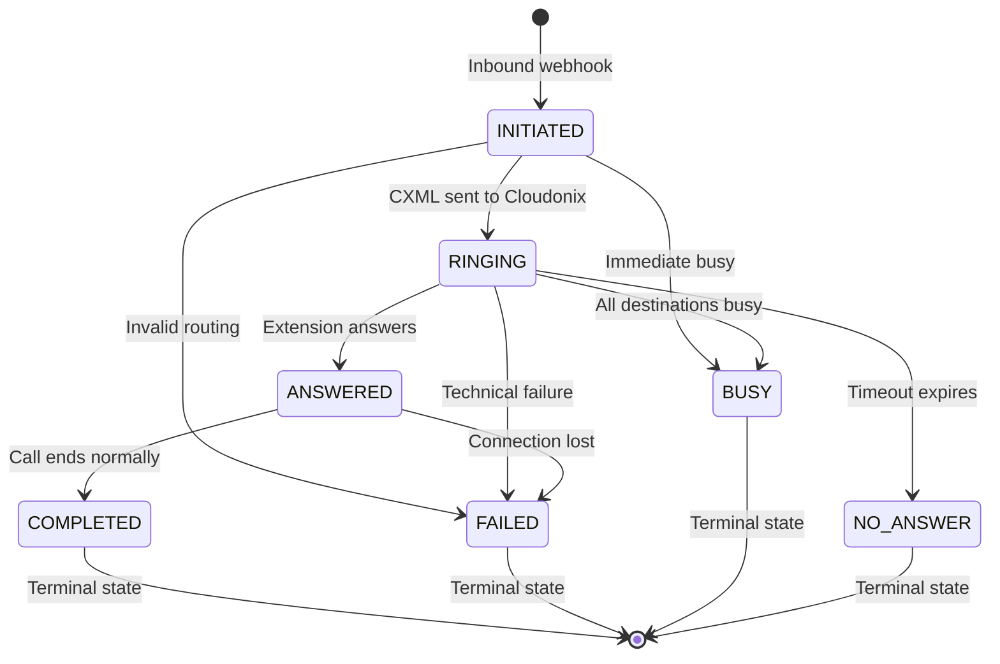

### State Transition Rules

| From State | To State | Conditions | Actions |
|------------|----------|------------|---------|
| INITIATED | RINGING | Valid routing found | Send CXML to Cloudonix |
| INITIATED | FAILED | Invalid DID/extension | Send error CXML |
| INITIATED | BUSY | Immediate busy response | Send busy CXML |
| RINGING | ANSWERED | Status webhook: answered | Update call log |
| RINGING | NO_ANSWER | Timeout reached | Process no-answer logic |
| RINGING | BUSY | All destinations busy | Send busy CXML |
| RINGING | FAILED | Technical error | Log error |
| ANSWERED | COMPLETED | Normal hangup | Calculate duration |
| ANSWERED | FAILED | Connection lost | Mark as failed |

## Inbound Call Flow

### Complete Inbound Call Sequence

```mermaid
sequenceDiagram
    participant Caller
    participant Cloudonix
    participant OpBX
    participant Redis
    participant MySQL
    participant UI

    Note over Caller,UI: Inbound Call Processing

    Caller->>Cloudonix: Phone Call
    Cloudonix->>OpBX: POST /webhooks/cloudonix/call-initiated
    OpBX->>OpBX: VerifyWebhookAuth (HMAC-SHA256)

    OpBX->>Redis: Lock call:{call_id}
    OpBX->>Redis: Check idempotency key

    OpBX->>MySQL: INSERT call_logs (INITIATED)
    OpBX->>Redis: Cache call state

    OpBX->>OpBX: Determine routing (DID → extension/ring_group/business_hours)
    OpBX->>Redis: Cache routing decision

    OpBX->>Cloudonix: POST /voice/route (CXML response)
    Cloudonix->>OpBX: 200 OK

    OpBX->>Redis: Update state to RINGING
    OpBX->>Redis: Broadcast call.initiated event
    Redis->>UI: Real-time notification

    Cloudonix->>OpBX: POST /webhooks/cloudonix/call-status (ringing)
    OpBX->>Redis: Update state
    OpBX->>Redis: Broadcast call.status event

    Cloudonix->>OpBX: POST /webhooks/cloudonix/call-status (answered)
    OpBX->>MySQL: UPDATE call_logs (answered_at)
    OpBX->>Redis: Update state to ANSWERED
    OpBX->>Redis: Broadcast call.answered event
    Redis->>UI: Update UI

    Cloudonix->>OpBX: POST /webhooks/cloudonix/cdr
    OpBX->>MySQL: UPDATE call_logs (COMPLETED, duration)
    OpBX->>Redis: Update final state
    OpBX->>Redis: Broadcast call.ended event
    Redis->>UI: Final update
```

### Routing Decision Flow

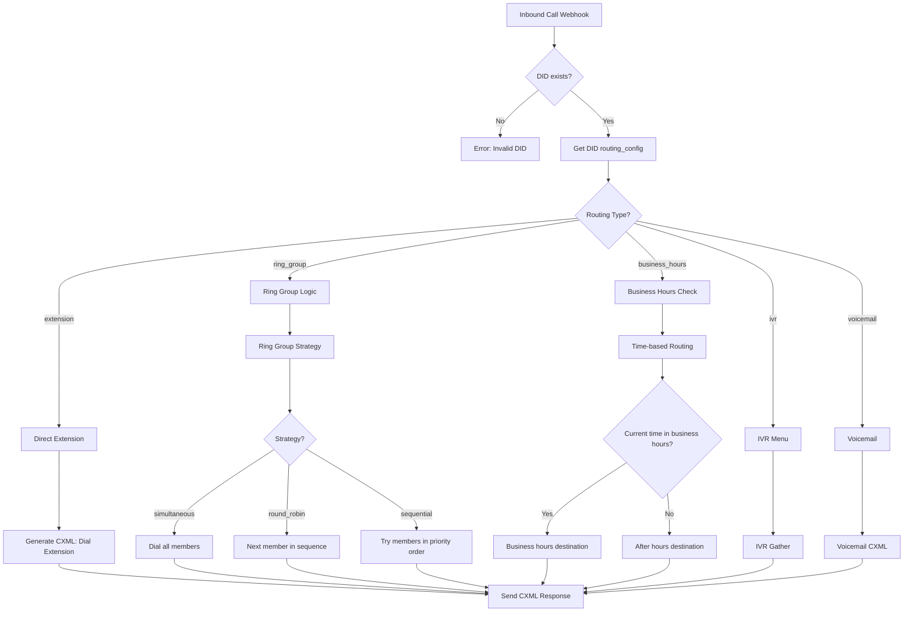

## Routing Strategy Details

### Direct Extension Routing

```mermaid
flowchart TD
    A[Direct Extension] --> B{Extension active?}
    B -->|No| C[Error: Extension inactive]
    B -->|Yes| D{User assigned?}
    D -->|No| E[Conference/IVR/Custom logic]
    D -->|Yes| F{User available?}
    F -->|No| G[Send to voicemail]
    F -->|Yes| H[Generate SIP URI]
    H --> I[Dial sip:{ext}@{domain}]
```

### Ring Group Routing

#### Simultaneous Strategy
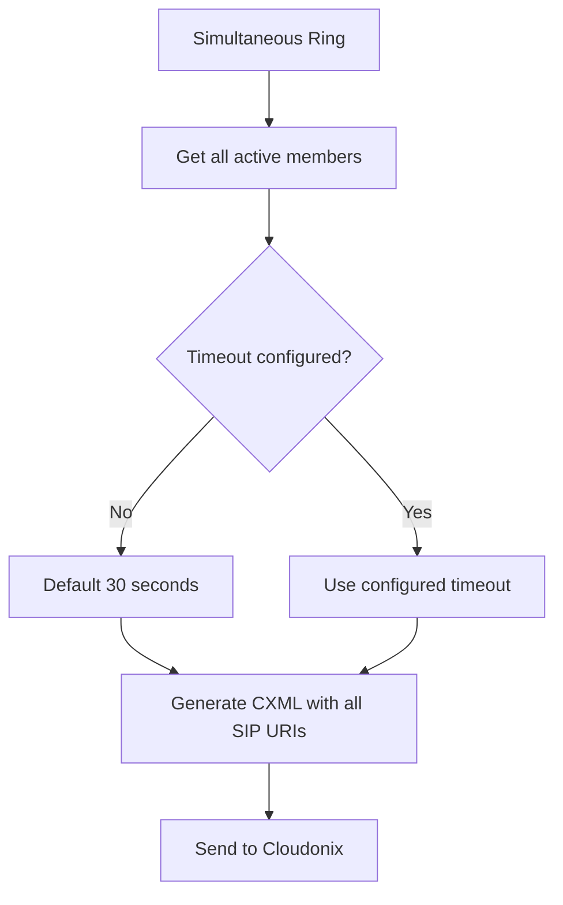

#### Round Robin Strategy
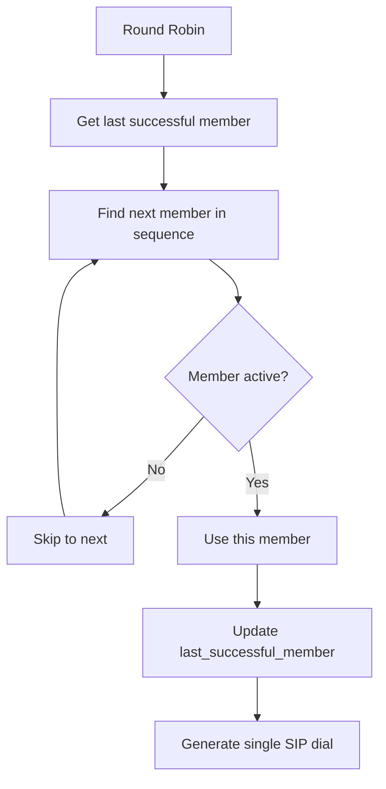

#### Sequential Strategy
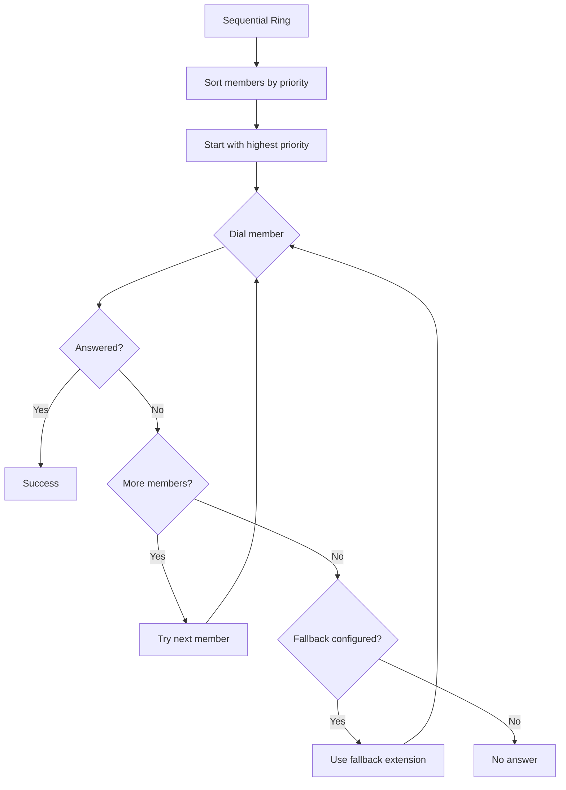

### Business Hours Routing

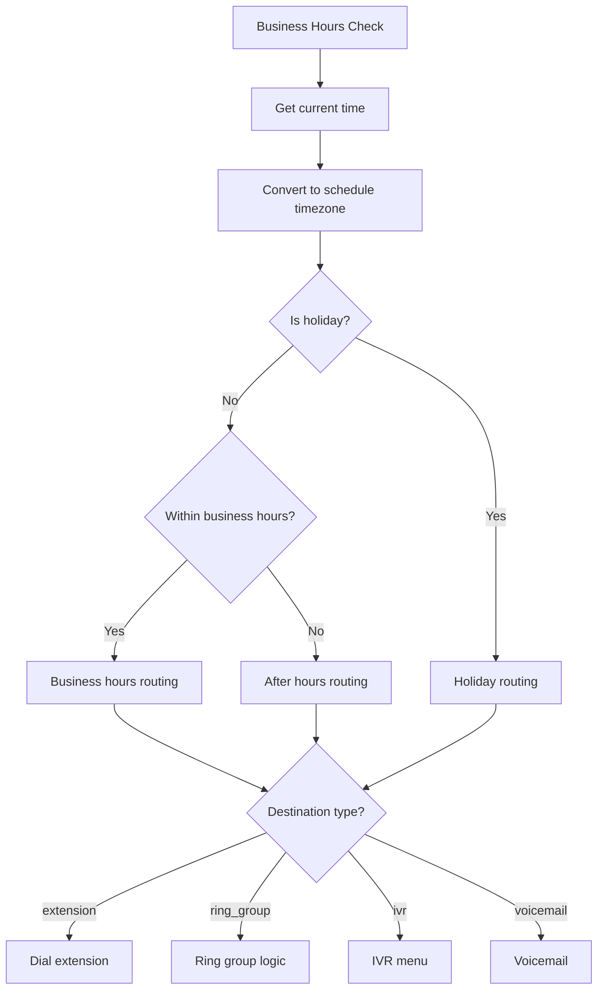

### IVR Menu Processing

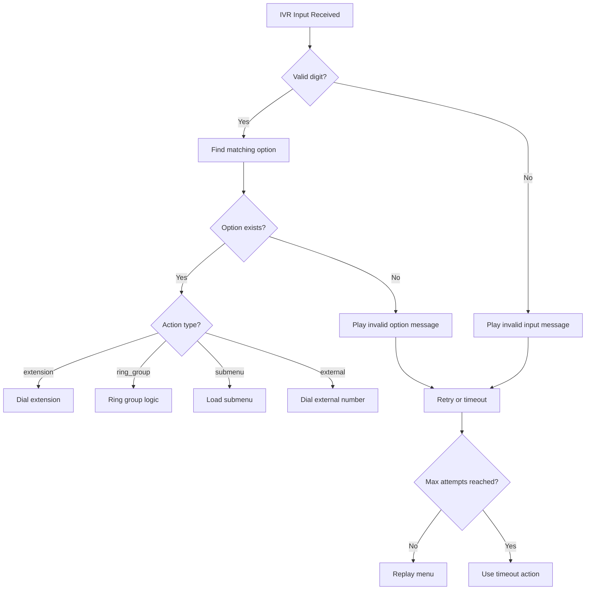

## Error Handling Flows

### Authentication Failure

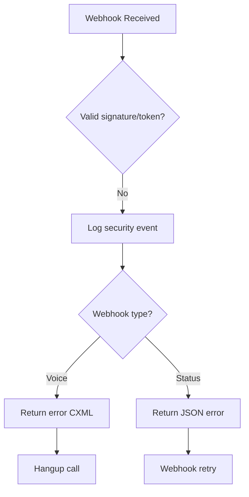

### Routing Failure

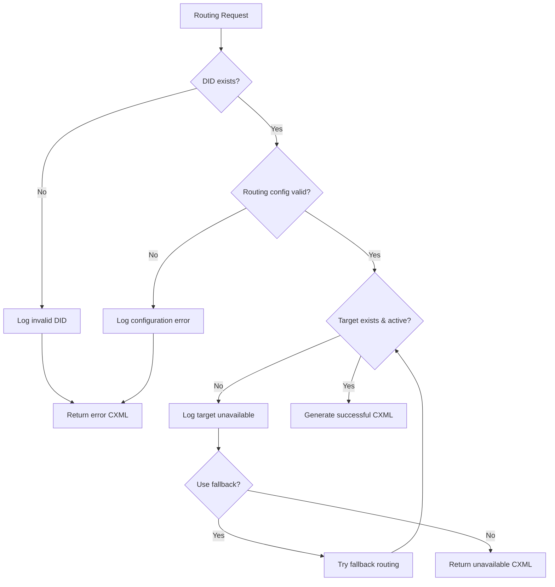

## Real-Time Update Flow

### WebSocket Event Broadcasting

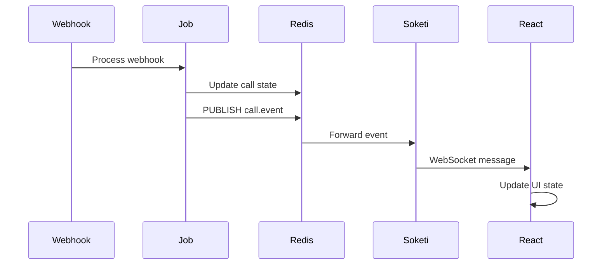

### Event Types and Payloads

```typescript
// Call initiated
{
    event: 'call.initiated',
    data: {
        call_id: string;
        from_number: string;
        to_number: string;
        did_id: number | null;
        status: 'initiated';
        initiated_at: string;
    }
}

// Call answered
{
    event: 'call.answered',
    data: {
        call_id: string;
        status: 'answered';
        answered_at: string;
        extension_id: number;
    }
}

// Call ended
{
    event: 'call.ended',
    data: {
        call_id: string;
        status: 'completed' | 'failed' | 'busy' | 'no_answer';
        ended_at: string;
        duration: number;
    }
}
```

## Performance Optimization

### Caching Strategy

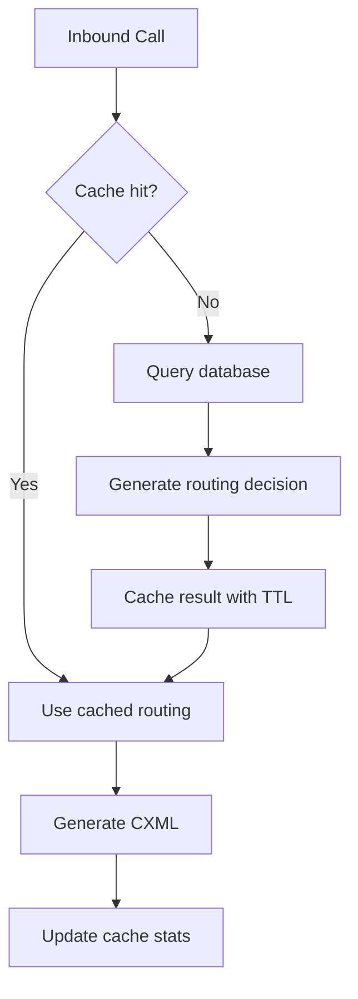

### Cache Invalidation

- **Model observers** automatically clear routing cache when configurations change
- **Time-based expiration** ensures cache freshness
- **Broadcast events** trigger UI cache invalidation

## Failure Scenarios

### Webhook Retry Handling

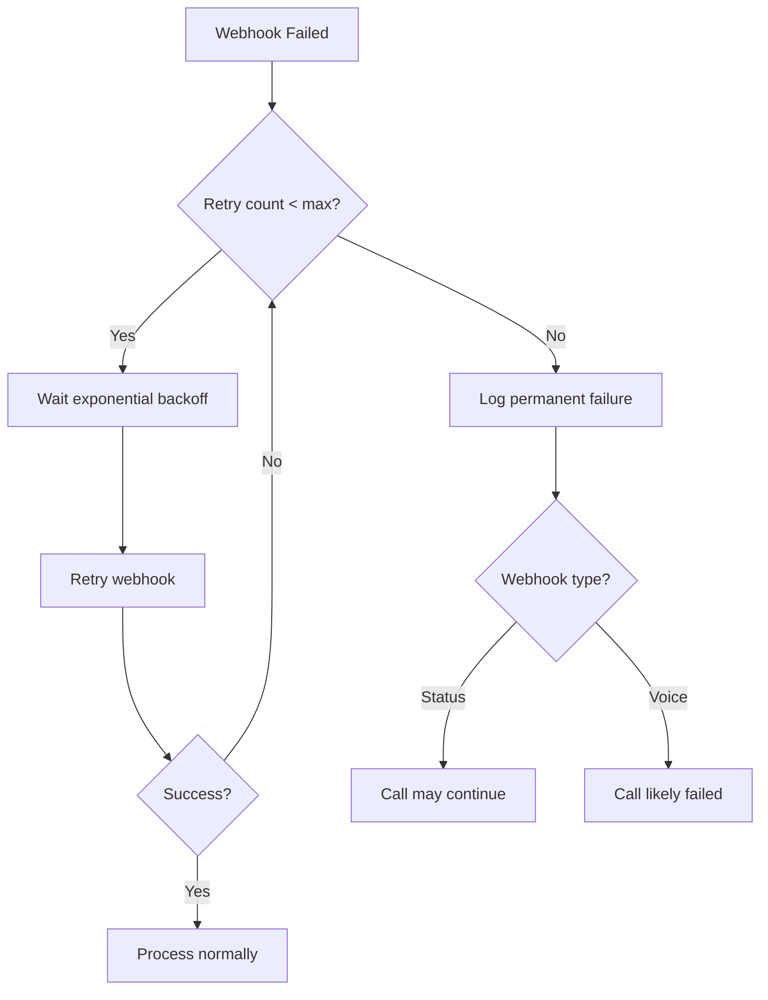

### Circuit Breaker Pattern

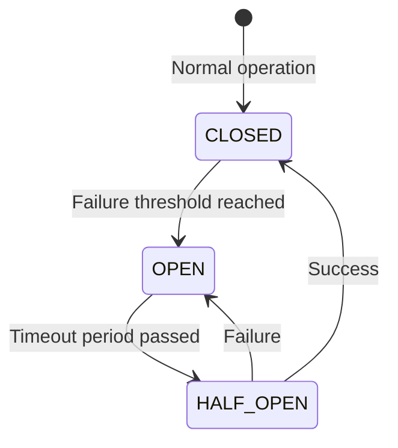

## Monitoring and Observability

### Key Metrics

- **Call completion rate**: Successful calls / total calls
- **Average answer time**: Time from ring to answer
- **Routing cache hit rate**: Cache hits / total lookups
- **Webhook processing latency**: Time to process webhooks
- **State transition errors**: Failed state changes

### Logging

- **Call correlation**: All logs include `call_id` for tracing
- **Security events**: Authentication failures, invalid signatures
- **Performance metrics**: Cache hits, database query times
- **Error tracking**: Failed routing attempts, webhook errors

This comprehensive call flow system ensures reliable, high-performance call processing with real-time updates, proper error handling, and extensive monitoring capabilities.