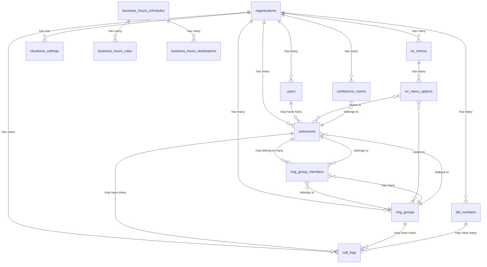

# Database Schema Documentation

## Overview

OpBX uses MySQL 8.0 as the single source of truth for all persistent data. Redis is used for ephemeral state management (call state, caching, locks, queues). All tables include `organization_id` for multi-tenant isolation.

## Core Tables

### Organizations (`organizations`)
Multi-tenant foundation table with organization-specific settings.

| Column | Type | Key | Description |
|--------|------|-----|-------------|
| `id` | BIGINT UNSIGNED | PK | Auto-incrementing primary key |
| `name` | VARCHAR(255) | | Organization display name |
| `slug` | VARCHAR(255) | UNIQUE | URL-friendly identifier |
| `status` | ENUM('active', 'suspended', 'deleted') | | Organization status |
| `timezone` | VARCHAR(50) | | Default timezone (UTC default) |
| `settings` | JSON | NULL | Organization-specific settings |
| `created_at` | TIMESTAMP | | Creation timestamp |
| `updated_at` | TIMESTAMP | | Last update timestamp |
| `deleted_at` | TIMESTAMP | NULL | Soft delete timestamp |

**Indexes:**
- `status` (for filtering active organizations)
- `created_at` (for chronological queries)

### Users (`users`)
User accounts with RBAC roles and contact information.

| Column | Type | Key | Description |
|--------|------|-----|-------------|
| `id` | BIGINT UNSIGNED | PK | Auto-incrementing primary key |
| `organization_id` | BIGINT UNSIGNED | FK → organizations | Tenant isolation |
| `name` | VARCHAR(255) | | Full display name |
| `email` | VARCHAR(255) | UNIQUE | Login email address |
| `email_verified_at` | TIMESTAMP | NULL | Email verification timestamp |
| `password` | VARCHAR(255) | | Bcrypt-hashed password |
| `role` | ENUM('owner', 'pbx_admin', 'pbx_user', 'reporter') | | RBAC role |
| `status` | ENUM('active', 'inactive', 'suspended') | | Account status |
| `phone` | VARCHAR(20) | NULL | Contact phone number |
| `street_address` | VARCHAR(255) | NULL | Address line 1 |
| `city` | VARCHAR(100) | NULL | City |
| `state_province` | VARCHAR(100) | NULL | State/Province |
| `postal_code` | VARCHAR(20) | NULL | Postal/ZIP code |
| `country` | VARCHAR(2) | NULL | ISO 3166-1 alpha-2 country code |
| `remember_token` | VARCHAR(100) | NULL | Laravel remember token |
| `created_at` | TIMESTAMP | | Creation timestamp |
| `updated_at` | TIMESTAMP | | Last update timestamp |

**Indexes:**
- `organization_id + status` (tenant-scoped user queries)
- `email` (login lookups)

### Extensions (`extensions`)
SIP extensions with routing configuration and user assignments.

| Column | Type | Key | Description |
|--------|------|-----|-------------|
| `id` | BIGINT UNSIGNED | PK | Auto-incrementing primary key |
| `organization_id` | BIGINT UNSIGNED | FK → organizations | Tenant isolation |
| `user_id` | BIGINT UNSIGNED | FK → users, NULL | Assigned user |
| `extension_number` | VARCHAR(5) | | 3-5 digit extension |
| `type` | ENUM('user', 'conference', 'ring_group', 'ivr', 'ai_assistant', 'custom_logic', 'forward') | | Extension purpose |
| `status` | ENUM('active', 'inactive') | | Extension status |
| `voicemail_enabled` | BOOLEAN | DEFAULT FALSE | Voicemail capability |
| `password` | VARCHAR(255) | | SIP authentication password |
| `cloudonix_subscriber_id` | VARCHAR(50) | NULL | Cloudonix subscriber ID |
| `cloudonix_uuid` | VARCHAR(50) | NULL | Cloudonix UUID |
| `cloudonix_synced` | BOOLEAN | DEFAULT FALSE | Sync status with Cloudonix |
| `configuration` | JSON | NULL | Type-specific settings |
| `service_url` | VARCHAR(500) | NULL | External service URL |
| `service_token` | VARCHAR(255) | NULL | Service authentication token |
| `service_params` | JSON | NULL | Additional service parameters |
| `created_at` | TIMESTAMP | | Creation timestamp |
| `updated_at` | TIMESTAMP | | Last update timestamp |

**Indexes:**
- `organization_id + extension_number` (UNIQUE - tenant-scoped extension lookup)
- `organization_id + status` (active extension queries)
- `organization_id + type` (extension type filtering)
- `user_id` (user extension lookup)

### DID Numbers (`did_numbers`)
Inbound phone numbers with routing configuration.

| Column | Type | Key | Description |
|--------|------|-----|-------------|
| `id` | BIGINT UNSIGNED | PK | Auto-incrementing primary key |
| `organization_id` | BIGINT UNSIGNED | FK → organizations | Tenant isolation |
| `phone_number` | VARCHAR(20) | UNIQUE | E.164 formatted number |
| `friendly_name` | VARCHAR(100) | NULL | Display name |
| `routing_type` | ENUM('extension', 'ring_group', 'business_hours', 'ivr', 'voicemail') | | Routing strategy |
| `routing_config` | JSON | NULL | Routing configuration |
| `status` | ENUM('active', 'inactive') | | DID status |
| `cloudonix_config` | JSON | NULL | Cloudonix-specific settings |
| `created_at` | TIMESTAMP | | Creation timestamp |
| `updated_at` | TIMESTAMP | | Last update timestamp |

**Indexes:**
- `organization_id + status` (active DID queries)
- `phone_number` (number lookup)

## Call Management Tables

### Call Logs (`call_logs`)
Complete call history with Cloudonix correlation.

| Column | Type | Key | Description |
|--------|------|-----|-------------|
| `id` | BIGINT UNSIGNED | PK | Auto-incrementing primary key |
| `organization_id` | BIGINT UNSIGNED | FK → organizations | Tenant isolation |
| `call_id` | VARCHAR(100) | UNIQUE | Cloudonix call ID |
| `direction` | ENUM('inbound', 'outbound') | | Call direction |
| `from_number` | VARCHAR(20) | | Caller ID number |
| `to_number` | VARCHAR(20) | | Destination number |
| `did_id` | BIGINT UNSIGNED | FK → did_numbers, NULL | Associated DID |
| `extension_id` | BIGINT UNSIGNED | FK → extensions, NULL | Associated extension |
| `ring_group_id` | BIGINT UNSIGNED | FK → ring_groups, NULL | Associated ring group |
| `status` | ENUM('initiated', 'ringing', 'answered', 'completed', 'busy', 'no_answer', 'failed') | | Call status |
| `initiated_at` | TIMESTAMP | NULL | Call start time |
| `answered_at` | TIMESTAMP | NULL | Call answer time |
| `ended_at` | TIMESTAMP | NULL | Call end time |
| `duration` | INTEGER UNSIGNED | NULL | Call duration in seconds |
| `recording_url` | VARCHAR(500) | NULL | Recording file URL |
| `cloudonix_cdr` | JSON | NULL | Raw Cloudonix CDR data |
| `created_at` | TIMESTAMP | | Creation timestamp |
| `updated_at` | TIMESTAMP | | Last update timestamp |

**Indexes:**
- `organization_id + created_at` (tenant-scoped chronological queries)
- `call_id` (Cloudonix correlation)
- `from_number + created_at` (caller history)
- `to_number + created_at` (destination history)
- `status` (status filtering)

### Call Detail Records (`call_detail_records`)
Normalized CDR data for reporting and analytics.

| Column | Type | Key | Description |
|--------|------|-----|-------------|
| `id` | BIGINT UNSIGNED | PK | Auto-incrementing primary key |
| `organization_id` | BIGINT UNSIGNED | FK → organizations | Tenant isolation |
| `call_id` | VARCHAR(100) | INDEX | Cloudonix call ID |
| `session_id` | VARCHAR(100) | INDEX | Cloudonix session ID |
| `direction` | ENUM('inbound', 'outbound') | | Call direction |
| `from_number` | VARCHAR(20) | | Caller number |
| `to_number` | VARCHAR(20) | | Called number |
| `disposition` | ENUM('ANSWERED', 'BUSY', 'NO_ANSWER', 'FAILED') | | Call outcome |
| `duration` | INTEGER UNSIGNED | NULL | Total duration |
| `billsec` | INTEGER UNSIGNED | NULL | Billed duration |
| `initiated_at` | TIMESTAMP | NULL | Call start |
| `answered_at` | TIMESTAMP | NULL | Answer time |
| `ended_at` | TIMESTAMP | NULL | End time |
| `recording_url` | VARCHAR(500) | NULL | Recording URL |
| `cost` | DECIMAL(10,6) | NULL | Call cost |
| `cloudonix_data` | JSON | NULL | Raw Cloudonix CDR |
| `created_at` | TIMESTAMP | | Creation timestamp |

**Indexes:**
- `organization_id + created_at` (reporting queries)
- `call_id`, `session_id` (correlation lookups)

## Ring Group Tables

### Ring Groups (`ring_groups`)
Call distribution groups with routing strategies.

| Column | Type | Key | Description |
|--------|------|-----|-------------|
| `id` | BIGINT UNSIGNED | PK | Auto-incrementing primary key |
| `organization_id` | BIGINT UNSIGNED | FK → organizations | Tenant isolation |
| `name` | VARCHAR(100) | | Ring group name |
| `description` | TEXT | NULL | Description |
| `strategy` | ENUM('simultaneous', 'round_robin', 'sequential') | | Distribution method |
| `timeout` | INTEGER UNSIGNED | DEFAULT 30 | Ring timeout seconds |
| `ring_turns` | INTEGER UNSIGNED | DEFAULT 1 | Number of ring cycles |
| `fallback_action` | ENUM('extension', 'hangup') | | Fallback behavior |
| `fallback_extension_id` | BIGINT UNSIGNED | FK → extensions, NULL | Fallback extension |
| `status` | ENUM('active', 'inactive') | | Group status |
| `created_at` | TIMESTAMP | | Creation timestamp |
| `updated_at` | TIMESTAMP | | Last update timestamp |

**Indexes:**
- `organization_id + status` (active groups)
- `organization_id + name` (UNIQUE - name uniqueness per org)

### Ring Group Members (`ring_group_members`)
Many-to-many relationship between ring groups and extensions.

| Column | Type | Key | Description |
|--------|------|-----|-------------|
| `id` | BIGINT UNSIGNED | PK | Auto-incrementing primary key |
| `ring_group_id` | BIGINT UNSIGNED | FK → ring_groups | Ring group reference |
| `extension_id` | BIGINT UNSIGNED | FK → extensions | Extension reference |
| `priority` | INTEGER UNSIGNED | DEFAULT 1 | Sequential priority |
| `created_at` | TIMESTAMP | | Creation timestamp |
| `updated_at` | TIMESTAMP | | Last update timestamp |

**Indexes:**
- `ring_group_id` (group member queries)
- `extension_id` (extension membership)
- `ring_group_id + extension_id` (UNIQUE - prevent duplicates)

## Business Hours Tables

### Business Hours Schedules (`business_hours_schedules`)
Time-based routing rules with holiday support.

| Column | Type | Key | Description |
|--------|------|-----|-------------|
| `id` | BIGINT UNSIGNED | PK | Auto-incrementing primary key |
| `organization_id` | BIGINT UNSIGNED | FK → organizations | Tenant isolation |
| `name` | VARCHAR(100) | | Schedule name |
| `description` | TEXT | NULL | Description |
| `timezone` | VARCHAR(50) | | Schedule timezone |
| `is_default` | BOOLEAN | DEFAULT FALSE | Default schedule |
| `status` | ENUM('active', 'inactive') | | Schedule status |
| `created_at` | TIMESTAMP | | Creation timestamp |
| `updated_at` | TIMESTAMP | | Last update timestamp |

### Business Hours Rules (`business_hours_rules`)
Weekly time rules for schedules.

| Column | Type | Key | Description |
|--------|------|-----|-------------|
| `id` | BIGINT UNSIGNED | PK | Auto-incrementing primary key |
| `schedule_id` | BIGINT UNSIGNED | FK → business_hours_schedules | Schedule reference |
| `day_of_week` | ENUM('monday', 'tuesday', 'wednesday', 'thursday', 'friday', 'saturday', 'sunday') | | Day of week |
| `start_time` | TIME | | Start time (HH:MM:SS) |
| `end_time` | TIME | | End time (HH:MM:SS) |
| `is_active` | BOOLEAN | DEFAULT TRUE | Rule active status |
| `created_at` | TIMESTAMP | | Creation timestamp |

### Business Hours Destinations (`business_hours_destinations`)
Routing destinations for time periods.

| Column | Type | Key | Description |
|--------|------|-----|-------------|
| `id` | BIGINT UNSIGNED | PK | Auto-incrementing primary key |
| `schedule_id` | BIGINT UNSIGNED | FK → business_hours_schedules | Schedule reference |
| `type` | ENUM('business_hours', 'after_hours', 'holiday') | | Time period type |
| `destination_type` | ENUM('extension', 'ring_group', 'ivr', 'voicemail') | | Routing type |
| `destination_id` | BIGINT UNSIGNED | NULL | Target resource ID |
| `priority` | INTEGER UNSIGNED | DEFAULT 1 | Routing priority |
| `created_at` | TIMESTAMP | | Creation timestamp |

## IVR Tables

### IVR Menus (`ivr_menus`)
Interactive voice response configurations.

| Column | Type | Key | Description |
|--------|------|-----|-------------|
| `id` | BIGINT UNSIGNED | PK | Auto-incrementing primary key |
| `organization_id` | BIGINT UNSIGNED | FK → organizations | Tenant isolation |
| `name` | VARCHAR(100) | | Menu name |
| `description` | TEXT | NULL | Description |
| `greeting_message` | TEXT | NULL | Welcome message |
| `tts_voice` | VARCHAR(50) | NULL | TTS voice selection |
| `timeout` | INTEGER UNSIGNED | DEFAULT 5 | Input timeout |
| `max_attempts` | INTEGER UNSIGNED | DEFAULT 3 | Retry attempts |
| `status` | ENUM('active', 'inactive') | | Menu status |
| `created_at` | TIMESTAMP | | Creation timestamp |
| `updated_at` | TIMESTAMP | | Last update timestamp |

### IVR Menu Options (`ivr_menu_options`)
DTMF options and their destinations.

| Column | Type | Key | Description |
|--------|------|-----|-------------|
| `id` | BIGINT UNSIGNED | PK | Auto-incrementing primary key |
| `ivr_menu_id` | BIGINT UNSIGNED | FK → ivr_menus | Menu reference |
| `digit` | CHAR(1) | | DTMF digit (0-9, *, #) |
| `description` | VARCHAR(255) | | Option description |
| `destination_type` | ENUM('extension', 'ring_group', 'submenu', 'external_number') | | Routing type |
| `destination_id` | BIGINT UNSIGNED | NULL | Target resource ID |
| `external_number` | VARCHAR(20) | NULL | External number |
| `created_at` | TIMESTAMP | | Creation timestamp |

## Conference Tables

### Conference Rooms (`conference_rooms`)
Multi-party audio conferencing.

| Column | Type | Key | Description |
|--------|------|-----|-------------|
| `id` | BIGINT UNSIGNED | PK | Auto-incrementing primary key |
| `organization_id` | BIGINT UNSIGNED | FK → organizations | Tenant isolation |
| `extension_id` | BIGINT UNSIGNED | FK → extensions | Associated extension |
| `name` | VARCHAR(100) | | Conference name |
| `description` | TEXT | NULL | Description |
| `max_participants` | INTEGER UNSIGNED | DEFAULT 10 | Participant limit |
| `start_conference_on_enter` | BOOLEAN | DEFAULT TRUE | Auto-start on join |
| `end_conference_on_exit` | BOOLEAN | DEFAULT FALSE | End on last leave |
| `mute_on_entry` | BOOLEAN | DEFAULT FALSE | Mute participants |
| `announce_join_leave` | BOOLEAN | DEFAULT FALSE | Entry/exit announcements |
| `status` | ENUM('active', 'inactive') | | Room status |
| `created_at` | TIMESTAMP | | Creation timestamp |
| `updated_at` | TIMESTAMP | | Last update timestamp |

## Security & Configuration Tables

### Cloudonix Settings (`cloudonix_settings`)
Organization-specific Cloudonix configuration.

| Column | Type | Key | Description |
|--------|------|-----|-------------|
| `id` | BIGINT UNSIGNED | PK | Auto-incrementing primary key |
| `organization_id` | BIGINT UNSIGNED | FK → organizations, UNIQUE | One per organization |
| `domain_name` | VARCHAR(255) | | Cloudonix domain |
| `domain_uuid` | VARCHAR(50) | NULL | Cloudonix domain UUID |
| `domain_api_key` | VARCHAR(255) | | Domain API key |
| `domain_requests_api_key` | VARCHAR(255) | | Voice webhook key |
| `application_id` | VARCHAR(50) | NULL | Voice application ID |
| `application_uuid` | VARCHAR(50) | NULL | Voice application UUID |
| `settings` | JSON | NULL | Additional settings |
| `created_at` | TIMESTAMP | | Creation timestamp |
| `updated_at` | TIMESTAMP | | Last update timestamp |

### Outbound Whitelists (`outbound_whitelists`)
Outbound calling permissions.

| Column | Type | Key | Description |
|--------|------|-----|-------------|
| `id` | BIGINT UNSIGNED | PK | Auto-incrementing primary key |
| `organization_id` | BIGINT UNSIGNED | FK → organizations | Tenant isolation |
| `name` | VARCHAR(100) | | Rule name |
| `pattern_type` | ENUM('prefix', 'exact', 'regex') | | Match type |
| `pattern` | VARCHAR(50) | | Match pattern |
| `description` | TEXT | NULL | Description |
| `is_allowed` | BOOLEAN | DEFAULT TRUE | Allow/deny rule |
| `priority` | INTEGER UNSIGNED | DEFAULT 1 | Rule priority |
| `created_at` | TIMESTAMP | | Creation timestamp |

## Recording Tables

### Recordings (`recordings`)
Call recording metadata.

| Column | Type | Key | Description |
|--------|------|-----|-------------|
| `id` | BIGINT UNSIGNED | PK | Auto-incrementing primary key |
| `organization_id` | BIGINT UNSIGNED | FK → organizations | Tenant isolation |
| `call_id` | VARCHAR(100) | INDEX | Associated call |
| `filename` | VARCHAR(255) | | Recording filename |
| `original_filename` | VARCHAR(255) | | Original filename |
| `file_path` | VARCHAR(500) | | Storage path |
| `file_size` | BIGINT UNSIGNED | | File size in bytes |
| `duration` | INTEGER UNSIGNED | NULL | Recording duration |
| `mime_type` | VARCHAR(100) | | File MIME type |
| `status` | ENUM('processing', 'completed', 'failed') | | Processing status |
| `created_at` | TIMESTAMP | | Creation timestamp |
| `updated_at` | TIMESTAMP | | Last update timestamp |

## Session Management Tables

### Session Updates (`session_updates`)
Real-time call state tracking.

| Column | Type | Key | Description |
|--------|------|-----|-------------|
| `id` | BIGINT UNSIGNED | PK | Auto-incrementing primary key |
| `organization_id` | BIGINT UNSIGNED | FK → organizations | Tenant isolation |
| `session_id` | VARCHAR(100) | INDEX | Cloudonix session ID |
| `call_id` | VARCHAR(100) | INDEX | Associated call ID |
| `event_id` | VARCHAR(100) | | Unique event identifier |
| `status` | VARCHAR(50) | | Call status |
| `from_number` | VARCHAR(20) | | Caller number |
| `to_number` | VARCHAR(20) | | Called number |
| `data` | JSON | | Full event payload |
| `processed_at` | TIMESTAMP | NULL | Processing timestamp |
| `created_at` | TIMESTAMP | | Creation timestamp |

## Database Relationships

## Indexing Strategy

### Composite Indexes for Performance
- **Tenant-scoped queries**: All tenant tables have `organization_id + status` indexes
- **Temporal queries**: `organization_id + created_at` for chronological filtering
- **Correlation lookups**: Unique indexes on Cloudonix IDs (`call_id`, `session_id`)

### Full-Text Indexes
- **Search functionality**: Names, descriptions, and phone numbers
- **Log searching**: Call detail records with full-text on JSON fields

### Foreign Key Constraints
- **Cascade deletes**: Organization deletion removes all associated data
- **Set null on delete**: Optional relationships (user assignments, fallbacks)
- **Restrict deletes**: Critical relationships prevent accidental data loss

## Data Retention & Archiving

### Retention Policies
- **Call logs**: 2 years retention (configurable)
- **CDRs**: 7 years retention (compliance)
- **Session updates**: 30 days retention
- **Recordings**: 1 year retention

### Archiving Strategy
- **Automated archiving**: Background jobs move old data to archive tables
- **Compression**: Archived data compressed with gzip
- **Cold storage**: Archive tables on separate storage for cost optimization

This schema provides a robust foundation for multi-tenant PBX operations with comprehensive indexing, proper relationships, and scalable data management.