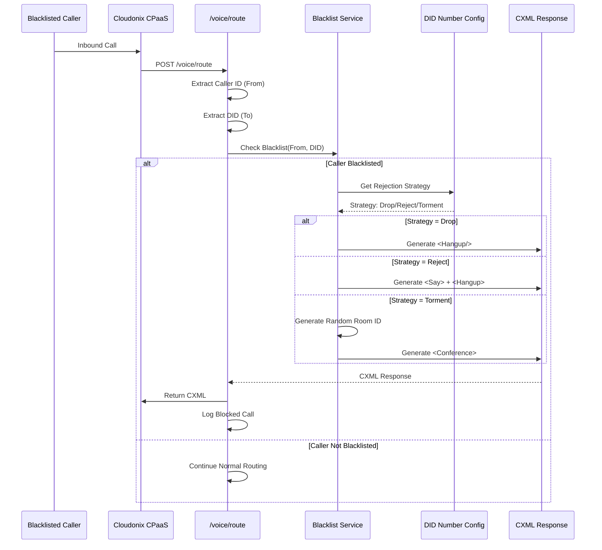
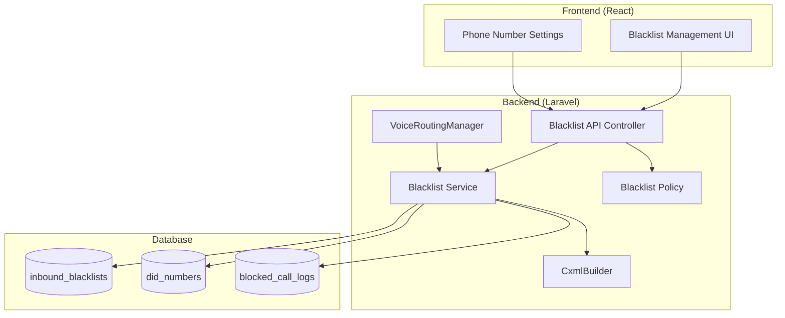

# Inbound Blacklist Feature Specification

**Feature:** Inbound Caller ID Blacklist with Rejection Strategies  
**Status:** Specification  
**Created:** February 17, 2026  
**Target Release:** v1.5.0  

---

## Executive Summary

The Inbound Blacklist feature provides organizations with the ability to block unwanted incoming calls based on Caller ID numbers or prefixes. When a blacklisted caller attempts to reach a protected Phone Number (DID), the system applies one of three rejection strategies: **Drop** (silent hangup), **Reject** (verbal message), or **Torment** (music in random conference room).

### Key Capabilities
- **Caller ID Blacklisting**: Block specific phone numbers (e.g., `+14155551234`)
- **Prefix Blacklisting**: Block number ranges (e.g., `+1415*` blocks all San Francisco callers)
- **Per-DID Protection**: Associate blacklists with specific Phone Numbers or apply organization-wide
- **Rejection Strategies**: Configurable response types (Drop, Reject, Torment)
- **Audit Trail**: Log all blocked attempts with metadata

---

## Architecture Overview

### System Flow



### Component Diagram



---

## Phase 1: Backend API & Database (Week 1)

### 1.1 Database Schema

#### Migration: Create `inbound_blacklists` Table

```php
<?php
// database/migrations/2026_02_17_000001_create_inbound_blacklists_table.php

Schema::create('inbound_blacklists', function (Blueprint $table) {
    $table->id();
    $table->foreignId('organization_id')->constrained()->onDelete('cascade');
    
    // Blacklist entry type
    $table->enum('match_type', ['exact', 'prefix', 'wildcard'])->default('exact');
    $table->string('caller_id_pattern', 50); // E.164 number or pattern
    $table->string('description', 255)->nullable();
    
    // Scope: specific DID or organization-wide
    $table->foreignId('did_number_id')->nullable()->constrained('did_numbers')->onDelete('cascade');
    $table->boolean('is_global')->default(false); // Apply to all DIDs in org
    
    // Rejection strategy
    $table->enum('rejection_strategy', ['drop', 'reject', 'torment'])->default('drop');
    
    // Torment-specific: conference room configuration
    $table->string('torment_room_prefix', 20)->nullable();
    $table->integer('torment_music_timeout')->default(300); // 5 minutes
    
    // Metadata
    $table->enum('status', ['active', 'inactive'])->default('active');
    $table->timestamp('expires_at')->nullable(); // Temporary blacklists
    $table->integer('blocked_count')->default(0); // Statistics
    
    $table->timestamps();
    
    // Indexes
    $table->index(['organization_id', 'caller_id_pattern']);
    $table->index(['organization_id', 'did_number_id']);
    $table->index(['organization_id', 'status']);
    $table->index(['organization_id', 'is_global', 'status']);
});
```

#### Migration: Create `blocked_call_logs` Table

```php
<?php
// database/migrations/2026_02_17_000002_create_blocked_call_logs_table.php

Schema::create('blocked_call_logs', function (Blueprint $table) {
    $table->id();
    $table->foreignId('organization_id')->constrained()->onDelete('cascade');
    $table->foreignId('inbound_blacklist_id')->nullable()->constrained()->onDelete('set null');
    $table->foreignId('did_number_id')->nullable()->constrained()->onDelete('set null');
    
    // Call details
    $table->string('caller_id', 50);
    $table->string('called_number', 50);
    $table->string('call_sid', 100)->nullable();
    $table->string('session_id', 50)->nullable();
    
    // Rejection details
    $table->enum('rejection_strategy', ['drop', 'reject', 'torment']);
    $table->string('torment_room_id', 100)->nullable();
    $table->integer('torment_duration')->nullable(); // How long they stayed
    
    // Request metadata
    $table->json('webhook_payload')->nullable();
    $table->ipAddress('source_ip')->nullable();
    
    $table->timestamp('blocked_at');
    
    // Indexes
    $table->index(['organization_id', 'blocked_at']);
    $table->index(['organization_id', 'caller_id']);
    $table->index(['organization_id', 'did_number_id', 'blocked_at']);
});
```

### 1.2 Model: InboundBlacklist

```php
<?php
// app/Models/InboundBlacklist.php

declare(strict_types=1);

namespace App\Models;

use App\Enums\InboundBlacklistMatchType;
use App\Enums\InboundBlacklistRejectionStrategy;
use App\Enums\UserStatus;
use App\Scopes\OrganizationScope;
use Illuminate\Database\Eloquent\Attributes\ScopedBy;
use Illuminate\Database\Eloquent\Factories\HasFactory;
use Illuminate\Database\Eloquent\Model;
use Illuminate\Database\Eloquent\Relations\BelongsTo;
use Illuminate\Database\Eloquent\Relations\HasMany;

#[ScopedBy([OrganizationScope::class])]
class InboundBlacklist extends Model
{
    use HasFactory;

    protected $fillable = [
        'organization_id',
        'match_type',
        'caller_id_pattern',
        'description',
        'did_number_id',
        'is_global',
        'rejection_strategy',
        'torment_room_prefix',
        'torment_music_timeout',
        'status',
        'expires_at',
        'blocked_count',
    ];

    protected function casts(): array
    {
        return [
            'match_type' => InboundBlacklistMatchType::class,
            'rejection_strategy' => InboundBlacklistRejectionStrategy::class,
            'status' => UserStatus::class,
            'is_global' => 'boolean',
            'expires_at' => 'datetime',
            'expires_at' => 'datetime',
            'blocked_count' => 'integer',
            'torment_music_timeout' => 'integer',
        ];
    }

    public function organization(): BelongsTo
    {
        return $this->belongsTo(Organization::class);
    }

    public function didNumber(): BelongsTo
    {
        return $this->belongsTo(DidNumber::class);
    }

    public function blockedCallLogs(): HasMany
    {
        return $this->hasMany(BlockedCallLog::class);
    }

    /**
     * Check if a caller ID matches this blacklist entry.
     */
    public function matches(string $callerId): bool
    {
        return match ($this->match_type) {
            InboundBlacklistMatchType::EXACT => $callerId === $this->caller_id_pattern,
            InboundBlacklistMatchType::PREFIX => str_starts_with($callerId, $this->caller_id_pattern),
            InboundBlacklistMatchType::WILDCARD => fnmatch($this->caller_id_pattern, $callerId),
        };
    }

    /**
     * Increment blocked count.
     */
    public function incrementBlockedCount(): void
    {
        $this->increment('blocked_count');
    }

    /**
     * Check if this entry is expired.
     */
    public function isExpired(): bool
    {
        return $this->expires_at !== null && $this->expires_at->isPast();
    }

    /**
     * Check if this entry is active and not expired.
     */
    public function isActive(): bool
    {
        return $this->status === UserStatus::ACTIVE && !$this->isExpired();
    }
}
```

### 1.3 Enums

```php
<?php
// app/Enums/InboundBlacklistMatchType.php

declare(strict_types=1);

namespace App\Enums;

enum InboundBlacklistMatchType: string
{
    case EXACT = 'exact';
    case PREFIX = 'prefix';
    case WILDCARD = 'wildcard';

    public function label(): string
    {
        return match ($this) {
            self::EXACT => 'Exact Match',
            self::PREFIX => 'Prefix Match',
            self::WILDCARD => 'Wildcard Pattern',
        };
    }
}
```

```php
<?php
// app/Enums/InboundBlacklistRejectionStrategy.php

declare(strict_types=1);

namespace App\Enums;

enum InboundBlacklistRejectionStrategy: string
{
    case DROP = 'drop';
    case REJECT = 'reject';
    case TORMENT = 'torment';

    public function label(): string
    {
        return match ($this) {
            self::DROP => 'Drop (Silent)',
            self::REJECT => 'Reject (With Message)',
            self::TORMENT => 'Torment (Music Loop)',
        };
    }

    public function description(): string
    {
        return match ($this) {
            self::DROP => 'Immediately hang up without any message',
            self::REJECT => 'Play "Your call has been rejected" then hang up',
            self::TORMENT => 'Put caller in a random conference room with hold music',
        };
    }
}
```

### 1.4 Service: InboundBlacklistService

```php
<?php
// app/Services/InboundBlacklist/InboundBlacklistService.php

declare(strict_types=1);

namespace App\Services\InboundBlacklist;

use App\Enums\InboundBlacklistRejectionStrategy;
use App\Models\BlockedCallLog;
use App\Models\DidNumber;
use App\Models\InboundBlacklist;
use App\Services\CxmlBuilder\CxmlBuilder;
use Illuminate\Http\Request;
use Illuminate\Http\Response;
use Illuminate\Support\Facades\Log;

class InboundBlacklistService
{
    /**
     * Check if a caller is blacklisted for the given DID.
     */
    public function isBlacklisted(string $callerId, int $didNumberId, int $organizationId): ?InboundBlacklist
    {
        // Get all active blacklist entries for this organization
        $entries = InboundBlacklist::where('organization_id', $organizationId)
            ->where('status', 'active')
            ->where(function ($query) use ($didNumberId) {
                $query->where('is_global', true)
                    ->orWhere('did_number_id', $didNumberId);
            })
            ->where(function ($query) {
                $query->whereNull('expires_at')
                    ->orWhere('expires_at', '>', now());
            })
            ->get();

        foreach ($entries as $entry) {
            if ($entry->matches($callerId)) {
                return $entry;
            }
        }

        return null;
    }

    /**
     * Generate CXML response for blacklisted caller.
     */
    public function generateRejectionCxml(InboundBlacklist $blacklist, Request $request): Response
    {
        $callerId = $request->input('From');
        $calledNumber = $request->input('To');

        return match ($blacklist->rejection_strategy) {
            InboundBlacklistRejectionStrategy::DROP => $this->generateDropResponse($blacklist, $request),
            InboundBlacklistRejectionStrategy::REJECT => $this->generateRejectResponse($blacklist, $request),
            InboundBlacklistRejectionStrategy::TORMENT => $this->generateTormentResponse($blacklist, $request),
        };
    }

    /**
     * Strategy: Drop - Silent hangup.
     */
    private function generateDropResponse(InboundBlacklist $blacklist, Request $request): Response
    {
        Log::info('InboundBlacklist: Dropping blacklisted call', [
            'caller_id' => $request->input('From'),
            'blacklist_id' => $blacklist->id,
        ]);

        $this->logBlockedCall($blacklist, $request, null, null);

        return response(
            CxmlBuilder::simpleHangup(),
            200,
            ['Content-Type' => 'application/xml']
        );
    }

    /**
     * Strategy: Reject - Message then hangup.
     */
    private function generateRejectResponse(InboundBlacklist $blacklist, Request $request): Response
    {
        Log::info('InboundBlacklist: Rejecting blacklisted call with message', [
            'caller_id' => $request->input('From'),
            'blacklist_id' => $blacklist->id,
        ]);

        $this->logBlockedCall($blacklist, $request, null, null);

        return response(
            CxmlBuilder::sayWithHangup('Your call has been rejected', true),
            200,
            ['Content-Type' => 'application/xml']
        );
    }

    /**
     * Strategy: Torment - Random conference room with music.
     */
    private function generateTormentResponse(InboundBlacklist $blacklist, Request $request): Response
    {
        $callerId = $request->input('From');
        
        // Generate random room ID
        $roomId = $this->generateTormentRoomId($blacklist);
        
        Log::info('InboundBlacklist: Tormenting blacklisted caller', [
            'caller_id' => $callerId,
            'blacklist_id' => $blacklist->id,
            'room_id' => $roomId,
        ]);

        $this->logBlockedCall($blacklist, $request, $roomId, null);

        return response(
            CxmlBuilder::conference($roomId, null, $blacklist->torment_music_timeout),
            200,
            ['Content-Type' => 'application/xml']
        );
    }

    /**
     * Generate a random conference room ID for torment mode.
     */
    private function generateTormentRoomId(InboundBlacklist $blacklist): string
    {
        $prefix = $blacklist->torment_room_prefix ?? 'blacklist';
        $hash = substr(md5(uniqid((string) rand(), true)), 0, 12);
        
        return "{$prefix}-{$hash}";
    }

    /**
     * Log a blocked call for audit purposes.
     */
    private function logBlockedCall(
        InboundBlacklist $blacklist,
        Request $request,
        ?string $tormentRoomId,
        ?int $tormentDuration
    ): void {
        try {
            BlockedCallLog::create([
                'organization_id' => $blacklist->organization_id,
                'inbound_blacklist_id' => $blacklist->id,
                'did_number_id' => $blacklist->did_number_id,
                'caller_id' => $request->input('From'),
                'called_number' => $request->input('To'),
                'call_sid' => $request->input('CallSid'),
                'session_id' => $request->input('Session'),
                'rejection_strategy' => $blacklist->rejection_strategy,
                'torment_room_id' => $tormentRoomId,
                'torment_duration' => $tormentDuration,
                'webhook_payload' => $request->all(),
                'source_ip' => $request->ip(),
                'blocked_at' => now(),
            ]);

            // Increment statistics
            $blacklist->incrementBlockedCount();
        } catch (\Exception $e) {
            Log::error('Failed to log blocked call', [
                'error' => $e->getMessage(),
                'blacklist_id' => $blacklist->id,
            ]);
        }
    }
}
```

### 1.5 API Controller: InboundBlacklistController

```php
<?php
// app/Http/Controllers/Api/InboundBlacklistController.php

declare(strict_types=1);

namespace App\Http\Controllers\Api;

use App\Http\Controllers\Api\AbstractApiCrudController;
use App\Http\Requests\InboundBlacklist\StoreInboundBlacklistRequest;
use App\Http\Requests\InboundBlacklist\UpdateInboundBlacklistRequest;
use App\Models\InboundBlacklist;
use Illuminate\Http\JsonResponse;
use Illuminate\Http\Request;

class InboundBlacklistController extends AbstractApiCrudController
{
    protected string $modelClass = InboundBlacklist::class;

    protected array $allowedFilters = [
        'caller_id_pattern',
        'match_type',
        'rejection_strategy',
        'status',
        'did_number_id',
        'is_global',
    ];

    protected array $allowedSorts = [
        'caller_id_pattern',
        'created_at',
        'updated_at',
        'blocked_count',
    ];

    protected string $collectionResource = 'inbound_blacklists';

    /**
     * List inbound blacklist entries.
     */
    public function index(Request $request): JsonResponse
    {
        $user = $this->getAuthenticatedUser();
        $query = InboundBlacklist::where('organization_id', $user->organization_id);

        // Apply filters
        if ($request->has('search')) {
            $search = $request->input('search');
            $query->where(function ($q) use ($search) {
                $q->where('caller_id_pattern', 'like', "%{$search}%")
                    ->orWhere('description', 'like', "%{$search}%");
            });
        }

        // Apply strategy filter
        if ($request->has('rejection_strategy')) {
            $query->where('rejection_strategy', $request->input('rejection_strategy'));
        }

        // Apply scope filter
        if ($request->has('scope')) {
            match ($request->input('scope')) {
                'global' => $query->where('is_global', true),
                'did_specific' => $query->where('is_global', false)->whereNotNull('did_number_id'),
                default => null,
            };
        }

        // Apply status filter
        if ($request->has('status')) {
            $query->where('status', $request->input('status'));
        }

        $entries = $query->with('didNumber:id,phone_number,friendly_name')
            ->orderBy('created_at', 'desc')
            ->paginate($request->input('per_page', 20));

        return response()->json([
            'data' => $entries->items(),
            'meta' => [
                'current_page' => $entries->currentPage(),
                'last_page' => $entries->lastPage(),
                'per_page' => $entries->perPage(),
                'total' => $entries->total(),
            ],
        ]);
    }

    /**
     * Create a new blacklist entry.
     */
    public function store(StoreInboundBlacklistRequest $request): JsonResponse
    {
        $user = $this->getAuthenticatedUser();
        $validated = $request->validated();
        $validated['organization_id'] = $user->organization_id;

        $entry = InboundBlacklist::create($validated);

        return response()->json([
            'data' => $entry->load('didNumber:id,phone_number,friendly_name'),
            'message' => 'Blacklist entry created successfully',
        ], 201);
    }

    /**
     * Show a specific blacklist entry.
     */
    public function show(InboundBlacklist $inboundBlacklist): JsonResponse
    {
        $this->authorize('view', $inboundBlacklist);

        return response()->json([
            'data' => $inboundBlacklist->load('didNumber:id,phone_number,friendly_name'),
        ]);
    }

    /**
     * Update a blacklist entry.
     */
    public function update(UpdateInboundBlacklistRequest $request, InboundBlacklist $inboundBlacklist): JsonResponse
    {
        $this->authorize('update', $inboundBlacklist);

        $inboundBlacklist->update($request->validated());

        return response()->json([
            'data' => $inboundBlacklist->fresh()->load('didNumber:id,phone_number,friendly_name'),
            'message' => 'Blacklist entry updated successfully',
        ]);
    }

    /**
     * Delete a blacklist entry.
     */
    public function destroy(InboundBlacklist $inboundBlacklist): JsonResponse
    {
        $this->authorize('delete', $inboundBlacklist);

        $inboundBlacklist->delete();

        return response()->json([
            'message' => 'Blacklist entry deleted successfully',
        ]);
    }

    /**
     * Get blocked call logs.
     */
    public function getBlockedCallLogs(Request $request): JsonResponse
    {
        $user = $this->getAuthenticatedUser();

        $logs = \App\Models\BlockedCallLog::where('organization_id', $user->organization_id)
            ->with(['inboundBlacklist:id,caller_id_pattern', 'didNumber:id,phone_number'])
            ->when($request->has('caller_id'), function ($query) use ($request) {
                $query->where('caller_id', 'like', '%' . $request->input('caller_id') . '%');
            })
            ->when($request->has('from_date'), function ($query) use ($request) {
                $query->where('blocked_at', '>=', $request->input('from_date'));
            })
            ->when($request->has('to_date'), function ($query) use ($request) {
                $query->where('blocked_at', '<=', $request->input('to_date'));
            })
            ->orderBy('blocked_at', 'desc')
            ->paginate($request->input('per_page', 20));

        return response()->json([
            'data' => $logs->items(),
            'meta' => [
                'current_page' => $logs->currentPage(),
                'last_page' => $logs->lastPage(),
                'per_page' => $logs->perPage(),
                'total' => $logs->total(),
            ],
        ]);
    }

    /**
     * Get blacklist statistics.
     */
    public function getStatistics(Request $request): JsonResponse
    {
        $user = $this->getAuthenticatedUser();

        $stats = [
            'total_entries' => InboundBlacklist::where('organization_id', $user->organization_id)->count(),
            'active_entries' => InboundBlacklist::where('organization_id', $user->organization_id)
                ->where('status', 'active')
                ->count(),
            'global_entries' => InboundBlacklist::where('organization_id', $user->organization_id)
                ->where('is_global', true)
                ->count(),
            'by_strategy' => [
                'drop' => InboundBlacklist::where('organization_id', $user->organization_id)
                    ->where('rejection_strategy', 'drop')
                    ->count(),
                'reject' => InboundBlacklist::where('organization_id', $user->organization_id)
                    ->where('rejection_strategy', 'reject')
                    ->count(),
                'torment' => InboundBlacklist::where('organization_id', $user->organization_id)
                    ->where('rejection_strategy', 'torment')
                    ->count(),
            ],
            'total_blocked_calls' => \App\Models\BlockedCallLog::where('organization_id', $user->organization_id)
                ->count(),
            'blocked_calls_today' => \App\Models\BlockedCallLog::where('organization_id', $user->organization_id)
                ->whereDate('blocked_at', today())
                ->count(),
        ];

        return response()->json(['data' => $stats]);
    }
}
```

### 1.6 Form Requests

```php
<?php
// app/Http/Requests/InboundBlacklist/StoreInboundBlacklistRequest.php

declare(strict_types=1);

namespace App\Http\Requests\InboundBlacklist;

use App\Enums\InboundBlacklistMatchType;
use App\Enums\InboundBlacklistRejectionStrategy;
use App\Enums\UserStatus;
use Illuminate\Foundation\Http\FormRequest;
use Illuminate\Validation\Rule;

class StoreInboundBlacklistRequest extends FormRequest
{
    public function authorize(): bool
    {
        return true;
    }

    public function rules(): array
    {
        return [
            'caller_id_pattern' => [
                'required',
                'string',
                'max:50',
                'regex:/^[\d\+\*\?]+$/', // E.164 format or wildcards
            ],
            'match_type' => ['required', Rule::enum(InboundBlacklistMatchType::class)],
            'description' => ['nullable', 'string', 'max:255'],
            'rejection_strategy' => ['required', Rule::enum(InboundBlacklistRejectionStrategy::class)],
            'did_number_id' => [
                'nullable',
                'integer',
                'exists:did_numbers,id',
            ],
            'is_global' => ['boolean'],
            'torment_room_prefix' => [
                'nullable',
                'string',
                'max:20',
                'required_if:rejection_strategy,torment',
            ],
            'torment_music_timeout' => [
                'nullable',
                'integer',
                'min:60',
                'max:3600',
            ],
            'status' => [Rule::enum(UserStatus::class)],
            'expires_at' => ['nullable', 'date', 'after:now'],
        ];
    }

    public function messages(): array
    {
        return [
            'caller_id_pattern.regex' => 'The caller ID pattern must be a valid phone number or pattern (digits, +, *, ? only).',
            'did_number_id.exists' => 'The selected phone number does not exist.',
            'torment_room_prefix.required_if' => 'A room prefix is required when using the Torment strategy.',
        ];
    }

    protected function prepareForValidation(): void
    {
        // If did_number_id is provided, is_global should be false
        if ($this->has('did_number_id') && $this->input('did_number_id')) {
            $this->merge(['is_global' => false]);
        }
    }
}
```

### 1.7 Policy

```php
<?php
// app/Policies/InboundBlacklistPolicy.php

declare(strict_types=1);

namespace App\Policies;

use App\Models\InboundBlacklist;
use App\Models\User;

class InboundBlacklistPolicy
{
    public function viewAny(User $user): bool
    {
        return true; // All authenticated users can view
    }

    public function view(User $user, InboundBlacklist $blacklist): bool
    {
        return $user->organization_id === $blacklist->organization_id;
    }

    public function create(User $user): bool
    {
        return in_array($user->role, ['owner', 'pbx_admin']);
    }

    public function update(User $user, InboundBlacklist $blacklist): bool
    {
        return $user->organization_id === $blacklist->organization_id
            && in_array($user->role, ['owner', 'pbx_admin']);
    }

    public function delete(User $user, InboundBlacklist $blacklist): bool
    {
        return $user->organization_id === $blacklist->organization_id
            && in_array($user->role, ['owner', 'pbx_admin']);
    }
}
```

### 1.8 Routes

```php
<?php
// routes/api.php (additions)

use App\Http\Controllers\Api\InboundBlacklistController;

Route::middleware(['auth:sanctum'])->group(function () {
    // Inbound Blacklist Management
    Route::get('inbound-blacklist/statistics', [InboundBlacklistController::class, 'getStatistics'])
        ->name('inbound-blacklist.statistics');
    Route::get('inbound-blacklist/blocked-logs', [InboundBlacklistController::class, 'getBlockedCallLogs'])
        ->name('inbound-blacklist.blocked-logs');
    Route::apiResource('inbound-blacklist', InboundBlacklistController::class);
});
```

### 1.9 Voice Routing Integration

```php
<?php
// Add to VoiceRoutingManager::handleInboundDirection() or create separate check

/**
 * Check inbound blacklist before processing call.
 */
private function checkInboundBlacklist(Request $request, int $orgId): ?Response
{
    $callerId = $request->input('From');
    $calledNumber = $request->input('To');

    // Get DID ID from phone number
    $did = DidNumber::where('phone_number', $calledNumber)
        ->where('organization_id', $orgId)
        ->first();

    if (!$did) {
        return null;
    }

    $blacklistService = app(InboundBlacklistService::class);
    $blacklist = $blacklistService->isBlacklisted($callerId, $did->id, $orgId);

    if ($blacklist) {
        Log::warning('VoiceRoutingManager: Blacklisted caller detected', [
            'caller_id' => $callerId,
            'called_number' => $calledNumber,
            'blacklist_id' => $blacklist->id,
            'strategy' => $blacklist->rejection_strategy->value,
        ]);

        return $blacklistService->generateRejectionCxml($blacklist, $request);
    }

    return null;
}
```

---

## Phase 2: Frontend UI/UX (Week 2)

### 2.1 New Page: InboundBlacklist.tsx

**Location:** `frontend/src/pages/InboundBlacklist.tsx`

**Features:**
- List view with filters (strategy, scope, status)
- Create/Edit dialog with form validation
- Statistics dashboard
- Blocked call logs viewer
- Quick actions (enable/disable, delete)

**UI Components:**
- Data table with sorting and pagination
- Strategy badges with color coding:
  - Drop: Red
  - Reject: Orange
  - Torment: Purple
- Match type icons
- Scope indicators (Global vs DID-specific)

### 2.2 Phone Number Integration

**Location:** `frontend/src/pages/PhoneNumbers.tsx` (additions)

**Features:**
- "Blacklist" tab in Phone Number edit dialog
- Show associated blacklist entries
- Quick-add blacklist from phone number context
- Toggle organization-wide blacklist protection

### 2.3 Types

```typescript
// frontend/src/types/index.ts (additions)

export interface InboundBlacklist {
  id: number;
  organization_id: number;
  match_type: 'exact' | 'prefix' | 'wildcard';
  caller_id_pattern: string;
  description?: string;
  did_number_id?: number;
  is_global: boolean;
  rejection_strategy: 'drop' | 'reject' | 'torment';
  torment_room_prefix?: string;
  torment_music_timeout?: number;
  status: 'active' | 'inactive';
  expires_at?: string;
  blocked_count: number;
  created_at: string;
  updated_at: string;
  did_number?: {
    id: number;
    phone_number: string;
    friendly_name: string;
  };
}

export interface BlockedCallLog {
  id: number;
  organization_id: number;
  inbound_blacklist_id?: number;
  did_number_id?: number;
  caller_id: string;
  called_number: string;
  call_sid?: string;
  session_id?: string;
  rejection_strategy: 'drop' | 'reject' | 'torment';
  torment_room_id?: string;
  torment_duration?: number;
  blocked_at: string;
  inbound_blacklist?: {
    id: number;
    caller_id_pattern: string;
  };
  did_number?: {
    id: number;
    phone_number: string;
  };
}

export interface InboundBlacklistStats {
  total_entries: number;
  active_entries: number;
  global_entries: number;
  by_strategy: {
    drop: number;
    reject: number;
    torment: number;
  };
  total_blocked_calls: number;
  blocked_calls_today: number;
}
```

### 2.4 Service

```typescript
// frontend/src/services/inboundBlacklist.service.ts

import api from './api';
import type { InboundBlacklist, BlockedCallLog, InboundBlacklistStats } from '@/types';

export interface CreateInboundBlacklistRequest {
  caller_id_pattern: string;
  match_type: 'exact' | 'prefix' | 'wildcard';
  description?: string;
  rejection_strategy: 'drop' | 'reject' | 'torment';
  did_number_id?: number;
  is_global?: boolean;
  torment_room_prefix?: string;
  torment_music_timeout?: number;
  status?: 'active' | 'inactive';
  expires_at?: string;
}

export interface UpdateInboundBlacklistRequest {
  description?: string;
  rejection_strategy?: 'drop' | 'reject' | 'torment';
  torment_room_prefix?: string;
  torment_music_timeout?: number;
  status?: 'active' | 'inactive';
  expires_at?: string;
}

export const inboundBlacklistService = {
  getAll: (params?: { search?: string; rejection_strategy?: string; status?: string; page?: number }) =>
    api.get('/inbound-blacklist', { params }),

  getById: (id: number) =>
    api.get(`/inbound-blacklist/${id}`),

  create: (data: CreateInboundBlacklistRequest) =>
    api.post('/inbound-blacklist', data),

  update: (id: number, data: UpdateInboundBlacklistRequest) =>
    api.put(`/inbound-blacklist/${id}`, data),

  delete: (id: number) =>
    api.delete(`/inbound-blacklist/${id}`),

  getStatistics: () =>
    api.get('/inbound-blacklist/statistics'),

  getBlockedLogs: (params?: { caller_id?: string; from_date?: string; to_date?: string; page?: number }) =>
    api.get('/inbound-blacklist/blocked-logs', { params }),
};
```

---

## Phase 3: Testing (Week 2-3)

### 3.1 Unit Tests

```php
<?php
// tests/Unit/Services/InboundBlacklistServiceTest.php

class InboundBlacklistServiceTest extends TestCase
{
    public function test_exact_match_blacklist()
    {
        $service = new InboundBlacklistService();
        $blacklist = InboundBlacklist::factory()->create([
            'match_type' => InboundBlacklistMatchType::EXACT,
            'caller_id_pattern' => '+14155551234',
        ]);

        $result = $service->isBlacklisted('+14155551234', $blacklist->did_number_id, $blacklist->organization_id);
        $this->assertNotNull($result);

        $result = $service->isBlacklisted('+14155559999', $blacklist->did_number_id, $blacklist->organization_id);
        $this->assertNull($result);
    }

    public function test_prefix_match_blacklist()
    {
        $service = new InboundBlacklistService();
        $blacklist = InboundBlacklist::factory()->create([
            'match_type' => InboundBlacklistMatchType::PREFIX,
            'caller_id_pattern' => '+1415',
        ]);

        $this->assertNotNull($service->isBlacklisted('+14155551234', $blacklist->did_number_id, $blacklist->organization_id));
        $this->assertNotNull($service->isBlacklisted('+14159998888', $blacklist->did_number_id, $blacklist->organization_id));
        $this->assertNull($service->isBlacklisted('+14165551234', $blacklist->did_number_id, $blacklist->organization_id));
    }

    public function test_torment_strategy_generates_random_room()
    {
        $service = new InboundBlacklistService();
        $blacklist = InboundBlacklist::factory()->create([
            'rejection_strategy' => InboundBlacklistRejectionStrategy::TORMENT,
            'torment_room_prefix' => 'spam',
        ]);

        $response = $service->generateRejectionCxml($blacklist, new Request(['From' => '+1234567890']));
        $cxml = $response->getContent();

        $this->assertStringContainsString('<Conference', $cxml);
        $this->assertStringContainsString('spam-', $cxml);
    }
}
```

### 3.2 Feature Tests

```php
<?php
// tests/Feature/Api/InboundBlacklistControllerTest.php

class InboundBlacklistControllerTest extends TestCase
{
    use RefreshDatabase;

    public function test_owner_can_create_blacklist_entry()
    {
        $user = User::factory()->create(['role' => 'owner']);
        $did = DidNumber::factory()->create(['organization_id' => $user->organization_id]);

        $response = $this->actingAs($user)->postJson('/api/v1/inbound-blacklist', [
            'caller_id_pattern' => '+14155551234',
            'match_type' => 'exact',
            'rejection_strategy' => 'reject',
            'did_number_id' => $did->id,
        ]);

        $response->assertStatus(201)
            ->assertJsonPath('data.caller_id_pattern', '+14155551234');
    }

    public function test_blacklisted_call_is_blocked()
    {
        $user = User::factory()->create();
        $did = DidNumber::factory()->create(['organization_id' => $user->organization_id]);
        
        InboundBlacklist::factory()->create([
            'organization_id' => $user->organization_id,
            'did_number_id' => $did->id,
            'caller_id_pattern' => '+14155559999',
            'match_type' => 'exact',
            'rejection_strategy' => 'reject',
        ]);

        $response = $this->postJson('/api/voice/route', [
            'From' => '+14155559999',
            'To' => $did->phone_number,
            'CallSid' => 'test-call-sid',
        ], [
            'X-Cx-Domain' => 'test.cloudonix.net',
        ]);

        $response->assertStatus(200)
            ->assertHeader('Content-Type', 'application/xml')
            ->assertSee('Your call has been rejected');
    }
}
```

---

## Phase 4: API Examples

### 4.1 Create Blacklist Entry

```bash
# Drop strategy (silent)
curl -X POST http://localhost/api/v1/inbound-blacklist \
  -H "Authorization: Bearer YOUR_TOKEN" \
  -H "Content-Type: application/json" \
  -d '{
    "caller_id_pattern": "+14155551234",
    "match_type": "exact",
    "rejection_strategy": "drop",
    "description": "Known spam caller"
  }'

# Reject strategy (with message)
curl -X POST http://localhost/api/v1/inbound-blacklist \
  -H "Authorization: Bearer YOUR_TOKEN" \
  -H "Content-Type: application/json" \
  -d '{
    "caller_id_pattern": "+1415",
    "match_type": "prefix",
    "rejection_strategy": "reject",
    "description": "Block all San Francisco calls",
    "is_global": true
  }'

# Torment strategy (music loop)
curl -X POST http://localhost/api/v1/inbound-blacklist \
  -H "Authorization: Bearer YOUR_TOKEN" \
  -H "Content-Type: application/json" \
  -d '{
    "caller_id_pattern": "+1415555*",
    "match_type": "wildcard",
    "rejection_strategy": "torment",
    "torment_room_prefix": "spam-trap",
    "torment_music_timeout": 600,
    "description": "Waste telemarketer time"
  }'
```

### 4.2 Get Statistics

```bash
curl http://localhost/api/v1/inbound-blacklist/statistics \
  -H "Authorization: Bearer YOUR_TOKEN"

# Response:
# {
#   "data": {
#     "total_entries": 42,
#     "active_entries": 38,
#     "global_entries": 5,
#     "by_strategy": {
#       "drop": 20,
#       "reject": 15,
#       "torment": 7
#     },
#     "total_blocked_calls": 1523,
#     "blocked_calls_today": 47
#   }
# }
```

### 4.3 Get Blocked Call Logs

```bash
# Get all blocked calls
curl http://localhost/api/v1/inbound-blacklist/blocked-logs \
  -H "Authorization: Bearer YOUR_TOKEN"

# Filter by date range
curl "http://localhost/api/v1/inbound-blacklist/blocked-logs?from_date=2026-02-01&to_date=2026-02-17" \
  -H "Authorization: Bearer YOUR_TOKEN"

# Filter by caller
curl "http://localhost/api/v1/inbound-blacklist/blocked-logs?caller_id=%2B1415" \
  -H "Authorization: Bearer YOUR_TOKEN"
```

---

## Implementation Timeline

| Phase | Duration | Components |
|-------|----------|------------|
| **Phase 1** | Week 1 | Database, Models, Service, API, Policy, Routes |
| **Phase 2** | Week 2 | Frontend UI, Phone Number integration, Types |
| **Phase 3** | Week 2-3 | Unit tests, Feature tests, Integration tests |
| **Phase 4** | Week 3 | Documentation, API examples, Final review |

**Total Estimated Time:** 3 weeks  
**Total Estimated Effort:** 80-100 hours

---

## Success Criteria

### Functionality
- [ ] Blacklist entries can be created with exact/prefix/wildcard matching
- [ ] Three rejection strategies work correctly (Drop, Reject, Torment)
- [ ] Per-DID and global scoping works as expected
- [ ] Expired entries are automatically ignored
- [ ] Blocked calls are logged with full metadata

### Security
- [ ] Only authorized users (Owner/PBX Admin) can manage blacklists
- [ ] Organization isolation enforced on all queries
- [ ] No caller ID information leaked in error messages
- [ ] Audit trail complete for compliance

### Performance
- [ ] Blacklist lookup completes in <10ms
- [ ] Database queries use proper indexes
- [ ] Caching implemented for frequently accessed entries

### Testing
- [ ] 90%+ code coverage on service class
- [ ] Feature tests for all API endpoints
- [ ] Integration tests for voice routing

---

**Document Version:** 1.0  
**Last Updated:** February 17, 2026  
**Author:** Engineering Team
