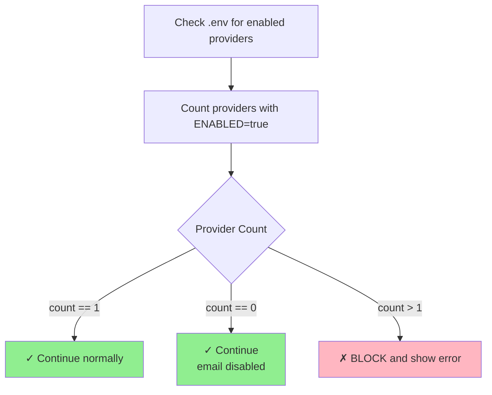
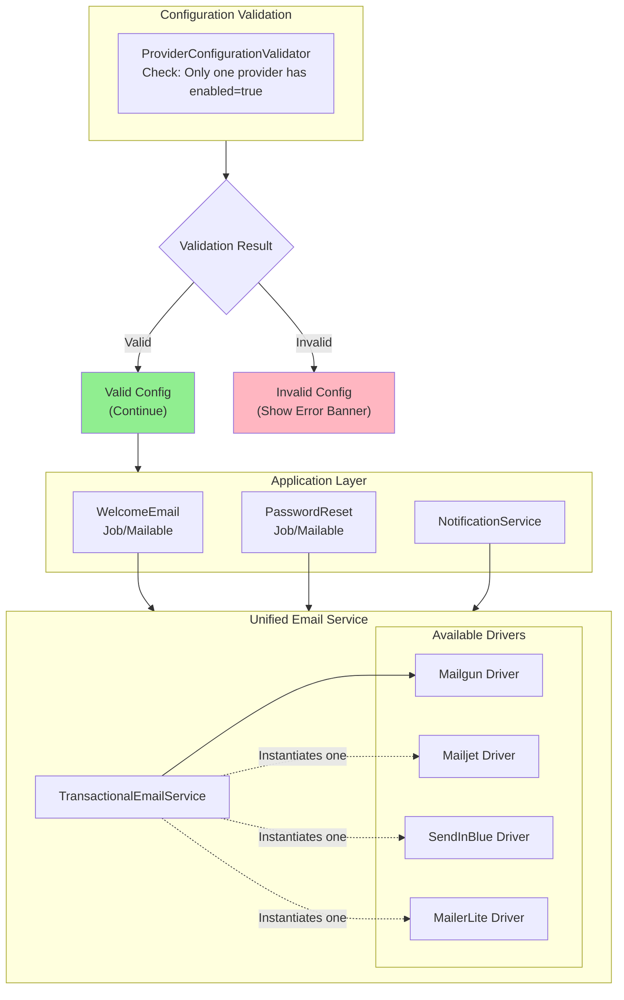

# Unified Transactional Email Handler - Implementation Plan

**Document Version:** 2.0  
**Date:** 2026-02-18  
**Status:** Draft - Pending Review  
**Author:** Engineering Team  

---

## Executive Summary

This document outlines the implementation plan for a unified transactional email handler supporting multiple email service providers (ESPs). The system provides a single, consistent interface for sending transactional emails with **strict enforcement of single-provider activation**.

**IMPORTANT:** Only **ONE** transactional email provider can be active at any given time. If multiple providers are configured as enabled, the application will display a clear error message and refuse to send emails until the configuration is corrected.

**Supported Providers:**
1. **Mailgun** - Recommended for high-volume transactional email
2. **Mailjet** - EU data residency, good deliverability
3. **MailerLite** - Limited transactional support (not recommended)
4. **SendInBlue (Brevo)** - Generous free tier, marketing focus

**Architecture Principle:** Single active provider with swappable implementations. No failover.

---

## Table of Contents

1. [Requirements Analysis](#1-requirements-analysis)
2. [Architecture Overview](#2-architecture-overview)
3. [Implementation Phases](#3-implementation-phases)
4. [Technical Specifications](#4-technical-specifications)
5. [Provider-Specific Details](#5-provider-specific-details)
6. [Testing Strategy](#6-testing-strategy)
7. [Deployment Plan](#7-deployment-plan)
8. [Appendices](#8-appendices)

---

## 1. Requirements Analysis

### 1.1 Functional Requirements

| ID | Requirement | Priority | Description |
|----|-------------|----------|-------------|
| FR-001 | Unified Interface | Must | Single `TransactionalEmailInterface` for all providers |
| FR-002 | Single Active Provider | Must | Only one provider can be active at any time |
| FR-003 | Configuration Validation | Must | Detect and reject multiple active providers |
| FR-004 | Visual Error on Misconfig | Must | Display clear browser error when multiple providers enabled |
| FR-005 | Queue Support | Must | Async sending via Laravel queues |
| FR-006 | Template Support | Should | Support both inline HTML and template-based emails |
| FR-007 | Attachment Support | Should | Support file attachments |
| FR-008 | Rate Limiting | Should | Per-provider rate limiting |
| FR-009 | Delivery Tracking | Nice | Webhook support for delivery status |

### 1.2 Non-Functional Requirements

| ID | Requirement | Target |
|----|-------------|--------|
| NFR-001 | Send Latency | < 5 seconds (p95) for sync sends |
| NFR-002 | Queue Throughput | 1000 emails/minute per queue worker |
| NFR-003 | Configuration Check | < 100ms to validate provider config |
| NFR-004 | Data Retention | 30 days for send logs |
| NFR-005 | Error Visibility | Clear error messages for configuration issues |

### 1.3 Provider Capabilities Matrix

| Feature | Mailgun | Mailjet | MailerLite | SendInBlue |
|---------|---------|---------|------------|------------|
| SMTP API | ✅ | ✅ | ❌ | ✅ |
| HTTP API | ✅ | ✅ | ✅ | ✅ |
| Templates | ✅ | ✅ | ✅ | ✅ |
| Attachments | ✅ | ✅ | ❌ | ✅ |
| Batch Send | ✅ | ✅ | ❌ | ✅ |
| Webhooks | ✅ | ✅ | ✅ | ✅ |
| EU Region | ✅ | ✅ | ✅ | ✅ |

### 1.4 Configuration Constraint

**CRITICAL:** The system enforces a **single active provider policy**:



**Error Display:**
When multiple providers are enabled, the application will:
1. Log critical configuration error
2. Display prominent error banner in admin UI
3. Block all email sending attempts
4. Return clear error message via API

---

## 2. Architecture Overview

### 2.1 Component Diagram



### 2.2 Directory Structure

```mermaid
tree
  app
    Services
      Email
        Contracts
          TransactionalEmailInterface.php
        DTOs
          EmailMessage.php
          EmailRecipient.php
          EmailAttachment.php
          EmailSendResult.php
        Drivers
          AbstractEmailDriver.php
          MailgunDriver.php
          MailjetDriver.php
          MailerLiteDriver.php
          SendInBlueDriver.php
        Exceptions
          EmailException.php
          DriverException.php
          InvalidConfigurationException.php
          MultipleProvidersException.php
        Jobs
          SendTransactionalEmailJob.php
        Providers
          EmailServiceProvider.php
        Validation
          ProviderConfigurationValidator.php
        TransactionalEmailService.php
    Models
      EmailLog.php
    Console
      Commands
        EmailSendTestCommand.php
```

---

## 3. Implementation Phases

### Phase 1: Core Interface, DTOs & Configuration Validation (Estimated: 3 days)

**Goal:** Establish the contract, data structures, and strict configuration validation

#### 3.1.1 Create Interface Contract
- [ ] `TransactionalEmailInterface` with methods:
  ```php
  interface TransactionalEmailInterface
  {
      public function send(EmailMessage $message): EmailSendResult;
      public function sendAsync(EmailMessage $message): string;
      public function supportsAttachments(): bool;
      public function supportsTemplates(): bool;
      public function getDriverName(): string;
      public function healthCheck(): bool;
  }
  ```

#### 3.1.2 Create Data Transfer Objects
- [ ] `EmailMessage` - Main email container
- [ ] `EmailRecipient` - Email + name
- [ ] `EmailAttachment` - File attachment
- [ ] `EmailSendResult` - Send operation result

#### 3.1.3 Create Base Exceptions
- [ ] `EmailException` - Base exception
- [ ] `DriverException` - Driver-specific errors
- [ ] `InvalidConfigurationException` - Config errors
- [ ] `MultipleProvidersException` - When >1 provider enabled

#### 3.1.4 Create Configuration Validator
- [ ] `ProviderConfigurationValidator` class
- [ ] Method `validate(): ValidationResult`
- [ ] Detects multiple enabled providers
- [ ] Returns detailed error message

```php
class ProviderConfigurationValidator
{
    public function validate(): ValidationResult
    {
        $enabledProviders = [];
        $config = config('services.transactional_email.providers');
        
        foreach ($config as $name => $provider) {
            if ($provider['enabled'] ?? false) {
                $enabledProviders[] = $name;
            }
        }
        
        if (count($enabledProviders) > 1) {
            return ValidationResult::failure(
                'Multiple transactional email providers are enabled: ' . 
                implode(', ', $enabledProviders) . 
                '. Only one provider can be active at a time. ' .
                'Please disable all but one provider in your .env file.'
            );
        }
        
        return ValidationResult::success($enabledProviders[0] ?? null);
    }
}
```

#### 3.1.5 Create EmailLog Model & Migration
- [ ] Migration for `email_logs` table
- [ ] Model with scopes for querying

**Deliverables:**
- All interfaces and DTOs implemented
- Configuration validator with tests
- Migration created

---

### Phase 2: Abstract Driver & Configuration (Estimated: 1 day)

**Goal:** Create the driver foundation and updated configuration

#### 3.2.1 Create Abstract Driver
- [ ] `AbstractEmailDriver` implementing `TransactionalEmailInterface`
- [ ] Common HTTP client configuration
- [ ] Request/response logging
- [ ] Error normalization

#### 3.2.2 Updated Configuration Structure
- [ ] Add to `config/services.php`:
  ```php
  'transactional_email' => [
      // Single provider selection (must match provider key below)
      'provider' => env('EMAIL_PROVIDER', 'mailgun'),
      
      'queue' => env('EMAIL_QUEUE', 'default'),
      'track_opens' => env('EMAIL_TRACK_OPENS', true),
      'track_clicks' => env('EMAIL_TRACK_CLICKS', true),
      
      // Provider configurations (ONLY ONE should be enabled)
      'providers' => [
          'mailgun' => [
              'enabled' => env('MAILGUN_ENABLED', false),
              'domain' => env('MAILGUN_DOMAIN'),
              'secret' => env('MAILGUN_SECRET'),
              'endpoint' => env('MAILGUN_ENDPOINT', 'api.mailgun.net'),
              'region' => env('MAILGUN_REGION', 'us'),
          ],
          'mailjet' => [
              'enabled' => env('MAILJET_ENABLED', false),
              'key' => env('MAILJET_APIKEY'),
              'secret' => env('MAILJET_APISECRET'),
          ],
          'mailerlite' => [
              'enabled' => env('MAILERLITE_ENABLED', false),
              'api_key' => env('MAILERLITE_API_KEY'),
          ],
          'sendinblue' => [
              'enabled' => env('SENDINBLUE_ENABLED', false),
              'api_key' => env('SENDINBLUE_API_KEY'),
          ],
      ],
  ],
  ```

#### 3.2.3 Environment Variables
- [ ] Add to `.env.example`:
  ```env
  # ═══════════════════════════════════════════════════════════
  # TRANSACTIONAL EMAIL CONFIGURATION
  # ═══════════════════════════════════════════════════════════
  # IMPORTANT: Only ONE provider can be enabled at a time!
  # Set the provider you want to use:
  EMAIL_PROVIDER=mailgun
  
  EMAIL_QUEUE=default
  EMAIL_TRACK_OPENS=true
  EMAIL_TRACK_CLICKS=true
  
  # Mailgun (set ENABLED=true to use)
  MAILGUN_ENABLED=true
  MAILGUN_DOMAIN=
  MAILGUN_SECRET=
  MAILGUN_ENDPOINT=api.mailgun.net
  MAILGUN_REGION=us
  
  # Mailjet (set ENABLED=true to use)
  MAILJET_ENABLED=false
  MAILJET_APIKEY=
  MAILJET_APISECRET=
  
  # MailerLite (set ENABLED=true to use)
  MAILERLITE_ENABLED=false
  MAILERLITE_API_KEY=
  
  # SendInBlue/Brevo (set ENABLED=true to use)
  SENDINBLUE_ENABLED=false
  SENDINBLUE_API_KEY=
  ```

**Deliverables:**
- Abstract driver with common functionality
- Configuration structure with validation
- Environment variables documented

---

### Phase 3: Provider Drivers (Estimated: 4 days)

Implement each provider driver. Only the enabled provider is instantiated.

#### 3.3.1 Mailgun Driver (Day 1)
- [ ] Create `MailgunDriver`
- [ ] Install `mailgun/mailgun-php`
- [ ] Implement full API support
- [ ] Region support (US vs EU)

#### 3.3.2 Mailjet Driver (Day 2)
- [ ] Create `MailjetDriver`
- [ ] Install `mailjet/mailjet-apiv3-php`
- [ ] Implement Send API v3.1
- [ ] Sandbox mode support

#### 3.3.3 SendInBlue (Brevo) Driver (Day 3)
- [ ] Create `SendInBlueDriver`
- [ ] Install `sendinblue/api-v3-sdk`
- [ ] Implement Transactional Email API
- [ ] Template support

#### 3.3.4 MailerLite Driver (Day 4)
- [ ] Create `MailerLiteDriver`
- [ ] Install `mailerlite/mailerlite-php`
- [ ] **Document limitations prominently**
- [ ] Warning when used for transactional

**Deliverables:**
- All four drivers implemented
- Unit tests for each driver

---

### Phase 4: Service Provider & Error Display (Estimated: 2 days)

**Goal:** Create service provider with configuration validation and visual error handling

#### 3.4.1 Email Service Provider
- [ ] `EmailServiceProvider` with validation on boot
- [ ] Detects multiple enabled providers
- [ ] Throws exception or logs error

```php
class EmailServiceProvider extends ServiceProvider
{
    public function boot(): void
    {
        $validator = new ProviderConfigurationValidator();
        $result = $validator->validate();
        
        if (!$result->isValid()) {
            Log::critical('Email configuration error: ' . $result->getError());
            
            // Store error for display in UI
            config(['services.transactional_email.error' => $result->getError()]);
        }
    }
    
    public function register(): void
    {
        $this->app->singleton(TransactionalEmailInterface::class, function ($app) {
            // Check for configuration error
            if ($error = config('services.transactional_email.error')) {
                throw new InvalidConfigurationException($error);
            }
            
            $provider = config('services.transactional_email.provider');
            $driverClass = $this->getDriverClass($provider);
            
            return new TransactionalEmailService(
                $app->make($driverClass),
                config('services.transactional_email')
            );
        });
    }
}
```

#### 3.4.2 Admin UI Error Banner
- [ ] Create middleware to inject config error
- [ ] Display error banner in admin layout
- [ ] Show specific providers that are enabled

```php
// Middleware
class EmailConfigurationCheckMiddleware
{
    public function handle($request, $next)
    {
        if ($error = config('services.transactional_email.error')) {
            view()->share('emailConfigError', $error);
        }
        
        return $next($request);
    }
}
```

```html
<!-- Error Banner Component -->
@if(isset($emailConfigError))
<div class="bg-red-50 border-l-4 border-red-500 p-4 mb-4">
    <div class="flex">
        <div class="flex-shrink-0">
            <svg class="h-5 w-5 text-red-400" viewBox="0 0 20 20" fill="currentColor">
                <path fill-rule="evenodd" d="M10 18a8 8 0 100-16 8 8 0 000 16zM8.707 7.293a1 1 0 00-1.414 1.414L8.586 10l-1.293 1.293a1 1 0 101.414 1.414L10 11.414l1.293 1.293a1 1 0 001.414-1.414L11.414 10l1.293-1.293a1 1 0 00-1.414-1.414L10 8.586 8.707 7.293z" clip-rule="evenodd"/>
            </svg>
        </div>
        <div class="ml-3">
            <h3 class="text-sm font-medium text-red-800">
                Email Configuration Error
            </h3>
            <div class="mt-2 text-sm text-red-700">
                <p>{{ $emailConfigError }}</p>
            </div>
            <div class="mt-4">
                <div class="-mx-2 -my-1.5 flex">
                    <a href="/admin/settings" class="bg-red-50 px-2 py-1.5 rounded-md text-sm font-medium text-red-800 hover:bg-red-100 focus:outline-none focus:ring-2 focus:ring-offset-2 focus:ring-red-500">
                        Fix Configuration
                    </a>
                </div>
            </div>
        </div>
    </div>
</div>
@endif
```

#### 3.4.3 API Error Response
- [ ] Return clear error when multiple providers configured
- [ ] Include list of enabled providers
- [ ] Suggest fix in error message

```json
{
  "error": "Multiple transactional email providers are enabled: mailgun, mailjet. Only one provider can be active at a time. Please disable all but one provider in your .env file.",
  "enabled_providers": ["mailgun", "mailjet"],
  "suggested_action": "Set MAILGUN_ENABLED=true and MAILJET_ENABLED=false in your .env file"
}
```

**Deliverables:**
- Service provider with validation
- Admin UI error banner
- API error response format
- Tests for configuration validation

---

### Phase 5: Orchestrator Service & Queue (Estimated: 1 day)

**Goal:** Create the main service (single provider, no failover)

#### 3.5.1 TransactionalEmailService
- [ ] Simplified service with single driver
- [ ] No failover logic
- [ ] Rate limiting for single provider
- [ ] Comprehensive logging

```php
class TransactionalEmailService implements TransactionalEmailInterface
{
    public function __construct(
        private TransactionalEmailInterface $driver,
        private array $config,
        private EmailLogRepository $logRepository,
    ) {}
    
    public function send(EmailMessage $message): EmailSendResult
    {
        $correlationId = $this->generateCorrelationId();
        $message->correlationId = $correlationId;
        
        try {
            $this->checkRateLimit();
            $result = $this->driver->send($message);
            $this->logSuccess($result, $message);
            return $result;
        } catch (Exception $e) {
            $this->logFailure($e, $message);
            throw $e;
        }
    }
}
```

#### 3.5.2 Queue Job
- [ ] `SendTransactionalEmailJob`
- [ ] Retry logic
- [ ] Dead letter handling

**Deliverables:**
- Orchestrator service (single provider)
- Queue job
- Tests

---

### Phase 6: Laravel Integration & Testing (Estimated: 1 day)

**Goal:** Full Laravel integration

#### 3.6.1 Facade
- [ ] `TransactionalEmail` facade

#### 3.6.2 Artisan Command
- [ ] `email:send-test` command
- [ ] Validates configuration before sending

#### 3.6.3 Testing
- [ ] Unit tests for all components
- [ ] Integration tests with sandbox APIs
- [ ] Configuration validation tests

**Deliverables:**
- Facade working
- Artisan command
- Complete test suite

---

## 4. Technical Specifications

### 4.1 Single Provider Enforcement

```php
class ProviderConfigurationValidator
{
    /**
     * Validate that only one provider is enabled.
     */
    public function validate(): ValidationResult
    {
        $enabledProviders = [];
        $config = config('services.transactional_email.providers');
        
        foreach ($config as $name => $provider) {
            if (filter_var($provider['enabled'] ?? false, FILTER_VALIDATE_BOOLEAN)) {
                $enabledProviders[] = $name;
            }
        }
        
        $count = count($enabledProviders);
        
        if ($count === 0) {
            return ValidationResult::success(null); // Email disabled
        }
        
        if ($count === 1) {
            return ValidationResult::success($enabledProviders[0]);
        }
        
        return ValidationResult::failure(
            message: sprintf(
                'Configuration Error: %d transactional email providers are enabled (%s). ' .
                'Only ONE provider can be active at a time. ' .
                'Please update your .env file and set only one EMAIL_*_ENABLED=true.',
                $count,
                implode(', ', $enabledProviders)
            ),
            enabledProviders: $enabledProviders,
            suggestedFix: 'Set only one provider to ENABLED=true in your .env file'
        );
    }
}
```

### 4.2 Configuration Error Display

**Browser Error Banner:**
```html
<div class="email-config-error">
    <strong>⚠️ Email Configuration Error</strong>
    <p>Multiple transactional email providers are enabled (mailgun, mailjet).</p>
    <p>Only ONE provider can be active at a time.</p>
    <p><strong>How to fix:</strong> Edit your .env file and set only one provider to ENABLED=true.</p>
</div>
```

**API Error Response:**
```json
{
  "status": "error",
  "code": "MULTIPLE_EMAIL_PROVIDERS",
  "message": "Configuration Error: 2 transactional email providers are enabled (mailgun, mailjet). Only ONE provider can be active at a time.",
  "details": {
    "enabled_providers": ["mailgun", "mailjet"],
    "suggested_action": "Set only one provider to ENABLED=true in your .env file"
  }
}
```

### 4.3 Error Handling Matrix

| Scenario | Behavior | User Impact |
|----------|----------|-------------|
| 1 provider enabled | ✓ Normal operation | None |
| 0 providers enabled | Email disabled | Emails not sent (logged) |
| 2+ providers enabled | ✗ Block with error | Error banner + API error |
| Invalid API key | Driver exception | Error logged, user notified |
| Network timeout | Retry with backoff | Delay up to 30 seconds |

---

## 5. Provider-Specific Details

(Same as original spec - see sections 5.1-5.4)

---

## 6. Testing Strategy

### 6.1 Configuration Validation Tests

```php
class ProviderConfigurationValidatorTest extends TestCase
{
    public function test_single_provider_enabled_passes(): void
    {
        config(['services.transactional_email.providers' => [
            'mailgun' => ['enabled' => true],
            'mailjet' => ['enabled' => false],
        ]]);
        
        $validator = new ProviderConfigurationValidator();
        $result = $validator->validate();
        
        $this->assertTrue($result->isValid());
        $this->assertEquals('mailgun', $result->getProvider());
    }
    
    public function test_multiple_providers_enabled_fails(): void
    {
        config(['services.transactional_email.providers' => [
            'mailgun' => ['enabled' => true],
            'mailjet' => ['enabled' => true],
        ]]);
        
        $validator = new ProviderConfigurationValidator();
        $result = $validator->validate();
        
        $this->assertFalse($result->isValid());
        $this->assertStringContainsString('mailgun, mailjet', $result->getError());
    }
    
    public function test_zero_providers_enabled_passes(): void
    {
        config(['services.transactional_email.providers' => [
            'mailgun' => ['enabled' => false],
            'mailjet' => ['enabled' => false],
        ]]);
        
        $validator = new ProviderConfigurationValidator();
        $result = $validator->validate();
        
        $this->assertTrue($result->isValid());
        $this->assertNull($result->getProvider());
    }
}
```

---

## 7. Deployment Plan

### 7.1 Pre-Deployment Checklist

- [ ] Verify only ONE provider is enabled in production .env
- [ ] Configure EMAIL_PROVIDER to match enabled provider
- [ ] Test configuration validation in staging
- [ ] Verify error banner displays correctly

### 7.2 Deployment Steps

1. Deploy with current provider configuration
2. Monitor logs for configuration errors
3. Verify email sending works
4. Test error banner by temporarily enabling 2nd provider (in staging)

---

## 8. Appendices

### Appendix A: Estimated Timeline

| Phase | Duration | Cumulative |
|-------|----------|------------|
| Phase 1: Core Interface, DTOs & Validation | 3 days | 3 days |
| Phase 2: Abstract Driver & Config | 1 day | 4 days |
| Phase 3: Provider Drivers | 4 days | 8 days |
| Phase 4: Service Provider & Error Display | 2 days | 10 days |
| Phase 5: Orchestrator & Queue | 1 day | 11 days |
| Phase 6: Integration & Testing | 1 day | 12 days |
| **Total** | **12 days** | |

### Appendix B: Configuration Examples

**Valid Configuration (Single Provider):**
```env
EMAIL_PROVIDER=mailgun
MAILGUN_ENABLED=true
MAILJET_ENABLED=false
MAILERLITE_ENABLED=false
SENDINBLUE_ENABLED=false
```

**Invalid Configuration (Multiple Providers):**
```env
EMAIL_PROVIDER=mailgun
MAILGUN_ENABLED=true
MAILJET_ENABLED=true  # <-- ERROR: Second provider enabled!
```

**Result:** Error banner displayed: "2 transactional email providers are enabled (mailgun, mailjet). Only ONE provider can be active at a time."

---

**Next Steps:**
1. Review updated specification
2. Approve single-provider constraint
3. Begin Phase 1 implementation
