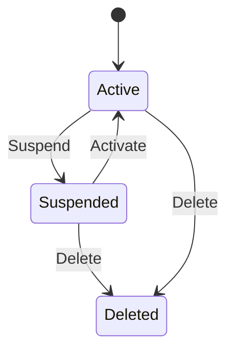

# Platform Management

Platform Management provides a cross-tenant administrative interface for service providers managing multiple organizations.

## Access Requirements

Platform Management requires the `platform_manager` flag on your user account. This flag can only be set by:

- Direct database modification
- Another existing platform manager

Contact your system administrator if you need platform manager access.

## Platform Dashboard

The Platform Dashboard displays aggregate statistics across all organizations:

| Metric | Description |
|--------|-------------|
| Total Organizations | Number of organizations on the platform |
| Total Users | Combined user count across all organizations |
| Total Extensions | Total extensions configured |
| Active Calls | Currently active calls across all tenants |

## Organization Management

### Viewing Organizations

The Organizations list shows all organizations with key details:

- Organization name and ID
- Owner information
- Status (Active, Suspended)
- Creation date
- User and extension counts

### Creating Organizations

Click **Create Organization** to add a new organization. You will need to specify:

- Organization name
- Owner email address
- Owner name

OPBX creates the organization and sends an invitation email to the owner.

### Suspending Organizations

Suspended organizations prevent all user login and API access. Use suspension for:

- Non-payment situations
- Policy violations
- Temporary service pauses

Suspended organizations retain all data and can be reactivated.

### Deleting Organizations

Deleting an organization permanently removes ALL data including:

- Users and authentication records
- Extensions and devices
- Call records and history
- Recordings and voicemails
- Configuration and routing rules

:::danger
Deleting an organization permanently removes ALL data including users, extensions, call records, recordings, and configuration. This action cannot be undone.
:::

### Organization Status

Organizations transition through states based on platform manager actions:

## User Management

### Viewing Users

The Users list displays all users across all organizations with:

- User name and email
- Organization membership
- Role (Owner, Admin, User)
- Platform manager status
- Last login time

### Creating Users

Create users in any organization by specifying:

- Organization (dropdown selection)
- Name
- Email address
- Role
- Password (or send invitation)

### Editing Users

Modify user details including:

- Name and contact information
- Role assignment
- Password resets
- Platform manager flag

### Platform Manager Access

Grant or revoke platform manager access for any user. When you revoke platform manager access:

- All active tokens for that user are immediately invalidated
- The user must log in again
- Access to Platform Management is removed

:::warning
Revoking platform manager access immediately invalidates all tokens and forces re-login.
:::

## Audit Logs

Every platform management action is logged with:

| Field | Description |
|-------|-------------|
| Timestamp | When the action occurred |
| Actor | Who performed the action |
| Action | What was done |
| Target | Which organization or user was affected |
| Before State | Previous values (for updates) |
| After State | New values (for updates) |

Review audit logs to track changes and investigate issues.

## Safety Guards

Platform Management includes safety guards to prevent accidental damage:

| Guard | Behavior |
|-------|----------|
| Last Owner Protection | Cannot delete the last owner of an organization |
| Self-Protection | Cannot delete your own user account |
| Last Platform Manager | Cannot revoke the last platform manager access |
| Cascade Warnings | Confirm before deleting organizations |

These guards protect against accidental lockouts and data loss.
