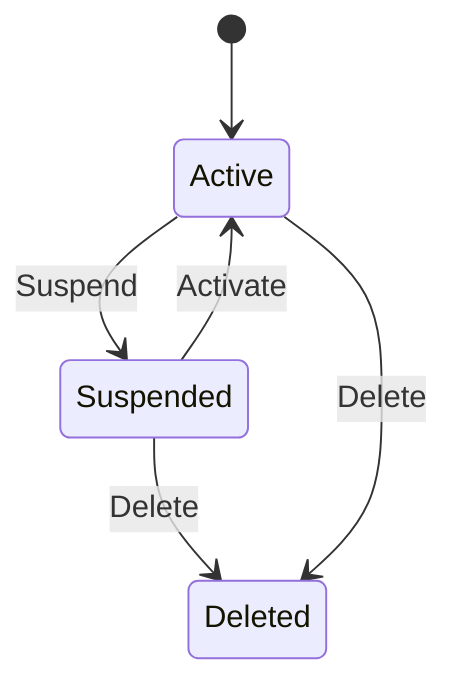

# Platform Management

:::danger Platform Owners/Operators Only
This section applies exclusively to **platform owners and operators** who manage the OPBX deployment itself. Regular organization users (Owner, PBX Admin, PBX User, Reporter) do not have access to Platform Management features. If you are an organization administrator, refer to [Organization Settings](/administration) instead.
:::

Platform Management provides a cross-tenant administrative interface for service providers who host and operate OPBX for multiple customer organizations.

## Access Requirements

Platform Management requires the `platform_manager` flag on your user account. This is a system-level privilege that is separate from the organization role hierarchy. The flag can only be set by:

- Direct database modification by a system administrator
- Another existing platform manager

This privilege is intended for the team that operates the OPBX platform, not for end-user organizations.

## Platform Dashboard

The Platform Dashboard displays aggregate statistics across all organizations:

| Metric | Description |
|--------|-------------|
| Total Organizations | Number of organizations on the platform |
| Total Users | Combined user count across all organizations |
| Total Extensions | Total extensions configured |
| Active Calls | Currently active calls across all tenants |

## Organization Management

### Viewing Organizations

The Organizations list shows all organizations with key details:

- Organization name and ID
- Owner information
- Status (Active, Suspended)
- Creation date
- User and extension counts

### Creating Organizations

Click **Create Organization** to add a new organization. You will need to specify:

- Organization name
- Owner email address
- Owner name

OPBX creates the organization and sends an invitation email to the owner.

### Suspending Organizations

Suspended organizations prevent all user login and API access. Use suspension for:

- Non-payment situations
- Policy violations
- Temporary service pauses

Suspended organizations retain all data and can be reactivated.

### Deleting Organizations

Deleting an organization permanently removes ALL data including:

- Users and authentication records
- Extensions and devices
- Call records and history
- Recordings and voicemails
- Configuration and routing rules

:::danger
Deleting an organization permanently removes ALL data including users, extensions, call records, recordings, and configuration. This action cannot be undone.
:::

### Organization Status

Organizations transition through states based on platform manager actions:

## User Management

### Viewing Users

The Users list displays all users across all organizations with:

- User name and email
- Organization membership
- Role (Owner, Admin, User)
- Platform manager status
- Last login time

### Creating Users

Create users in any organization by specifying:

- Organization (dropdown selection)
- Name
- Email address
- Role
- Password (or send invitation)

### Editing Users

Modify user details including:

- Name and contact information
- Role assignment
- Password resets
- Platform manager flag

### Platform Manager Access

Grant or revoke platform manager access for any user. When you revoke platform manager access:

- All active tokens for that user are immediately invalidated
- The user must log in again
- Access to Platform Management is removed

:::warning
Revoking platform manager access immediately invalidates all tokens and forces re-login.
:::

## Operating as an Organization

Platform managers can temporarily act **as the Owner** of any active
organization directly from the Organizations list — useful for
troubleshooting a customer's configuration or reproducing a support ticket
without needing the customer's own credentials.

### Starting a session

1. Open **Platform → Organizations**.
2. Click **Operate As** on the row for the target organization.

You are immediately switched into that organization with **Owner**
permissions. Every screen — dashboard, extensions, ring groups, settings,
and so on — reflects the target organization's data, exactly as that
organization's own Owner would see it.

A persistent yellow banner is shown at the top of every page for the
duration of the session:

> ⚠️ Operating as **{Organization Name}** — you are acting as an organization admin. [Exit organization]

### Ending a session

Click **Exit organization** in the banner. This restores your real
platform-manager identity and returns you to **Platform → Organizations**.
The session also ends automatically if you log out or your token expires —
there is no server-side session to time out separately.

### How it works

- The switch is driven entirely by an `X-Operate-As-Organization` request
  header the SPA attaches to every API call while a session is active. Start
  and stop are lightweight validate-and-audit calls — they do not themselves
  hold any server-side session state.
- Only a **real platform-manager user** can trigger a switch. API keys and
  non-platform-manager users are rejected with a `403` even if they somehow
  send the header.
- Only **active** organizations can be targeted — suspended or deleted
  organizations return a `403`.
- While operating as an organization, you cannot accidentally modify your own
  platform-owner user record (e.g. via **Profile**) — the effective identity
  used for the session exists only in memory for the duration of each
  request and is never saved.
- Entering or exiting a session clears the SPA's cached data so nothing from
  the previous context (real or impersonated) leaks into the new view.

### Audit trail

Every start and stop is recorded in the [platform audit log](#audit-logs) as
`operate_as.started` / `operate_as.stopped`, attributed to your real
platform-manager user id and the target organization. Starting a session
accepts an optional free-text reason (e.g. "Investigating ticket #1234") that
is stored on the audit entry.

:::warning Treat this as full Owner access
While operating as an organization you can view and change anything that
organization's own Owner could — including billing-adjacent settings, user
management, and call routing. Use it deliberately and exit as soon as you're
done.
:::

## Audit Logs

Every platform management action is logged with:

| Field | Description |
|-------|-------------|
| Timestamp | When the action occurred |
| Actor | Who performed the action |
| Action | What was done |
| Target | Which organization or user was affected |
| Before State | Previous values (for updates) |
| After State | New values (for updates) |

Review audit logs to track changes and investigate issues.

## Safety Guards

Platform Management includes safety guards to prevent accidental damage:

| Guard | Behavior |
|-------|----------|
| Last Owner Protection | Cannot delete the last owner of an organization |
| Self-Protection | Cannot delete your own user account |
| Last Platform Manager | Cannot revoke the last platform manager access |
| Cascade Warnings | Confirm before deleting organizations |

These guards protect against accidental lockouts and data loss.
