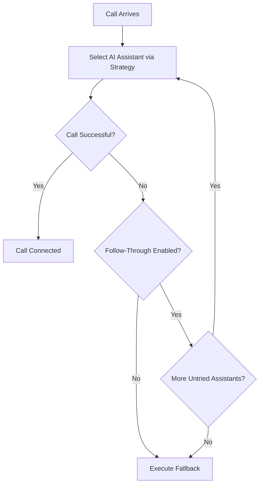

# AI Load Balancers

AI Load Balancers distribute incoming calls across multiple AI assistants using configurable strategies. This ensures high availability, load distribution, and intelligent failover handling.

## Load Balancing Strategies

Choose the strategy that best fits your use case:

| Strategy | Algorithm | Best For |
|----------|-----------|----------|
| Round Robin | Rotates through members in order (Redis-backed counter) | Even distribution across assistants |
| Priority | Routes to highest-priority available member | Primary/backup setups |
| Percentage | Weighted random distribution (0-100% per member) | A/B testing, gradual rollouts |

### Round Robin

Calls rotate through members sequentially. A Redis-backed counter ensures consistent distribution even across multiple OPBX instances.

### Priority

Members are ordered by priority value. The system always attempts to route to the highest-priority active member first.

### Percentage

Each member receives a percentage weight (0-100%). The system uses weighted random selection to distribute calls proportionally. Total percentages do not need to equal 100%.

## Members

Add AI assistants as members with configurable attributes:

| Attribute | Description |
|-----------|-------------|
| AI Assistant | The assistant to include in the pool |
| Priority | Used by Priority strategy (lower number = higher priority) |
| Weight | Used by Percentage strategy (0-100) |
| Position | Used by Round Robin strategy (order in rotation) |
| Status | Active or Inactive |

:::tip
Set a member to Inactive to temporarily remove it from the pool without deleting the configuration.
:::

## Follow-Through Failover

Enable follow-through to automatically try the next assistant when the selected one fails.

### How It Works

The system tracks which assistants have been tried for each call to prevent infinite loops. An assistant is considered failed if it returns busy or no-answer.

### When Follow-Through Applies

Follow-through triggers when:

- The selected AI Assistant is busy
- The selected AI Assistant does not answer
- The connection fails

### When All Assistants Fail

If all available assistants have been tried and failed, the system executes the configured fallback action.

## Fallback Actions

When follow-through is disabled or all assistants fail, the system executes a fallback action:

| Fallback | Description |
|----------|-------------|
| Extension | Route to a specific extension |
| Ring Group | Route to a ring group |
| IVR Menu | Route to an IVR menu |
| AI Assistant | Route to another AI Assistant (without follow-through to prevent loops) |
| Hangup | End the call |

:::warning
When using another AI Assistant as fallback, follow-through is automatically disabled to prevent routing loops.
:::

## Creating an AI Load Balancer

1. Navigate to **AI Load Balancers** in the sidebar
2. Click **Create**
3. Enter a descriptive name
4. Select a load balancing strategy
5. Add members (AI assistants with their configuration)
6. Enable or disable follow-through failover
7. Select a fallback action
8. Click **Save**

## Best Practices

### For High Availability

- Use the **Priority** strategy with follow-through enabled
- Configure at least two AI assistants from different providers
- Set a Ring Group or extension as fallback

### For Gradual Rollouts

- Use the **Percentage** strategy
- Start with 10% on the new assistant, 90% on the existing one
- Gradually shift percentages as you gain confidence

### For Cost Optimization

- Use the **Round Robin** strategy to distribute load evenly
- Monitor usage patterns and adjust member weights accordingly

## Monitoring

Track load balancer performance through:

- Call logs showing which assistant handled each call
- Failure rates per member
- Fallback action triggers

:::note
Member status changes take effect immediately for new calls. Ongoing calls are not affected.
:::
