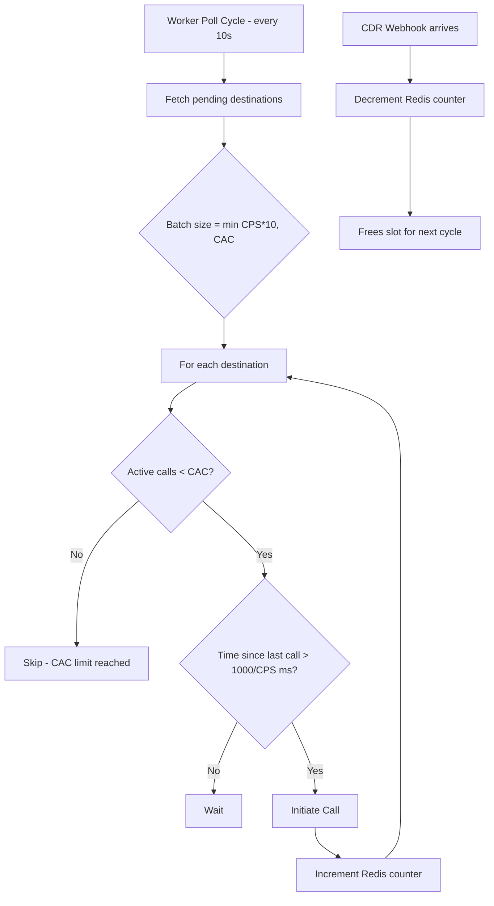

# Rate Limiting (CAC and CPS)

The Auto Dialer provides two independent controls for managing outbound call volume: CAC (Concurrent Active Calls) and CPS (Calls Per Second). These settings prevent system overload and ensure predictable dialing behavior.

## Understanding the Controls

### CAC (Concurrent Active Calls)

CAC sets the maximum number of simultaneous active calls allowed for a campaign.

- **Range**: 1 to 50
- **Purpose**: Acts as a ceiling on concurrent call volume
- **Behavior**: When active calls reach the CAC limit, no new calls are initiated until existing calls complete

### CPS (Calls Per Second)

CPS controls how quickly new calls are initiated.

- **Range**: 1 to 5
- **Purpose**: Controls the pacing of call initiation
- **Behavior**: Higher CPS means calls are initiated more frequently

| CPS Value | Interval Between Calls | Calls Per Minute |
|-----------|----------------------|------------------|
| 1 | 1000ms (1 second) | 60 |
| 2 | 500ms | 120 |
| 3 | 333ms | 180 |
| 4 | 250ms | 240 |
| 5 | 200ms | 300 |

## How CAC and CPS Interact

The Go Dialer Worker uses both values to determine how many calls to initiate in each 10-second polling cycle:

```
Batch size per cycle = min(CPS x 10, CAC)
Interval between calls = 1000 / CPS milliseconds
```

**Example Calculation:**

If CAC = 20 and CPS = 3:
- Batch size = min(3 x 10, 20) = 20 calls per 10-second cycle
- Interval between calls = 1000 / 3 = 333ms

### Configuration Examples

| CAC | CPS | Batch Size | Interval | Description |
|-----|-----|-----------|----------|-------------|
| 1 | 1 | 1 | 1000ms | Conservative: 1 call at a time, 1 per second |
| 10 | 1 | 10 | 1000ms | 10 concurrent calls, paced at 1 per second |
| 20 | 3 | 20 | 333ms | 20 concurrent calls, fast pacing |
| 50 | 5 | 50 | 200ms | Maximum throughput |
| 10 | 5 | 10 | 200ms | CPS limited by CAC ceiling |

:::note
When CPS x 10 exceeds CAC, the batch size is capped at CAC. This prevents the worker from attempting to start more calls than the concurrency limit allows.
:::

## Rate Limiting Flow



## Redis Counter Management

The system tracks concurrent calls using a Redis counter:

- **Key**: `dialer:cac:{campaign_id}:active`
- **Incremented**: When the Go worker initiates a call
- **Decremented**: When Laravel receives a CDR webhook indicating call completion

This distributed counter ensures accurate tracking across the multi-component architecture.

## Choosing Rate Limit Values

### Start Conservative

Begin with low values and increase gradually:

1. **Initial test**: CAC = 1, CPS = 1
2. **Small scale**: CAC = 5, CPS = 1
3. **Medium scale**: CAC = 10, CPS = 2
4. **High volume**: CAC = 25+, CPS = 3-5

### Consider Your Routing Destination

Your AI assistant or load balancer capacity should inform your rate limits:

- **Single AI assistant**: Keep CAC low (1-5) to prevent overwhelming the endpoint
- **Load balancer with multiple backends**: Can support higher CAC (10-50)
- **External rate limits**: Check if your AI provider has concurrency limits

### Monitor and Adjust

Watch the Real-Time Monitor for these indicators:

| Indicator | Meaning | Action |
|-----------|---------|--------|
| CAC at 100% | All slots filled | Consider increasing CAC if calls complete quickly |
| CAC rarely fills | Low utilization | You can increase CPS for faster dialing |
| Rate limit warnings | CPS throttling | Normal if CAC is the bottleneck |

:::tip
If you see "CAC limit reached" messages in the dialer logs, your calls are completing slower than they are being initiated. Either increase CAC to allow more concurrency, or reduce CPS to slow the initiation rate.
:::

## Rate Limiting Scenarios

### Scenario 1: High CAC, Low CPS

**Configuration**: CAC = 50, CPS = 1

- Many concurrent calls allowed (up to 50)
- Slow initiation rate (1 per second)
- **Result**: Takes 50 seconds to reach full capacity. Good for gradual ramp-up.

### Scenario 2: Low CAC, High CPS

**Configuration**: CAC = 5, CPS = 5

- Few concurrent calls (max 5)
- Fast initiation rate (5 per second)
- **Result**: Quickly reaches capacity, then waits for calls to complete. Good for testing with minimal resource usage.

### Scenario 3: Balanced

**Configuration**: CAC = 20, CPS = 2

- Moderate concurrency (20 calls)
- Moderate initiation rate (2 per second)
- **Result**: Steady dialing with good throughput. Reaches capacity in 10 seconds.

## Best Practices

1. **Match to Capacity**: Set CAC based on your AI assistant or load balancer capacity

2. **Respect Carrier Limits**: Your telephony provider may have rate limits. Check with Cloudonix for recommended CPS values.

3. **Monitor Answer Rates**: If answer rates are low, higher CPS wastes resources on unanswered calls

4. **Consider Time of Day**: You might use different campaigns with different rate limits for peak vs. off-peak hours

5. **Test Before Scaling**: Always test with low rate limits before increasing to production volumes

## Troubleshooting

| Symptom | Cause | Solution |
|---------|-------|----------|
| Calls not initiating | CAC = 0 or CPS = 0 | Check campaign settings |
| Slow dialing | CPS too low | Increase CPS value |
| CAC always at limit | Calls taking long to complete | Increase CAC or reduce CPS |
| Rate limit errors | CPS x 10 > CAC | This is normal; CAC is the bottleneck |
