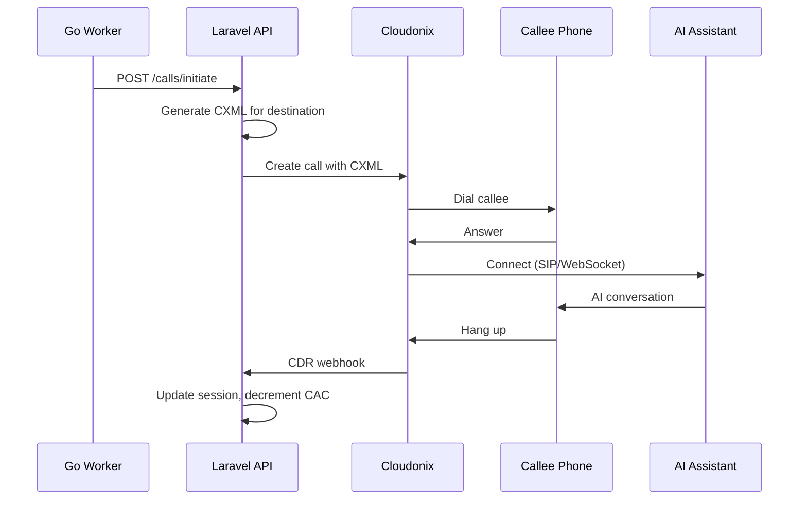

# Campaign Routing

When an auto-dialer call is answered, OPBX routes it to the campaign's configured routing destination. This destination determines what happens to the call after the callee picks up.

## Routing Overview

The routing destination is configured per campaign on the Basic tab of the campaign form. All calls from the campaign use the same routing destination.

## Destination Types

OPBX supports four routing destination types:

| Type | Description | Use Case |
|------|-------------|----------|
| **AI Assistant (SIP)** | Routes to a SIP-based AI provider | Traditional AI voice providers using SIP trunking |
| **AI Assistant (WebSocket)** | Routes to a WebSocket AI provider | Modern AI platforms using real-time streaming |
| **AI Load Balancer** | Distributes calls across multiple AI assistants | High-volume campaigns requiring redundancy |
| **Hangup** | Immediately ends the call | Testing campaigns without connecting to AI |

## CXML Generation

When the Go Dialer Worker initiates a call, Laravel generates CXML (Cloudonix XML) that instructs Cloudonix how to handle the answered call:

| Destination Type | CXML Generated |
|-----------------|----------------|
| **AI Assistant (SIP)** | `<Dial><Service provider="...">phone</Service></Dial>` |
| **AI Assistant (WebSocket)** | `<Connect><Stream url="wss://..."/></Connect>` |
| **AI Load Balancer** | Same as above, selected by load balancing strategy |
| **Hangup** | `<Response><Hangup/></Response>` |

## Call Flow



**Flow Explanation:**

1. **Worker Polls**: Go Dialer Worker requests pending destinations from Laravel every 10 seconds
2. **CXML Generation**: Laravel generates the appropriate CXML based on the campaign's routing destination
3. **Call Creation**: Laravel calls Cloudonix API with the CXML and destination phone number
4. **Dialing**: Cloudonix initiates the call to the callee's phone
5. **Answer**: When the callee answers, Cloudonix executes the CXML
6. **Connection**: CXML connects the call to the AI assistant via SIP or WebSocket
7. **Conversation**: AI assistant interacts with the callee
8. **Completion**: When the call ends, Cloudonix sends a CDR webhook to Laravel
9. **Cleanup**: Laravel updates the call session, decrements the CAC counter, and updates campaign statistics

## AI Assistant (SIP)

SIP-based AI assistants use traditional telephony protocols to connect calls.

**Configuration:**
- Select an AI assistant configured with SIP provider details
- The assistant's SIP URI is used in the CXML

**CXML Example:**
```xml
<Response>
  <Dial>
    <Service provider="custom_sip_provider">sip:ai@example.com</Service>
  </Dial>
</Response>
```

**When to Use:**
- Your AI provider requires SIP connectivity
- You need compatibility with traditional telephony infrastructure
- Your AI platform does not support WebSocket streaming

## AI Assistant (WebSocket)

WebSocket-based AI assistants use real-time bidirectional streaming for AI interactions.

**Configuration:**
- Select an AI assistant configured with a WebSocket URL template
- OPBX fills in placeholders when generating CXML

**CXML Example:**
```xml
<Response>
  <Connect>
    <Stream url="wss://ai.example.com/stream?session=123&amp;from=+14155551234&amp;to=+14155555678"/>
  </Connect>
</Response>
```

**WebSocket URL Parameters:**

The URL template supports placeholders that OPBX fills in at call time:

| Placeholder | Value |
|-------------|-------|
| **\{session\}** | Unique auto-dialer session ID for this call |
| **\{from\}** | Campaign's configured Caller ID |
| **\{to\}** | Destination phone number being dialed |
| **\{bot_id\}** | AI assistant's bot identifier |
| **\{auth_token\}** | Authentication token from AI assistant configuration |

**When to Use:**
- Your AI provider supports WebSocket streaming
- You need lower latency than SIP can provide
- You want real-time bidirectional audio streaming

## AI Load Balancer

The AI Load Balancer distributes calls across multiple AI assistants using configurable strategies.

**Configuration:**
- Select a load balancer that contains multiple AI assistants
- The load balancer's strategy determines which assistant handles each call

**Strategies:**

| Strategy | Description |
|----------|-------------|
| **Round Robin** | Cycles through assistants in order |
| **Least Connections** | Routes to the assistant with fewest active calls |
| **Random** | Randomly selects an assistant |
| **Weighted** | Routes based on configured weights |

**When to Use:**
- High-volume campaigns that exceed single assistant capacity
- Redundancy requirements (failover if one assistant fails)
- Geographic distribution (different assistants for different regions)

## Hangup

The Hangup destination immediately ends the call when answered.

**CXML Example:**
```xml
<Response>
  <Hangup/>
</Response>
```

**When to Use:**
- Testing campaign configuration without connecting to AI
- Verifying rate limiting and scheduling behavior
- Load testing the dialing infrastructure

:::warning
Using Hangup in production campaigns results in immediate disconnection when callees answer. Only use this for testing.
:::

## Routing Configuration

Configure routing when creating or editing a campaign:

1. Go to the **Basic** tab
2. Select **Routing Destination Type**
3. Select the specific **Destination** (AI assistant or load balancer)
4. Complete other campaign settings
5. Save

:::note
The routing destination is configured once per campaign and applies to all calls. If you need different routing for different segments, create separate campaigns.
:::

## Best Practices

1. **Test Before Scaling**: Use Hangup or a test AI assistant to verify your campaign works before using production AI

2. **Match Capacity**: Ensure your AI assistant or load balancer can handle the campaign's CAC setting

3. **Monitor Connection Quality**: Track answer rates and call durations to detect routing issues

4. **Use Load Balancers for Scale**: When CAC exceeds 10, consider using a load balancer for redundancy

5. **Verify WebSocket Parameters**: If using WebSocket routing, confirm all placeholder values are correctly configured in your AI assistant settings

## Troubleshooting

| Symptom | Cause | Solution |
|---------|-------|----------|
| Calls hang up immediately | Hangup destination selected | Change to an AI assistant destination |
| AI never connects | CXML generation error | Check AI assistant configuration |
| WebSocket connection fails | Invalid URL template | Verify placeholder syntax in AI assistant config |
| SIP connection fails | Invalid SIP URI | Check SIP provider configuration |
| Load balancer not distributing | Single assistant in balancer | Add more assistants to the load balancer |
| High drop rate after answer | AI assistant capacity exceeded | Reduce CAC or add more AI assistants |
