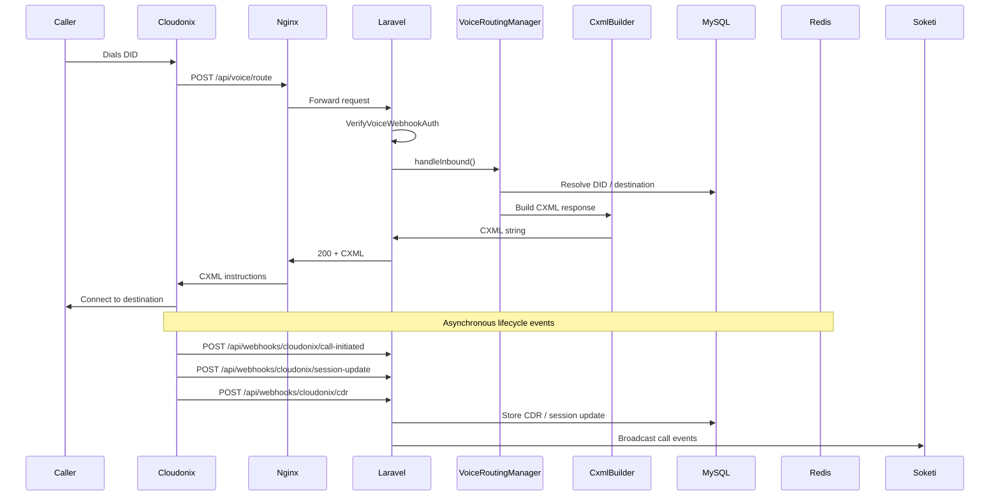

# Call Flow

This page traces the lifecycle of an inbound call from the moment Cloudonix receives it, through OPBX routing decisions, to CDR and session-update handling.

---

## Overview

---

## Step 1: Cloudonix Receives the Call

When a caller dials a DID number, Cloudonix routes the call to the voice application configured for the domain. The voice application URL points to OPBX (`/api/voice/route`).

Cloudonix sends a JSON payload that includes:

- `Domain` — the Cloudonix domain
- `To` / `to` — the called number
- `From` / `from` — the caller number
- `Direction` — call direction
- Additional Cloudonix session fields

---

## Step 2: Voice Webhook Authentication

`VerifyVoiceWebhookAuth` runs first:

1. Extracts the Bearer token from the `Authorization` header.
2. Extracts `Domain` and the `to`/`from` numbers.
3. Looks up `CloudonixSettings` by `domain_name` or `domain_uuid`.
4. Compares the Bearer token to `domain_requests_api_key` with `hash_equals()`.
5. Injects `_organization_id` into the request.
6. Returns CXML unauthorized response on failure.

If authentication succeeds, the request reaches `VoiceRoutingController@handleInbound`.

---

## Step 3: VoiceRoutingManager

`VoiceRoutingController` delegates to `App\Services\VoiceRouting\VoiceRoutingManager`.

### Direction Dispatch

The manager dispatches by the `Direction` field:

| Direction | Handler | Typical Use |
|-----------|---------|-------------|
| `subscriber` | `handleSubscriberDirection()` | Internal PBX user call. |
| `inbound` | `handleInboundDirection()` | External or internal-from-DID. |
| `outbound` | `handleOutgoingDirection()` | Outbound calls only. |
| `application` | `handleApplicationDirection()` | API-initiated calls. |
| default | `handleUnknownDirection()` | Falls back to inbound. |

### DID Resolution

For inbound calls, the manager resolves the called DID (`To` number):

1. Look up `did_numbers` by phone number.
2. Read the DID's `routing_type` and `routing_type_id`.
3. Load the destination model based on the routing type.

### Destination Types

| Routing Type | Model | Strategy |
|--------------|-------|----------|
| `extension` | `Extension` | `UserRoutingStrategy` |
| `ring_group` | `RingGroup` | `RingGroupRoutingStrategy` |
| `ivr_menu` | `IvrMenu` | `IvrRoutingStrategy` |
| `conference_room` | `ConferenceRoom` | `ConferenceRoutingStrategy` |
| `business_hours` | `BusinessHoursSchedule` | `BusinessHoursRoutingService` |
| `ai_assistant` | `Extension` with AI assistant | `AiAgentRoutingStrategy` |
| `ai_load_balancer` | `Extension` with ALB | `AiLoadBalancerRoutingStrategy` |
| `forward` | Forward target | `ForwardRoutingStrategy` |

---

## Step 4: Strategy Execution

`VoiceRoutingStrategyExecutor` iterates registered strategies and picks the first one whose `canHandle()` method matches the destination. The selected strategy returns a CXML response via `CxmlBuilder`.

### CxmlBuilder

`App\Services\CxmlBuilder\CxmlBuilder` generates CXML using `DOMDocument`. All user-controlled input is XML-encoded to prevent injection. Common CXML outputs include:

| Method | CXML Output |
|--------|-------------|
| `dialExtension($sipUri)` | `<Dial><Sip>...</Sip></Dial>` |
| `dialRingGroup($sipUris[])` | `<Dial>` with multiple `<Sip>` or `<Number>` nouns |
| `simpleDial($dest, ...)` | `<Dial>` for outbound numbers |
| `joinConference(...)` | `<Dial><Conference>...</Conference></Dial>` |
| `gather(...)` | `<Gather>` for IVR digit collection |
| `streamToWebSocket($url)` | `<Connect><Stream url="wss://..."/></Connect>` |
| `busy($msg)` / `unavailable($msg)` | Error prompt + hangup |

The CXML response is returned to Cloudonix with `Content-Type: application/xml`.

---

## Step 5: IVR Input Callback

If the route returns an IVR `Gather`, Cloudonix POSTs the caller's digits to `/api/voice/ivr-input`. The flow:

1. Authenticate with `VerifyVoiceWebhookAuth`.
2. Validate the IVR menu exists and is active.
3. Check/update call state in Redis (turn count, input history).
4. No input → replay or increment turns toward failover.
5. Valid option → route to the configured destination.
6. Invalid option → error message, replay, or failover after `max_turns`.

---

## Step 6: Ring Group Callback

For ring groups with sequential strategies, Cloudonix POSTs to `/api/callbacks/voice/ring-group-callback` after each dial attempt. `VoiceRoutingManager::routeRingGroupCallback` determines the next action (try next member, failover, or hangup).

---

## Step 7: AI Load Balancer Follow-Through

For AI load balancers, `/api/callbacks/voice/albs-follow-through` handles failover when the primary AI provider is busy or unavailable. It tries the next assistant in the balancer distribution.

---

## Step 8: Asynchronous Notifications

While the call is in progress, Cloudonix sends asynchronous JSON webhooks to OPBX.

### call-initiated

`POST /api/webhooks/cloudonix/call-initiated`

- Normalizes `from` and `to` to E.164.
- Identifies the organization from the middleware-injected `_organization_id` or by DID lookup.
- Dispatches `ProcessInboundCallJob` to create a `CallLog` and broadcast `CallInitiated`.

### session-update

`POST /api/webhooks/cloudonix/session-update`

- High-velocity stream of call progress events.
- Filters statuses to the allowed notification list.
- Creates a `SessionUpdate` record.
- Triggers call notification webhooks if configured.
- Broadcasts `CallAnswered` and `CallEnded` events via Soketi.

### CDR

`POST /api/webhooks/cloudonix/cdr`

- Creates a `CallDetailRecord` via `CallDetailRecord::createFromWebhook()`.
- Backfills the legacy `CallLog` record.
- Creates a final `SessionUpdate` with `action = 'cdr_final_status'`.
- Triggers call notification webhooks for the final status.
- For auto-dialer calls:
  - Updates `AutoDialerCallSession` and `AutoDialerDestination`.
  - Updates campaign counters.
  - Decrements the Redis CAC counter using the `dialer` connection (raw key `dialer:cac:{campaign_id}:active`).
  - Publishes the CDR event to Redis Pub/Sub channel `cdr:completed`.

---

## Call State in Redis

- `lock:call:{call_id}` — distributed lock for a call
- IVR state — turn count and digit history
- Dialer CAC counters — `dialer:cac:{campaign_id}:active`

---

## Related Documentation

- [Architecture Overview](./index)
- [Webhooks](./webhooks)
- [Multi-Tenancy](./multi-tenancy)
- [Security](./security)
- [Real-Time](./real-time)
- [Voice Routing Engine](/modules/voice-routing-engine) *(if available)*
