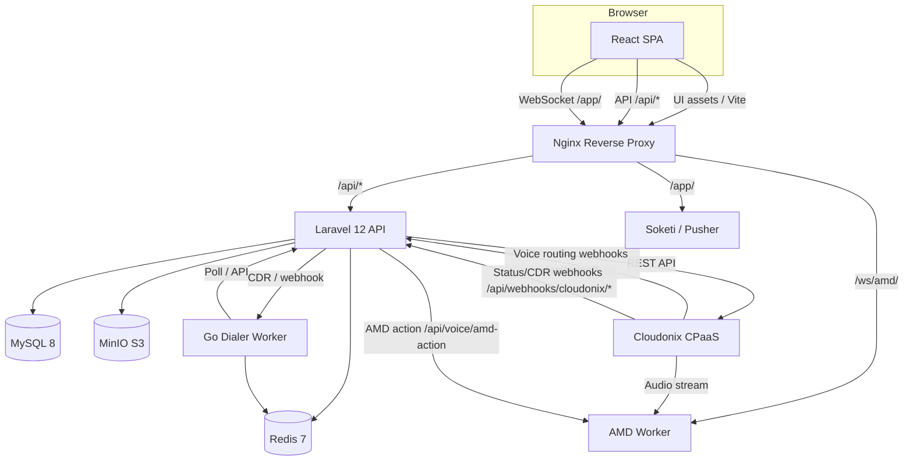

# Architecture Overview

OPBX is a multi-tenant business PBX. The platform splits responsibilities between a **control plane** for configuration and management, and an **execution plane** for real-time call processing and external integrations.

---

## Control Plane vs Execution Plane

| Plane | Purpose | Components |
|-------|---------|------------|
| **Control Plane** | Configure the PBX, manage users, review call logs, and administer the platform. | React SPA, Laravel API, MySQL |
| **Execution Plane** | Process live calls, webhooks, queues, real-time events, and worker coordination. | Voice routing controllers, webhook controllers, Redis queues, Soketi, Go dialer worker, Java/Vert.x AMD worker |

The control plane changes state slowly. The execution plane responds in milliseconds to voice routing requests from Cloudonix and handles high-velocity status updates.

---

## Service Architecture

### Component Responsibilities

| Component | Technology | Role |
|-----------|------------|------|
| React SPA | React 18 + TypeScript | User interface for PBX configuration, live calls, reporting, and administration. |
| Nginx | nginx:alpine | Reverse proxy, static asset delivery, WebSocket upgrade routing, and worker proxying. |
| Laravel | Laravel 12 (PHP 8.4) | REST API, voice routing decisions, webhook processing, multi-tenancy, queues, and broadcasting. |
| MySQL | MySQL 8.0 | Persistent relational storage for organizations, users, calls, routing configuration, and CDRs. |
| Redis | Redis 7 (Alpine) | Caching, sessions, queues, idempotency keys, distributed locks, rate-limit counters, and real-time state. |
| MinIO | MinIO (S3-compatible) | Object storage for call recordings, IVR audio, and announcement files. |
| Soketi | Soketi / Pusher protocol | WebSocket server for live call updates and presence channels. |
| Cloudonix CPaaS | Cloudonix REST API | External VoIP platform that handles call media, SIP registration, and telephony primitives. |
| Dialer Worker | Go | Outbound auto-dialer campaign execution, CAC/CPS limiting, and retry logic. |
| AMD Worker | Java / Vert.x 5 | Stream-based answering-machine detection for outbound campaigns. |

---

## Data-Store Responsibilities

OPBX uses three data stores. Each has a clearly defined responsibility and different durability expectations.

### MySQL (Source of Truth)

MySQL stores all durable application data. Examples include:

- Organizations, users, roles, and permissions
- Extensions, DIDs, ring groups, IVR menus, business hours
- Call detail records (CDRs), call logs, and session updates
- Auto-dialer campaigns, destinations, and call sessions
- Platform audit logs and call notification settings

MySQL data is preserved in host bind mounts (`./volumes/mysql`). Back it up regularly with `./scripts/backup-database.sh`.

### Redis (Ephemeral Runtime State)

Redis supports fast, transient state. It is configured with AOF persistence in the example Docker Compose file, so it survives normal restarts, but treat it as operational cache/queue storage rather than a primary source of truth. Redis is used for:

- Sessions (`SESSION_DRIVER=redis`)
- Job queues (`QUEUE_CONNECTION=redis`)
- Application cache (`CACHE_STORE=redis`)
- Rate-limit counters (`rate_limit:org:{id}:{type}`)
- Webhook idempotency keys (`idem:webhook:{key}`)
- Distributed locks (`lock:call:{call_id}`)
- IVR call state and dialer CAC counters

Redis data is preserved in host bind mounts (`./volumes/redis`).

### MinIO (Object Storage)

MinIO provides S3-compatible object storage for binary files:

- Call recordings
- IVR prompts and announcements
- Auto-dialer audio assets

Files are stored in host bind mounts (`./volumes/minio`). External access to recordings is gated through HMAC-signed URLs generated by the Laravel backend.

---

## Routing Planes

| Traffic Type | Entry Point | Handler | Output |
|--------------|-------------|---------|--------|
| Web UI | Nginx :80 | React SPA | HTML/JS |
| REST API | Nginx :80 `/api/*` | Laravel controllers | JSON |
| Voice routing | Nginx :80 `/api/voice/*` | `VoiceRoutingController` | CXML |
| Status/CDR webhooks | Nginx :80 `/api/webhooks/cloudonix/*` | `CloudonixWebhookController` | JSON |
| Auto-dialer webhooks | Nginx :80 `/api/webhooks/auto-dialer/*` | `AutoDialerWebhookController` | JSON |
| Real-time | Nginx :80 `/app/` | Soketi | WebSocket |
| AMD audio stream | Nginx :80 `/ws/amd/` | AMD Worker | WebSocket |

---

## Worker Services

The execution plane includes two optional worker services:

- **[Dialer Worker](/workers/dialer-worker)** — Polls Laravel for active auto-dialer campaigns, initiates outbound calls through Cloudonix, and receives CDR webhooks from Laravel.
- **[AMD Worker](/workers/amd-worker)** — Receives live audio streams from Cloudonix, detects voicemail beeps, and posts results to `/api/voice/amd-action`.

Both workers authenticate with OPBX using shared tokens (`DIALER_WORKER_API_TOKEN`, `AMD_WORKER_API_TOKEN`).

---

## Next Steps

- Learn how tenant isolation works: [Multi-Tenancy](./multi-tenancy)
- Understand webhook security: [Webhooks](./webhooks)
- Follow an inbound call through the system: [Call Flow](./call-flow)
- Review security controls: [Security](./security)
- See real-time infrastructure: [Real-Time](./real-time)
