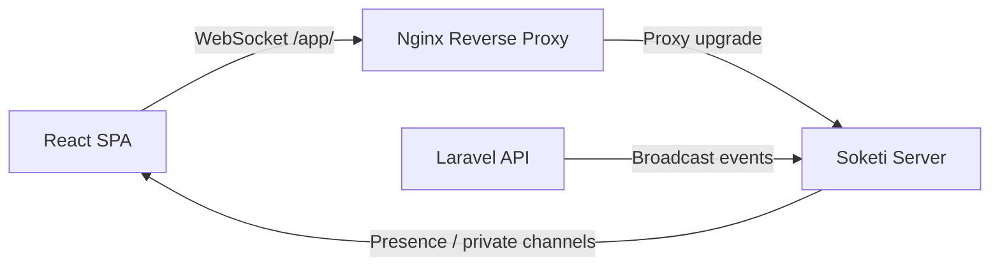

# Real-Time

OPBX delivers live call updates to the React SPA through WebSockets. The stack uses Soketi (a Pusher-compatible WebSocket server), Laravel Echo on the frontend, and Laravel broadcasting on the backend.

---

## Overview



When a call is initiated, answered, or ended, Laravel dispatches a broadcast event. Soketi forwards the event to all subscribed clients in the organization's presence channel. The React SPA updates the Live Calls view in real time.

---

## Soketi

Soketi runs as a Docker service (`opbx_websocket`) and listens on port 6001 internally. Nginx proxies the `/app/` path to Soketi, so browsers connect on the same port and domain as the API.

### Docker Configuration

From `docker-compose.yml.example`:

```yaml
soketi:
  image: 'quay.io/soketi/soketi:latest-16-alpine'
  ports:
    - "${SOKETI_PORT:-6001}:6001"
    - "${SOKETI_METRICS_PORT:-9601}:9601"
  environment:
    SOKETI_DEFAULT_APP_ID: '${PUSHER_APP_ID:-app-id}'
    SOKETI_DEFAULT_APP_KEY: '${PUSHER_APP_KEY:-pbxappkey}'
    SOKETI_DEFAULT_APP_SECRET: '${PUSHER_APP_SECRET:-pbxappsecret}'
    SOKETI_DEFAULT_APP_MAX_CONNECTIONS: '10000'
```

### Frontend Connection

The frontend uses the environment variables:

| Variable | Purpose |
|----------|---------|
| `VITE_PUSHER_APP_KEY` | Soketi app key |
| `VITE_WS_HOST` | WebSocket host |
| `VITE_WS_PORT` | WebSocket port (usually `80` when proxied through Nginx) |
| `VITE_WS_SCHEME` | `http` or `https` |

When Nginx proxies WebSockets, the browser connects to `ws://your-domain/app/` on port 80/443, not directly to port 6001.

---

## Broadcast Channels

Channel authorization is defined in `routes/channels.php`.

| Channel | Type | Authorization |
|---------|------|---------------|
| `org.{organizationId}` | Presence | User belongs to the organization. Returns `{id, name, email, role}`. |
| `user.{userId}` | Private | User ID matches the channel ID. |
| `extension.{extensionId}` | Private | User's organization matches the extension's organization. |

### Presence Channel

The organization presence channel is the primary channel for live call updates. All users in the same organization receive the same call events and can see each other's online presence.

---

## Broadcast Events

| Event | Channel | Data |
|-------|---------|------|
| `CallInitiated` | `org.{organizationId}` | `call_id`, `from`, `to`, `did`, `status`, `timestamp` |
| `CallAnswered` | `org.{organizationId}` | `call_id`, `extension`, `answered_at` |
| `CallEnded` | `org.{organizationId}` | `call_id`, `duration` |

Events are dispatched from webhook handlers and jobs as call state changes occur.

---

## Frontend Echo Service

`frontend/src/services/echo.service.ts` creates a singleton Laravel Echo instance backed by Pusher.

### Features

- Bearer auth for `/broadcasting/auth`
- Auto-retry with exponential backoff (initial 1s, max 30s, max 5 attempts)
- 10-second connection timeout
- Subscribes to organization presence channels
- Tracks online members via presence callbacks (`here`, `joining`, `leaving`)

### Hooks

- `useEchoConnection` — establishes the global Echo connection when the user is authenticated. It intentionally does **not** disconnect on component unmount so the connection persists across route changes.
- `useCallPresence` — tracks `activeCalls` and `onlineMembers`, deduplicates entries, and recalculates call durations every second.

### Returned State

```ts
{
  activeCalls,
  onlineMembers,
  totalActiveCalls,
  isConnected,
  connectionState,
}
```

---

## Broadcasting Authentication

Laravel's broadcasting auth route is registered in `routes/api.php`:

```php
Broadcast::routes(['middleware' => ['auth:sanctum', 'tenant.scope']]);
```

To subscribe to a private or presence channel, the client must first authenticate. Soketi forwards the auth request to `/broadcasting/auth`, where Sanctum validates the session or Bearer token and `EnsureTenantScope` validates the organization.

---

## Configuration

Relevant `.env.example` variables:

```env
BROADCAST_DRIVER=pusher
BROADCAST_CONNECTION=pusher

PUSHER_APP_ID=app-id
PUSHER_APP_KEY=pbxappkey
PUSHER_APP_SECRET=
PUSHER_HOST=soketi
PUSHER_PORT=6001
PUSHER_SCHEME=http
PUSHER_APP_CLUSTER=mt1
```

Frontend Vite variables:

```env
VITE_WS_HOST=localhost
VITE_WS_PORT=6001
VITE_WS_SCHEME=http
```

In production behind Nginx, set `VITE_WS_PORT=80` or `443` and `VITE_WS_SCHEME=https`.

---

## Scaling and Limits

Default Soketi limits from `docker-compose.yml.example`:

- Max connections: 10,000 per app
- Max backend events per second: 100
- Max client events per second: 100
- Max read requests per second: 100

For larger deployments, scale Soketi horizontally or tune these limits.

---

## Troubleshooting

### WebSocket Does Not Connect

1. Confirm Soketi is healthy: `docker compose ps soketi`
2. Check the frontend is using the Nginx-proxied path (`/app/`) and the correct port.
3. Verify `PUSHER_APP_KEY` matches between the Soketi container and the frontend build.
4. Check browser dev tools for auth failures on `/broadcasting/auth`.

### No Live Call Updates

1. Confirm the `CallInitiated` / `CallAnswered` / `CallEnded` events are dispatched from the webhook handlers.
2. Verify the user is subscribed to `org.{organizationId}`.
3. Check that the organization channel authorization returns `true` or user data.

---

## Related Documentation

- [Architecture Overview](./index)
- [Call Flow](./call-flow)
- [Webhooks](./webhooks)
- [Security](./security)
- [Installation](/installation)
