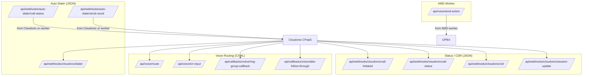

# Webhooks

OPBX receives webhooks from Cloudonix CPaaS for voice routing decisions, call status updates, session updates, and CDRs. This page describes the webhook endpoints, their authentication models, idempotency handling, and controller responsibilities.

For the complete security reference including token configuration and curl examples, see [`docs/WEBHOOK-AUTHENTICATION.md`](https://github.com/greenfieldtech-nirs/opbx/blob/main/docs/WEBHOOK-AUTHENTICATION.md).

---

## Webhook Categories

OPBX has three categories of inbound webhooks:

| Category | Middleware | Response Format | Purpose |
|----------|-----------|-----------------|---------|
| Voice routing | `voice.webhook.auth` | CXML | Real-time call routing instructions. |
| Status / CDR | `webhook.signature` (+ `webhook.idempotency`) | JSON | Asynchronous call events and records. |
| AMD action | Inline Bearer check | JSON | AMD worker callback with detection results. |

---

## Voice Routing Webhooks

Voice routing webhooks are synchronous: Cloudonix POSTs JSON and OPBX returns CXML instructions that tell Cloudonix how to handle the call.

### Authentication

- Middleware: `App\Http\Middleware\VerifyVoiceWebhookAuth` (alias `voice.webhook.auth`)
- Method: Bearer token from the `Authorization` header
- Token location: `cloudonix_settings.domain_requests_api_key`
- Token comparison: `hash_equals()` for timing-safe comparison
- Error format: CXML with `<Say>Unauthorized. Authentication failed.</Say><Hangup/>`

The voice webhook middleware requires a Bearer token. There is no unauthenticated fallback.

### Voice Routing Endpoints

| Method | URI | Controller | Purpose |
|--------|-----|------------|---------|
| POST | `/api/voice/route` | `VoiceRoutingController@handleInbound` | Main inbound call routing. |
| POST | `/api/voice/ivr-input` | `VoiceRoutingController@handleIvrInput` | IVR digit input callback. |
| POST | `/api/callbacks/voice/ring-group-callback` | `VoiceRoutingController@handleRingGroupCallback` | Ring group sequential/round-robin callback. |
| POST | `/api/callbacks/voice/albs-follow-through` | `AlbsFollowThroughController@handle` | AI load balancer failover routing. |
| GET | `/api/voice/health` | `VoiceRoutingController@health` | Voice routing health check (no auth). |

---

## Status / CDR Webhooks

Status and CDR webhooks are asynchronous notifications. OPBX acknowledges them with JSON responses.

### Authentication

- Middleware: `App\Http\Middleware\VerifyCloudonixSignature` (alias `webhook.signature`)
- Method: Bearer token from the `Authorization` header (conditional)
- Token location: `cloudonix_settings.domain_requests_api_key`
- Fallback: If `domain_requests_api_key` is empty, the request is accepted without a token for backward compatibility.
- Error format: JSON (`{"error": "Unauthorized - ..."}`)

The middleware extracts the domain from:

1. `payload.domain`
2. `payload.owner.domain.name`
3. `payload.owner.domain.uuid`

It then looks up the organization via `CloudonixSettings` by `domain_name` or `domain_uuid`.

### Status / CDR Endpoints

| Method | URI | Controller | Middleware | Purpose |
|--------|-----|------------|------------|---------|
| POST | `/api/webhooks/cloudonix/call-initiated` | `CloudonixWebhookController@callInitiated` | `webhook.signature`, `webhook.idempotency` | Call arrived notification (async). |
| POST | `/api/webhooks/cloudonix/call-status` | `CloudonixWebhookController@callStatus` | `webhook.signature`, `webhook.idempotency` | Call status changes. |
| POST | `/api/webhooks/cloudonix/cdr` | `CloudonixWebhookController@cdr` | `webhook.signature`, `webhook.idempotency` | Final call detail record. |
| POST | `/api/webhooks/cloudonix/session-update` | `CloudonixWebhookController@sessionUpdate` | `webhook.signature` only | High-velocity session progress events. |

### session-update Handling

`session-update` is high-velocity and therefore skips the idempotency middleware. The controller still deduplicates by `eventId` against the `session_updates` table.

It filters statuses into notification events:

- `new`, `initiated`, `created` → `new`
- `ringing`, `ring`, `progress` → `ringing`
- `connected`, `connect` → `connected`
- `answer`, `answered`, `active` → `answered`
- `busy` → `busy`
- `cancel`, `cancelled`, `canceled` → `cancel`
- `failed`, `fail`, `error` → `failed`
- `congestion`, `congested` → `congestion`

---

## Auto-Dialer Webhooks

Auto-dialer webhooks reuse the same status/CDR authentication stack.

| Method | URI | Controller | Middleware | Purpose |
|--------|-----|------------|------------|---------|
| POST | `/api/webhooks/auto-dialer/call-status` | `AutoDialerWebhookController@callStatus` | `webhook.signature`, `webhook.idempotency` | Outbound call status. |
| POST | `/api/webhooks/auto-dialer/amd-result` | `AutoDialerWebhookController@amdResult` | `webhook.signature`, `webhook.idempotency` | AMD result for outbound calls. |
| POST | `/api/webhooks/cloudonix/dialer` | `DialerWebhookProxyController@handleCloudonixWebhook` | `webhook.signature`, `webhook.idempotency` | Cloudonix-to-dialer proxy events. |

These handlers wrap all model queries in `OrganizationScope::bypass()` because they run without an authenticated user.

---

## AMD Action Callback

The AMD action callback receives detection results from the Java/Vert.x AMD worker.

| Method | URI | Controller | Auth |
|--------|-----|------------|------|
| POST | `/api/voice/amd-action` | `AmdActionController@handle` | `Authorization: Bearer {AMD_WORKER_API_TOKEN}` |

The controller:

1. Validates the Bearer token against `AMD_WORKER_API_TOKEN` using `hash_equals('Bearer '.$expectedToken, $authHeader)`.
2. Looks up the auto-dialer session by `session_token` and resolves the organization's `CloudonixSettings` using `OrganizationScope::bypass()`.
3. Updates the local `AutoDialerCallSession` with `amd_result` and `amd_confidence`.
4. Updates the Cloudonix session profile with the AMD result.
5. Executes the configured action:
   - `HANGUP` → disconnects the session
   - `https://...` URL → switches voice application
   - `CONTINUE` → logs only

---

## Idempotency

`App\Http\Middleware\EnsureWebhookIdempotency` (alias `webhook.idempotency`) prevents duplicate processing caused by retries or redeliveries.

### Key Settings

| Setting | Default | Env Var |
|---------|---------|---------|
| TTL | 24 hours (86,400 seconds) | `WEBHOOK_IDEMPOTENCY_TTL` |
| Max cached response size | 100 KB | `WEBHOOK_MAX_CACHE_SIZE` |
| Replay protection max age | 5 minutes | `WEBHOOK_REPLAY_MAX_AGE` |
| Future timestamp tolerance | 1 minute | *(hardcoded)* |

### Key Generation Priority

1. `X-Idempotency-Key` header
2. SHA-256 of `call_id` + `event_type`
3. SHA-256 of the full JSON payload

Redis key format: `idem:webhook:{key}`.

### Replay Protection

- Timestamps older than 5 minutes are rejected with 400 (except CDR webhooks, which are accepted with a warning log).
- Timestamps more than 1 minute in the future are rejected with 400.

### Response Caching

- Small responses (≤ 100 KB): full content is cached and returned on duplicate requests.
- Large responses (> 100 KB): only metadata is cached; duplicates receive an empty 200.

### Endpoints Using Idempotency

- `/api/webhooks/cloudonix/call-initiated`
- `/api/webhooks/cloudonix/call-status`
- `/api/webhooks/cloudonix/cdr`
- `/api/webhooks/cloudonix/dialer`
- `/api/webhooks/auto-dialer/call-status`
- `/api/webhooks/auto-dialer/amd-result`

`/api/webhooks/cloudonix/session-update` does **not** use the idempotency middleware; it deduplicates in the controller.

---

## Webhook Flow Diagram

---

## Configuration

The per-organization webhook auth key is stored in `cloudonix_settings.domain_requests_api_key`. It is encrypted at rest using Laravel's `encrypted` cast and masked in API responses.

Relevant environment variables:

| Variable | Purpose |
|----------|---------|
| `AMD_WORKER_API_TOKEN` | Shared secret for AMD action callbacks. |
| `DIALER_WORKER_API_TOKEN` | Token for dialer worker API authentication. |
| `DIALER_WORKER_API_TOKEN_SECONDARY` | Optional secondary token for rotation. |
| `WEBHOOK_IDEMPOTENCY_TTL` | Idempotency key TTL in seconds. |
| `WEBHOOK_MAX_CACHE_SIZE` | Max cached response size in bytes. |
| `WEBHOOK_REPLAY_MAX_AGE` | Max accepted webhook age in seconds. |

---

## Related Documentation

- [`docs/WEBHOOK-AUTHENTICATION.md`](https://github.com/greenfieldtech-nirs/opbx/blob/main/docs/WEBHOOK-AUTHENTICATION.md)
- [Call Flow](./call-flow)
- [Security](./security)
- [Multi-Tenancy](./multi-tenancy)
- [Auto Dialer Worker](/workers/dialer-worker)
- [AMD Worker](/workers/amd-worker)
