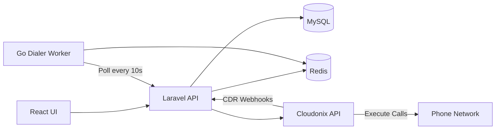
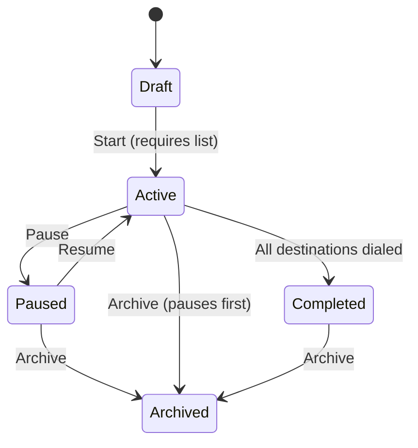

# Auto Dialer Overview

The Auto Dialer is an automated outbound calling system that dials phone numbers from distribution lists. It enables you to run scheduled campaigns with controlled dialing rates, answering machine detection, and real-time monitoring.

## Key Capabilities

- **Scheduled Campaigns**: Configure campaigns to run during specific time windows with timezone support
- **Rate-Limited Dialing**: Control concurrent calls (CAC) and call initiation speed (CPS)
- **Answering Machine Detection (AMD)**: Automatically detect and handle voicemail systems
- **Real-Time Monitoring**: Track campaign progress, active calls, and performance metrics
- **Retry Logic**: Automatically retry failed destinations with configurable attempt limits

## Who Can Use It

Only users with the following roles can access the Auto Dialer:

- **Owner**: Full access to create, manage, and monitor all campaigns
- **PBX Admin**: Full access to create, manage, and monitor all campaigns

:::note
Users with lower permission levels cannot access the Auto Dialer features.
:::

## System Architecture

The Auto Dialer operates as a three-tier system:

**Components:**

| Component | Technology | Responsibility |
|-----------|------------|----------------|
| Web UI | React 18 + TypeScript | Campaign configuration and monitoring |
| API Backend | Laravel 12 (PHP 8.4) | Campaign CRUD, Cloudonix integration, webhook processing |
| Dialer Worker | Go | Polls for work, rate-limited call initiation |
| Call Execution | Cloudonix CPaaS | Actual VoIP call execution and CDR delivery |
| State Storage | Redis | Concurrent call counters, session tracking |
| Persistent Storage | MySQL | Campaigns, distribution lists, call records |

## Campaign Lifecycle

Campaigns progress through a defined set of states:

**State Descriptions:**

| State | Description | Editable |
|-------|-------------|----------|
| **Draft** | Initial state. Configure all settings. Must assign a distribution list before starting. | Yes |
| **Active** | Campaign is dialing. The Go worker polls every 10 seconds to initiate calls. | No (pause first) |
| **Paused** | No new calls initiated. Active calls continue until they complete. | Yes |
| **Completed** | All destinations have been processed. Terminal state. | No |
| **Archived** | Soft-deleted. Terminal state. Hidden from default views. | No |

:::tip
You can pause an Active campaign at any time to modify its settings. Active calls continue but no new calls are initiated.
:::

## Quick Start

Get your first campaign running in 5 steps:

1. **Create a Campaign**: Go to Auto Dialer > Campaign Manager and click Create Campaign. Configure the name, routing destination, caller ID, and rate limits.

2. **Upload a Distribution List**: Go to Auto Dialer > Distribution Lists and click Create List. Upload a CSV file containing phone numbers.

3. **Assign the List**: Return to Campaign Manager, click your campaign, and assign the distribution list.

4. **Start the Campaign**: Click the status badge or Start button to begin dialing.

5. **Monitor Progress**: Open the Real-Time Monitor to watch calls in progress and track performance.

:::warning
A campaign requires at least one distribution list assigned before it can be started. You will receive an error if you attempt to start without a list.
:::

## Next Steps

- Learn about [Managing Campaigns](/opbx-userguide/auto-dialer/campaigns)
- Understand [Distribution Lists](/opbx-userguide/auto-dialer/distribution-lists)
- Configure [Rate Limiting](/opbx-userguide/auto-dialer/rate-limiting)
- Set up [Campaign Scheduling](/opbx-userguide/auto-dialer/scheduling)
- Enable [Answering Machine Detection](/opbx-userguide/auto-dialer/answering-machine-detection)
- Monitor with the [Real-Time Monitor](/opbx-userguide/auto-dialer/real-time-monitor)
- Configure [Routing Destinations](/opbx-userguide/auto-dialer/routing-destinations)
