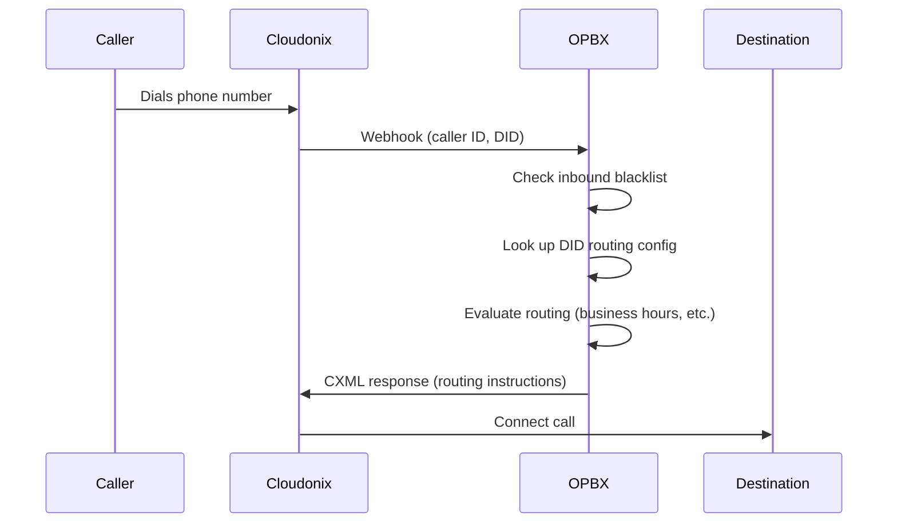

# Call Routing Overview

This page explains how OPBX processes inbound calls and routes them to the correct destination within your organization.

## Routing Overview

When a call arrives at a Cloudonix phone number assigned to your organization, OPBX determines where to route the call based on your configuration. This process happens in real-time using webhooks and CXML responses.

## Call Flow



### Step-by-Step Process

1. **Caller dials** a phone number (DID) assigned to your organization
2. **Cloudonix receives** the call and sends a webhook to OPBX
3. **OPBX checks** the inbound blacklist for the caller ID
4. **OPBX looks up** the routing configuration for the called number
5. **OPBX evaluates** the routing logic (business hours, IVR, etc.)
6. **OPBX returns** CXML instructions to Cloudonix
7. **Cloudonix connects** the call to the destination

## Routing Destinations

OPBX can route calls to these destination types:

| Destination | Description |
|-------------|-------------|
| Extension | A specific user's SIP phone |
| Ring Group | A group of extensions that ring together |
| IVR Menu | Interactive voice response menu |
| Business Hours | Time-based routing decision |
| Conference Room | Multi-party conference bridge |
| AI Assistant | AI-powered voice agent |
| AI Load Balancer | Distributed AI agent routing |

## Routing Chains

Destinations can cascade, creating complex routing chains:

### Example: IVR to Ring Group to Fallback

```
Phone Number -> IVR Menu -> Ring Group -> Fallback Extension
```

1. Caller dials main number
2. IVR menu plays: "Press 1 for Sales"
3. Caller presses 1
4. Sales Ring Group rings
5. No one answers, call routes to Sales Manager extension

### Example: Business Hours Branching

```
Phone Number -> Business Hours -> Open: Ring Group / Closed: IVR
```

1. Caller dials support number
2. Business Hours checks current time
3. During business hours: routes to Support Ring Group
4. After hours: routes to Emergency IVR

## Inbound Blacklist

Before routing, OPBX checks if the caller is on the inbound blacklist:

| Action | Behavior |
|--------|----------|
| Silent Drop | Call ends without notification |
| Reject | Caller hears a busy or error message |
| Torment | Call connects to a "torment" conference (hold music loop) |

:::tip
Use the blacklist to block spam callers, competitors, or harassing callers.
:::

## CXML

CXML (Cloudonix XML) is the language OPBX uses to instruct Cloudonix how to handle calls. OPBX generates CXML responses based on your routing configuration.

### Common CXML Actions

| Action | Purpose |
|--------|---------|
| Dial | Connect to an extension or external number |
| Connect | Bridge to a conference or AI agent |
| Gather | Collect digit input (for IVR) |
| Say | Play text-to-speech audio |
| Play | Play a recorded audio file |
| Conference | Join a conference room |
| Hangup | End the call |

### Example CXML Flow

```
Incoming Call
    |
    v
<Gather> - Play IVR menu, wait for digits
    |
    v
<Dial> - Route to extension based on input
    |
    v
<Hangup> - End when call completes
```

## Routing Configuration

Configure routing at these levels:

### Phone Numbers (DIDs)

The entry point for all inbound calls. Each DID has a routing type and destination.

See [Phone Numbers (DIDs)](phone-numbers.md) for details.

### Ring Groups

Distribute calls to multiple extensions with various strategies.

See [Ring Groups](ring-groups.md) for details.

### IVR Menus

Create interactive menus for caller self-service.

See [IVR Menus](ivr-menus.md) for details.

### Business Hours

Route based on time of day and day of week.

See [Business Hours](business-hours.md) for details.

## Best Practices

### Design for the Caller

- Keep IVR menus short and clear
- Always provide a "speak to someone" option
- Minimize the number of steps to reach a human

### Plan for Failures

- Configure fallbacks at every routing level
- Test what happens when destinations are busy or unavailable
- Have a "catch-all" destination for edge cases

### Document Your Routing

- Maintain a diagram of your call flows
- Label phone numbers with their purpose
- Review routing regularly for obsolete configurations

### Test Changes

- Test routing changes during low-traffic periods
- Verify both open and closed hours routing
- Check IVR digit options after updates
