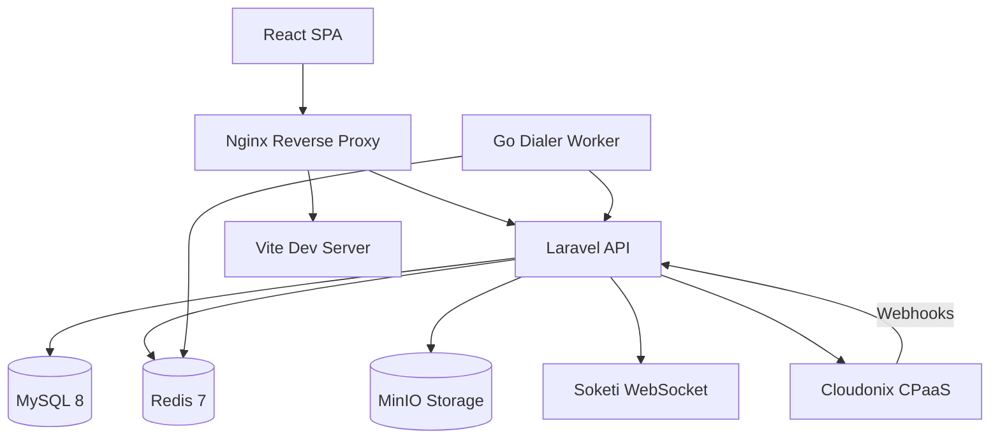

# Welcome to OPBX

OPBX is an open-source, multi-tenant business PBX platform built on top of the Cloudonix CPaaS (Communications Platform as a Service). It provides a complete phone system for organizations of any size.

The platform combines a powerful Laravel 12 backend with a modern React 18 frontend and a Go-based dialer worker for outbound campaigns. Everything runs containerized in Docker for easy deployment and scaling.

## Key Features

OPBX delivers enterprise-grade telephony features through an intuitive web interface:

- **Multi-tenant organizations** with complete data isolation between tenants
- **Role-based access control** supporting Owner, PBX Admin, PBX User, and Reporter roles
- **Extension management** with automatic Cloudonix SIP subscriber synchronization
- **DID phone number routing** to multiple destination types including extensions, ring groups, and IVRs
- **Ring groups** with simultaneous, round-robin, and sequential distribution strategies
- **IVR menus** supporting both text-to-speech and pre-recorded audio files
- **Business hours** with weekly schedules and holiday exception handling
- **Conference rooms** with optional PIN protection and host controls
- **AI assistant integration** supporting 17 SIP and WebSocket providers
- **AI load balancers** for distributing calls across multiple AI providers
- **Auto Dialer** for outbound campaigns with rate limiting and scheduling
- **Call recording and CDR reporting** for compliance and analysis
- **Inbound blacklist and outbound whitelist** for call security
- **Real-time call monitoring** with live call tracking
- **Platform management** tools for service providers hosting multiple organizations

## Architecture Overview

OPBX uses a microservices architecture with clear separation of concerns:

The browser interacts with a React single-page application served through Nginx. API requests route to the Laravel backend, which manages data in MySQL, caches in Redis, and stores files in MinIO. Real-time updates flow through Soketi WebSocket server. All VoIP functionality delegates to Cloudonix CPaaS via REST API and webhooks.

## Technology Stack

| Component | Technology | Purpose |
|-----------|------------|---------|
| Backend | Laravel 12 (PHP 8.4) | REST API and business logic |
| Frontend | React 18 + TypeScript | User interface |
| Database | MySQL 8 | Persistent data storage |
| Cache/Queue | Redis 7 | Caching, sessions, job queues |
| Storage | MinIO | S3-compatible object storage |
| Real-time | Soketi WebSocket | Live updates and notifications |
| VoIP | Cloudonix CPaaS | Call handling and SIP services |
| Dialer | Go Worker | Outbound campaign execution |

## Role Hierarchy

OPBX implements a hierarchical permission system. Each user belongs to exactly one organization and has one of the following roles:

| Role | Description | Key Capabilities |
|------|-------------|------------------|
| Owner | Organization creator | Full access to all features, can manage all users including other owners, configure system-wide settings |
| PBX Admin | System administrator | Manage extensions, routing rules, users (except owners), view all reports |
| PBX User | Regular user | View assigned resources, update own extension settings, view personal call history |
| Reporter | Read-only access | View call logs, generate reports, access dashboards without modification rights |

:::info Role Assignment
Only Owners can assign the Owner role. PBX Admins cannot create or modify other PBX Admins or Owners.
:::

## Quick Start

Ready to get started? Follow these steps:

1. [Install OPBX](./getting-started/installation) using Docker Compose
2. Complete your [first login and organization setup](./getting-started/first-login)
3. Configure [Cloudonix integration](./getting-started/cloudonix-setup) for telephony
4. Learn the [core concepts](./getting-started/concepts) before configuring your PBX

:::tip New to PBX Systems?
If you are unfamiliar with PBX terminology, start with the [Core Concepts](./getting-started/concepts) guide. It explains extensions, DIDs, ring groups, and other essential concepts you will need to configure your phone system.
:::
