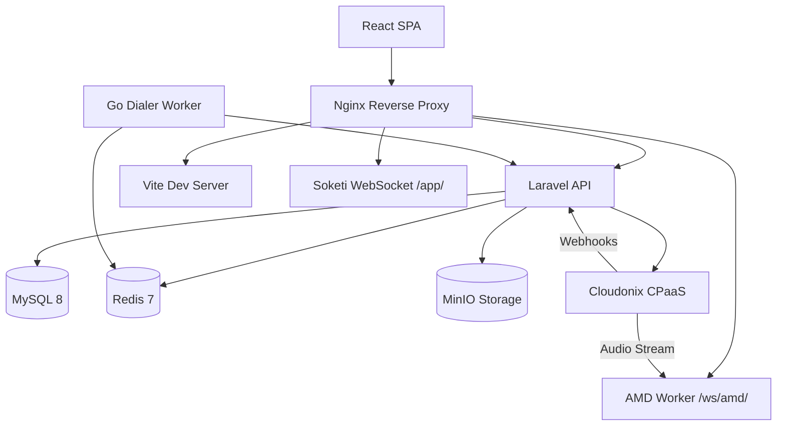

# Welcome to OPBX

OPBX is an open-source, multi-tenant business PBX platform built on top of the [Cloudonix CPaaS](https://developers.cloudonix.com/). It provides a complete phone system for organizations of any size, combining a Laravel 12 backend, a React 18 frontend, a Go dialer worker for outbound campaigns, and a Java/Vert.x 5 AMD worker for stream-based voicemail detection.

## Key Features

- **Multi-tenant organizations** with complete data isolation between tenants
- **Role-based access control** supporting Owner, PBX Admin, PBX User, and Reporter roles
- **Extension management** with automatic Cloudonix SIP subscriber synchronization
- **DID phone number routing** to extensions, ring groups, IVRs, business hours, conference rooms, AI assistants, and AI load balancers
- **Ring groups** with simultaneous, round-robin, and sequential distribution strategies
- **IVR menus** supporting audio files, remote URLs, and text-to-speech prompts
- **Business hours** with weekly schedules, holiday exceptions, and timezone support
- **Conference rooms** with optional PIN protection, host controls, and recording
- **AI assistants** with registry-based provider configuration (SIP and WebSocket protocols)
- **AI load balancers** for distributing calls across multiple AI providers with follow-through failover
- **Auto Dialer** for outbound campaigns with CAC/CPS rate limiting, scheduling, AMD, and retry logic
- **Call recordings and CDR reporting** for compliance and analysis
- **Inbound blacklist and outbound whitelist** for call security
- **Real-time call monitoring** with live call tracking and WebSocket updates
- **Call notifications** with per-organization webhook configuration, event filtering, and retry logic
- **Platform management** tools for service providers hosting multiple organizations

## Architecture Overview

The browser interacts with a React single-page application served through Nginx. API requests route to the Laravel backend, which manages data in MySQL, caches state in Redis, and stores files in MinIO. Real-time updates flow through Soketi. All VoIP functionality delegates to Cloudonix CPaaS via REST API and webhooks. The Go dialer worker executes outbound campaigns, and the Java AMD worker analyzes audio streams for voicemail detection.

## Technology Stack

| Component | Technology | Purpose |
|-----------|------------|---------|
| Backend | Laravel 12 (PHP 8.4) | REST API and business logic |
| Frontend | React 18 + TypeScript | User interface |
| Database | MySQL 8 | Persistent data storage |
| Cache/Queue | Redis 7 | Caching, sessions, job queues, locks |
| Storage | MinIO | S3-compatible object storage for recordings |
| Real-time | Soketi WebSocket | Live updates and notifications |
| VoIP | Cloudonix CPaaS | Call handling and SIP services |
| Dialer | Go Worker | Outbound campaign execution |
| AMD | Java/Vert.x 5 Worker | Stream-based voicemail detection |

## Role Hierarchy

OPBX implements a hierarchical permission system. Each user belongs to exactly one organization and has one of the following roles:

| Role | Description | Key Capabilities |
|------|-------------|------------------|
| Owner | Organization creator | Full access to all features, can manage all users including other owners, configure system-wide settings |
| PBX Admin | System administrator | Manage extensions, routing rules, users (except owners), view all reports |
| PBX User | Regular user | View assigned resources, update own extension settings, view personal call history |
| Reporter | Read-only access | View call logs, generate reports, access dashboards without modification rights |

:::info Role Assignment
Only Owners can assign the Owner role. PBX Admins cannot create or modify other PBX Admins or Owners.
:::

## API Documentation

The OPBX REST API is documented with OpenAPI 3.1.0. You can explore the endpoints at the [OPBX REST API reference](https://developers.cloudonix.com/opbxRestOpenAPI).

## Quick Start

Ready to get started? Follow these steps:

1. [Install OPBX](./installation) using Docker Compose
2. Complete your [first login and organization setup](./installation/first-login)
3. Configure [Cloudonix integration](./installation/cloudonix-setup) for telephony
4. Learn the [core concepts](./installation/concepts) before configuring your PBX

:::tip New to PBX Systems?
If you are unfamiliar with PBX terminology, start with the [Core Concepts](./installation/concepts) guide. It explains extensions, DIDs, ring groups, and other essential concepts you will need to configure your phone system.
:::
