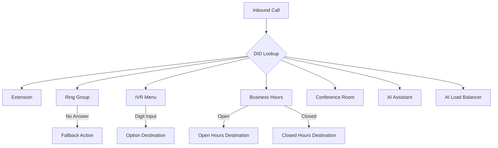

# Core Concepts

This guide explains the fundamental concepts you need to understand before configuring your OPBX phone system.

## Organizations

An organization represents a tenant in the multi-tenant OPBX system. All data belongs to exactly one organization, and users cannot access data from other organizations.

Key characteristics:

- Complete data isolation between organizations via `OrganizationScope`
- Each organization has its own extensions, DIDs, and configuration
- Users belong to exactly one organization
- Service providers can host multiple organizations on a single OPBX instance
- Platform managers can perform cross-tenant administration

:::tip Multi-Tenancy
If you are a service provider, create separate organizations for each of your customers. This keeps their data and configurations completely isolated.
:::

## Extensions

Extensions are numbered endpoints in your phone system. They are typically 3-5 digits long and serve as internal phone numbers.

### Extension Types

| Type | Value | Purpose | Example |
|------|-------|---------|---------|
| User | `user` | SIP phone assigned to a person | Extension 100 for John Doe |
| Conference | `conference` | Multi-party audio bridge | Extension 800 for team meetings |
| Ring Group | `ring_group` | Group of extensions that ring together | Extension 600 for Sales team |
| IVR | `ivr` | Automated phone menu | Extension 700 for main menu |
| AI Assistant | `ai_assistant` | Routes calls to AI providers | Extension 900 for AI receptionist |
| AI Load Balancer | `ai_load_balancer` | Distributes calls across AI providers | Extension 901 for AI failover |
| Forward | `forward` | Forwards calls to external numbers | Extension 101 forwarding to mobile |
| Custom Logic | `custom_logic` | Advanced routing via webhooks | Extension for custom integrations |

:::warning Immutable Numbers
Extension numbers cannot be changed after creation. If you need a different number, delete the extension and create a new one.
:::

## DIDs (Phone Numbers)

DIDs (Direct Inward Dialing) are external phone numbers that callers dial to reach your organization. OPBX stores numbers in E.164 format (for example, `+14155551234`).

Each DID has a destination that determines where incoming calls route:

- Extension
- Ring group
- IVR menu
- Business hours routing
- Conference room
- AI assistant
- AI load balancer

:::note DID Management
DIDs are configured in OPBX but must be purchased and assigned through your Cloudonix account or telecom provider.
:::

## Ring Groups

Ring groups distribute incoming calls among multiple extensions using different strategies.

### Distribution Strategies

| Strategy | Behavior | Best For |
|----------|----------|----------|
| Simultaneous | All extensions ring at once | Small teams where anyone can answer |
| Round Robin | Rotates through extensions evenly | Balancing workload across agents |
| Sequential | Rings extensions in order | Escalation chains or priority routing |

Each ring group has:

- Member extensions
- Ring timeout (how long to wait before giving up)
- Ring turns (for sequential strategy)
- Fallback action (extension, ring group, IVR, AI assistant, AI load balancer, or hang up)

## IVR Menus

IVR (Interactive Voice Response) menus provide automated phone navigation. Callers press digits on their keypad to route their call.

### IVR Components

- **Greeting**: Audio played when the menu starts (audio file, remote URL, or text-to-speech)
- **Options**: DTMF digit presses mapped to destinations
- **Timeout**: Action taken if no input is received
- **Max turns**: How many times the menu replays on invalid input
- **Failover destination**: Where to route after max turns

:::tip TTS Support
IVR menus support text-to-speech for dynamic content. Enter plain text and OPBX converts it to spoken audio using Cloudonix TTS voices.
:::

## Business Hours

Business hours enable time-based call routing. Calls route to different destinations depending on whether your business is open or closed.

### Configuration Elements

- **Weekly Schedule**: Define open hours for each day of the week
- **Time Zones**: Set your local time zone for accurate routing
- **Exception Dates**: Specify holidays or special closures (closed or special hours)
- **Open Destination**: Where calls go during business hours
- **Closed Destination**: Where calls go after hours

Destinations use prefixed string IDs such as `ext-{id}`, `rg-{id}`, `conf-{id}`, `ivr-{id}`, `ai-{id}`, and `alb-{id}`.

:::note Precision
Business hours use the IANA timezone configured on the schedule. Ensure the timezone is correct before configuring business hours.
:::

## Conference Rooms

Conference rooms provide multi-party audio bridges for meetings.

### Features

- **PIN Protection**: Optional numeric PIN to join
- **Host PIN**: Special PIN for host controls
- **Recording**: Option to record conference sessions
- **Wait for Host**: Wait for the host to join before starting
- **Mute on Entry**: Automatically mute new participants
- **Announce Join/Leave**: Play sounds when participants join or leave

Conference rooms have their own extension numbers and can be destinations for DIDs or IVR options.

## AI Assistants

AI assistants connect calls to AI providers via SIP or WebSocket protocols.

### Supported Providers

OPBX supports 19 providers through a registry-based configuration system. Common providers include OpenAI, Anthropic, Google, Azure, Bland AI, Retell AI, Vapi, Ultravox, and custom CXML endpoint providers.

Each AI assistant configuration includes:

- Provider selection
- Phone number (when applicable)
- Provider-specific configuration JSON
- Status (`active` or `inactive`)

## AI Load Balancers

AI load balancers distribute calls across multiple AI assistants for redundancy and capacity management.

### Distribution Strategies

| Strategy | Description |
|----------|-------------|
| Round Robin | Cycles through assistants in order |
| Priority | Uses the first active assistant by priority |
| Percentage | Weighted random distribution |

Load balancers support **follow-through** failover, which cascades to the next assistant when one fails.

## Auto Dialer

The Auto Dialer manages outbound campaigns for sales, surveys, or notifications.

### Key Concepts

- **Campaigns**: Define call lists, schedules, retry logic, and routing destinations
- **Distribution Lists**: Phone numbers to call, with CSV upload and versioning
- **Rate Limiting**: CAC (concurrent active calls) and CPS (calls per second) limits
- **Scheduling**: Set active calling hours and date ranges
- **AMD**: Answering Machine Detection via the Java/Vert.x AMD worker
- **Retry Logic**: Automatic redial on busy, no-answer, or cancelled dispositions

The Go-based dialer worker processes campaigns and initiates calls through Cloudonix.

## Call Routing Flow

This diagram shows how an inbound call flows through the OPBX system:

The call enters through a DID, which determines the initial destination. From there, the call may traverse multiple routing rules before reaching its final destination.

## Next Steps

Now that you understand these core concepts, you are ready to:

1. [Create extensions](../modules/extensions) for your users
2. [Configure DIDs](../modules/phone-numbers) for inbound calls
3. [Set up ring groups](../modules/ring-groups) for departments
4. [Build IVR menus](../modules/ivr-menus) for self-service
5. [Define business hours](../modules/business-hours) for time-based routing
