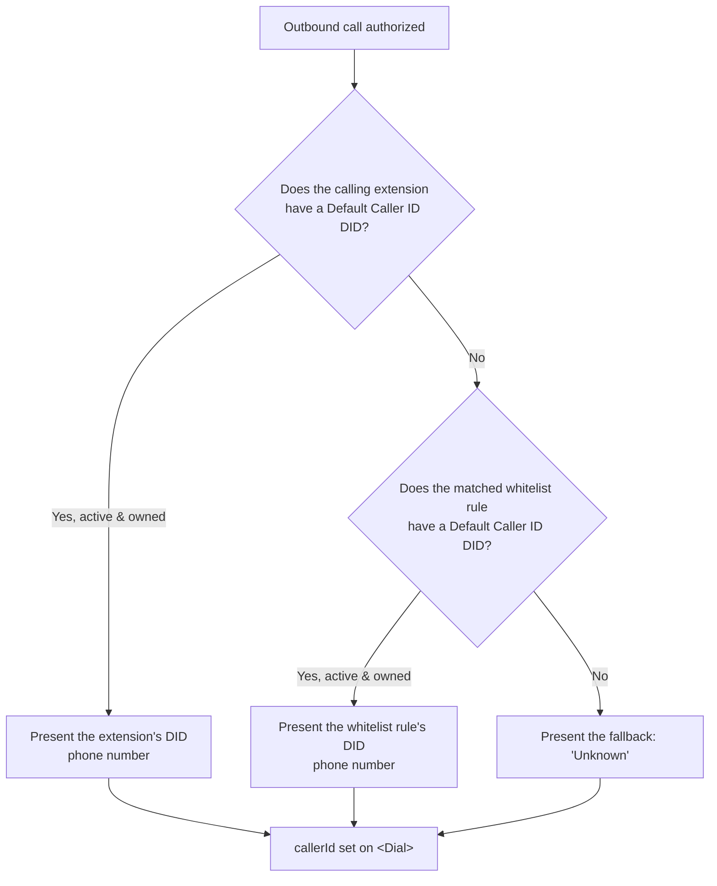

# Outbound Calling Overview

This page explains how OPBX handles calls that originate from an internal extension and go out to an external destination — how those calls are authorized, and, most importantly, **how OPBX decides which caller ID (the number the called party sees) to present, and why.**

## What Counts as an Outbound Call

An outbound call is one placed **from an internal user extension to an external number**. OPBX distinguishes these from internal extension-to-extension calls by the length of the dialed number: short numbers (3–4 digits) are treated as internal extensions and are never routed outbound.

Outbound calls are the only calls that use the caller ID resolution described below. Inbound and internal calls do not.

## Outbound Call Flow

When a user places an outbound call, Cloudonix sends a routing webhook to OPBX, which authorizes the call against the **Outbound Whitelist**, resolves the caller ID, and returns CXML instructing Cloudonix to dial the destination over the configured trunk.

```mermaid
sequenceDiagram
    participant Extension
    participant Cloudonix
    participant OPBX
    participant Destination

    Extension->>Cloudonix: Dials external number
    Cloudonix->>OPBX: Voice routing webhook (from, to)
    OPBX->>OPBX: Is caller an active internal extension?
    OPBX->>OPBX: Match destination against Outbound Whitelist
    Note over OPBX: No match → call rejected
    OPBX->>OPBX: Resolve outbound caller ID
    OPBX->>Cloudonix: CXML &lt;Dial callerId="..."&gt; via trunk
    Cloudonix->>Destination: Places call, presenting caller ID
```

### Step-by-Step Process

1. **A user dials** an external number from their extension.
2. **Cloudonix sends** a voice routing webhook to OPBX with the calling extension (`from`) and the dialed number (`to`).
3. **OPBX verifies** the caller is an active internal extension. If not, outbound routing does not apply.
4. **OPBX matches** the destination against the Outbound Whitelist. If no rule matches, the call is **rejected** — the whitelist is an allow-list, not a block-list.
5. **OPBX resolves the caller ID** to present (see below).
6. **OPBX returns CXML** with a `<Dial>` verb carrying the resolved `callerId`, routed over the matched rule's outbound trunk.
7. **Cloudonix places** the call, presenting the resolved caller ID to the destination.

## Caller ID Assignment

The caller ID is the phone number the **called party** sees. Presenting a valid, dialable company number matters for two reasons:

- **Trust and answer rates** — recipients are far more likely to answer a recognizable business number than an unknown or blank one.
- **Callbacks** — the presented number is what the recipient will call back, so it should be a real DID the organization owns.

OPBX resolves the caller ID at call time using a **strict precedence order**. The first source that is configured and valid wins; if none is configured, a safe fallback is used.

### Resolution Precedence



| Priority | Source | Where it is configured | When it wins |
|----------|--------|------------------------|--------------|
| 1 | The **calling extension's** Default Caller ID DID | [Extensions](/modules/extensions) — per-extension setting | The extension has an active, organization-owned DID selected |
| 2 | The **matched whitelist rule's** Default Caller ID DID | [Outbound Whitelist](/modules/outbound-whitelist) — per-rule setting | The extension has none, but the whitelist rule that authorized the call has one |
| 3 | The literal fallback `Unknown` | Built-in | Nothing is configured at either level |

At every level, OPBX only uses a DID that is **active** and **belongs to your organization**. A selected DID that has been deactivated or is otherwise unavailable is skipped, and resolution falls through to the next level.

### Why This Precedence?

The order goes from **most specific to most general**, so the closest, most intentional configuration always wins:

- **Extension first** lets you give an individual (or a specific desk phone) their own outbound identity — for example, a salesperson presenting their direct DID so customers can call them back directly.
- **Whitelist rule second** provides a sensible default for a whole class of destinations — for example, all calls to a given country presenting the main company number — without configuring every extension individually.
- **Fallback last** guarantees a call is never sent with an undefined caller ID. OPBX presents the literal string `Unknown` rather than an all-zeros number, because some carriers reject calls that present `00000000` as the caller ID.

The caller **name** is never set on outbound calls — only the caller ID number is presented.

## Configuring Caller IDs

To present a specific number on outbound calls:

1. Add the number as a [Phone Number (DID)](/modules/phone-numbers) in your organization and ensure it is **Active**.
2. Assign it as a **Default Caller ID** at the level you want:
   - On an [Extension](/modules/extensions) — applies to calls from that extension.
   - On an [Outbound Whitelist](/modules/outbound-whitelist) rule — applies to calls matching that rule when the extension has no caller ID of its own.

:::tip
Set the caller ID on the **whitelist rule** for an organization-wide default, and override it on **individual extensions** only where a person or device needs its own outbound identity.
:::

:::warning
A DID must be **active and owned by your organization** to be used as a caller ID. If a selected DID is deactivated, OPBX silently falls through to the next level in the precedence order.
:::

## Outbound Whitelist Matching

The destination must match an Outbound Whitelist rule for the call to proceed. OPBX scores candidate rules and selects the best match:

- Country match: `+10`
- International prefix match: `+length of the prefix`
- Local prefix match: `+length of the prefix`

The highest-scoring rule wins, and its outbound trunk carries the call. If no rule matches, the call is rejected.

See [Outbound Whitelist](/modules/outbound-whitelist) for rule configuration details.

## Related Pages

- [Call Routing Overview](/installation/call-routing-overview) — how **inbound** calls are routed
- [Outbound Whitelist](/modules/outbound-whitelist) — authorizing destinations and per-rule caller ID
- [Phone Numbers (DIDs)](/modules/phone-numbers) — the DIDs used as caller IDs
- [Extensions](/modules/extensions) — per-extension caller ID
