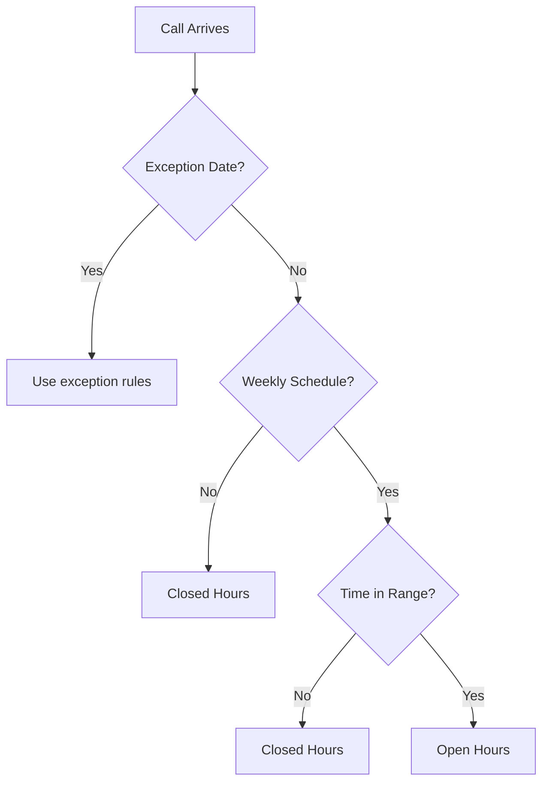

# Business Hours

Business Hours routes calls to different destinations based on the time of day and day of week. Use it to handle open/closed scenarios and holiday schedules.

## What Is Business Hours Routing

Business Hours is a routing destination that evaluates the current time against a schedule. It routes calls to one destination during business hours and another destination outside business hours.

## Components

A Business Hours configuration consists of:

### Weekly Schedule

Per-day enable/disable with time ranges:

| Day | Status | Hours |
|-----|--------|-------|
| Monday | Open | 09:00 - 17:00 |
| Tuesday | Open | 09:00 - 17:00 |
| Wednesday | Open | 09:00 - 17:00 |
| Thursday | Open | 09:00 - 17:00 |
| Friday | Open | 09:00 - 17:00 |
| Saturday | Closed | - |
| Sunday | Closed | - |

### Timezone

Select from 65+ timezones grouped by region:

- Americas
- Europe
- Asia Pacific
- Africa
- Middle East

:::warning
Select the timezone where your business operates. Calls are evaluated against this timezone, not the caller's location.
:::

### Actions

| Action | Purpose |
|--------|---------|
| Open Hours | Where to route during business hours |
| Closed Hours | Where to route outside business hours |

### Exception Dates

Special dates that override the weekly schedule:

| Type | Description |
|------|-------------|
| Closed | All-day closure (holiday). Routes to closed hours destination. |
| Special Hours | Modified hours (e.g., half day). Uses custom time ranges. |

## Creating a Business Hours Schedule

To create a new schedule:

1. Navigate to **Business Hours** in the sidebar
2. Click **Create Schedule**
3. Enter a descriptive name
4. Select the timezone
5. Configure the weekly schedule
6. Set open hours and closed hours destinations
7. Add exception dates if needed
8. Save the schedule

### Configuring Weekly Schedule

Use the calendar view to set hours:

1. Click on a day to enable/disable it
2. Drag time handles to set open/close times
3. Copy settings from one day to others

## Action Types

Both open and closed hours can route to:

| Type | Use Case |
|------|----------|
| Extension | Specific person during/after hours |
| Ring Group | Department coverage |
| Conference Room | Scheduled conferences |
| IVR Menu | After-hours menu or main menu |
| AI Assistant | Automated handling |
| AI Load Balancer | Distributed AI routing |

## Schedule Templates

OPBX provides templates for common schedules:

| Template | Description |
|----------|-------------|
| Mon-Fri Business | Monday-Friday, 9:00 AM - 5:00 PM |
| Mon-Fri All Day | Monday-Friday, 24 hours |
| Sun-Thu Business | Sunday-Thursday, 9:00 AM - 5:00 PM (Middle East) |
| 24/7 | Always open |

Select a template as a starting point, then customize as needed.

## Holiday Import

Import public holidays by country and year:

1. Open the Business Hours schedule
2. Click **Import Holidays**
3. Select country
4. Select year
5. Review imported dates
6. Save

Imported holidays are added as Closed exception dates. You can modify or delete them after import.

:::note
Holiday data comes from a public API. Verify imported dates against your actual business calendar.
:::

## Duplicating Schedules

Copy an existing schedule to create a variation:

1. Find the schedule to copy
2. Click **Duplicate**
3. A new schedule appears with "(Copy)" in the name
4. Modify the copy as needed
5. Save

This is useful for:
- Seasonal hour changes
- Different departments with similar schedules
- Testing schedule changes

## Evaluation Order

When a call arrives, Business Hours evaluates in this order:

1. **Check exception dates**: Is today a holiday or special hours date?
2. **Check weekly schedule**: Is today enabled in the weekly schedule?
3. **Check time ranges**: Is the current time within open hours?
4. **Route**: Send to open hours or closed hours destination

## Business Hours Examples

### Standard Office

- **Name**: Main Office Hours
- **Timezone**: America/New_York
- **Schedule**: Mon-Fri, 9:00 AM - 5:00 PM
- **Open Hours**: Main Ring Group
- **Closed Hours**: After-Hours IVR
- **Exceptions**: New Year's Day, Independence Day, Christmas

### Support Hotline

- **Name**: 24/7 Support
- **Timezone**: UTC
- **Schedule**: 24/7 (always open)
- **Open Hours**: Support Ring Group
- **Closed Hours**: Emergency Paging

### Retail Location

- **Name**: Downtown Store
- **Timezone**: America/Los_Angeles
- **Schedule**: Mon-Sat, 10:00 AM - 8:00 PM; Sun, 12:00 PM - 6:00 PM
- **Open Hours**: Store Ring Group
- **Closed Hours**: Store Info IVR

## Best Practices

### Timezone Selection

- Use the timezone of your physical location
- Consider daylight saving time changes
- Use UTC for global 24/7 operations

### Exception Planning

- Import holidays at the start of each year
- Add company-specific closures (training days, events)
- Plan special hours for peak seasons

### Fallback Design

- Closed hours destination should provide value (information, voicemail, emergency contact)
- Test closed hours routing after setup
- Consider time zone differences for global callers

### Testing

- Test during both open and closed periods
- Verify exception date handling
- Check timezone transitions (DST changes)
