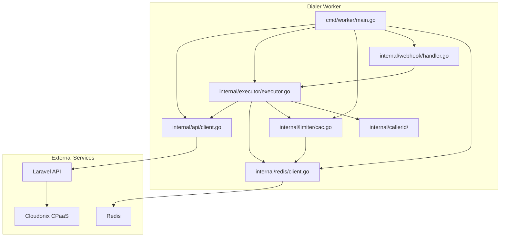

# Dialer Worker

The Dialer Worker is a Go-based service that executes outbound auto-dialer campaigns. It polls the Laravel API for active campaigns, rate-limits call initiation, and initiates calls through Cloudonix.

## Purpose

The worker handles:

- Polling for active campaigns every 10 seconds
- Fetching pending destinations from Laravel
- Enforcing CAC (Concurrent Active Calls) and CPS (Calls Per Second) limits
- Initiating calls via the Laravel API
- Receiving CDR webhooks from Laravel
- Managing retry queues in Redis
- Selecting Caller IDs from pools

## Architecture



## Build and Run

### Docker Compose (Recommended)

The worker starts automatically with the full OPBX stack:

```bash
docker compose up -d
```

### Local Development

```bash
cd dialer-worker

cp .env.example .env
# Edit .env with your configuration

make deps
make build
make run
```

### Makefile Targets

| Target | Description |
|--------|-------------|
| `make build` | Build the `worker` binary |
| `make run` | Run with `go run` |
| `make test` | Run tests |
| `make fmt` | Format Go code |
| `make lint` | Run `golangci-lint` |
| `make docker-build` | Build Docker image |
| `make docker-run` | Run Docker container with `.env` |
| `make health` | Check worker health endpoint |

## Environment Variables

| Variable | Default | Required | Description |
|----------|---------|----------|-------------|
| `LARAVEL_API_URL` | `http://localhost:8000` | Yes | Laravel API base URL |
| `LARAVEL_API_TOKEN` | — | Yes | Bearer token for Laravel API |
| `REDIS_HOST` | `localhost` | Yes | Redis host |
| `REDIS_PORT` | `6379` | Yes | Redis port |
| `REDIS_PASSWORD` | — | No | Redis password |
| `REDIS_DB` | `0` | No | Redis database |
| `WORKER_ID` | `worker-1` | Yes | Unique worker identifier |
| `POLL_INTERVAL` | `10s` | No | Campaign polling interval |
| `WEBHOOK_PORT` | `8081` | Yes | HTTP server port for CDR webhooks and health checks |

:::note
The worker exposes a single HTTP server on `WEBHOOK_PORT`. Health checks are available at `GET /webhooks/health` on this port.
:::
| `WEBHOOK_SECRET` | — | No | HMAC-SHA256 secret for CDR webhooks |

:::note
Laravel uses a dedicated `dialer` Redis connection with **no key prefix** for all keys shared with the Go worker. This ensures both services read and write the same keys.
:::

## Campaign Lifecycle Overview

1. Worker polls `GET /v1/dialer/worker/campaigns/active`
2. For each active campaign, it registers CAC/CPS limits
3. It fetches pending destinations: `GET /campaigns/{id}/destinations/pending`
4. For each destination, it acquires a Redis lock, checks CAC, selects a Caller ID, and calls `POST /calls/initiate`
5. On successful initiation, it increments the active call counter
6. When Laravel receives a CDR webhook, it decrements the counter and the worker receives a relayed CDR event
7. The worker updates call status and schedules retries if needed

## Redis Key Patterns

| Key Pattern | Purpose |
|-------------|---------|
| `dialer:cac:{id}:active` | Active call counter per campaign |
| `dialer:call:{session}` | Call state hash |
| `dialer:lock:{key}` | Distributed locks |
| `dialer:retry:{campaign}` | Retry sorted set |
| `dialer:worker:{id}` | Worker heartbeat |
| `dialer:idem:{key}` | Webhook idempotency |

## Horizontal Scaling

Multiple worker instances can run concurrently:

```bash
docker compose up -d --scale dialer-worker=3
```

Each instance polls independently and uses Redis for distributed locking and shared state.

## Troubleshooting

| Issue | Solution |
|-------|----------|
| Worker not dialing | Check `LARAVEL_API_URL` and `LARAVEL_API_TOKEN`; verify campaign status is `ACTIVE` |
| Health check unreachable | Check `WEBHOOK_PORT` and query `GET /webhooks/health` on that port |
| CAC counter drift | The worker reconciles the counter against live call state on each poll cycle |
| Webhook auth failures | Ensure `WEBHOOK_SECRET` matches the value used by Laravel |
| High memory usage | Reduce `POLL_INTERVAL` or scale horizontally |

## Related Modules

- [Auto Dialer Campaigns](/modules/auto-dialer-campaigns) — Campaign configuration
- [Distribution Lists](/modules/distribution-lists) — Contact sources
- [Outbound Whitelist](/modules/outbound-whitelist) — Outbound trunk selection
