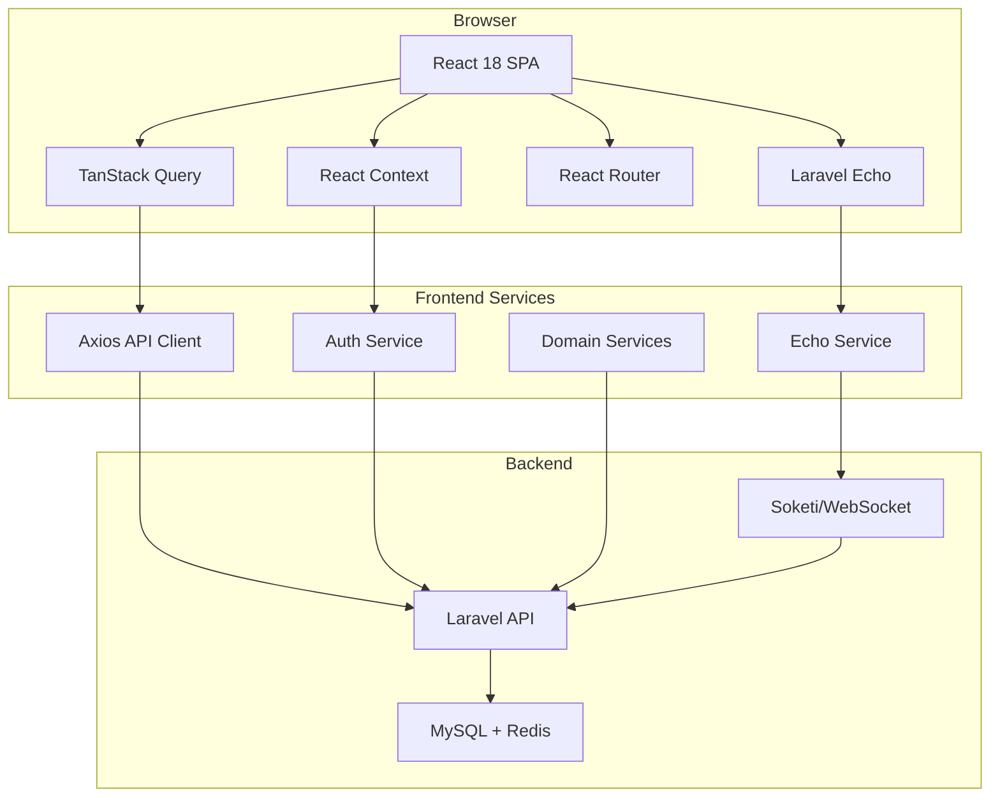
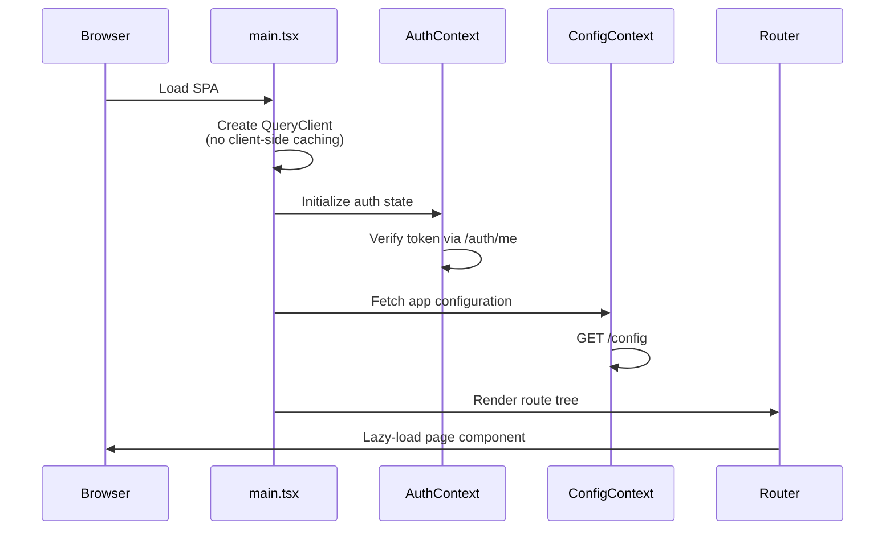

# OpBX Frontend

The **OpBX Frontend** is the React-based single-page application (SPA) that serves as the administrative interface for the OpBX open-source business PBX platform. It provides a modern, responsive web UI for managing phone systems, users, call routing, auto-dialer campaigns, real-time call monitoring, and platform-level administration.

## Overview

OpBX is a multi-tenant business PBX platform built on Laravel (backend) and React (frontend). This frontend application communicates with the Laravel API to provide a comprehensive web interface for PBX administrators and platform managers.

**Key Capabilities:**

- **User & Extension Management** — Manage SIP extensions, users, and ring groups
- **Phone Number Management** — Configure DID numbers and inbound routing
- **IVR & Call Flows** — Build interactive voice response menus and business hours
- **Auto-Dialer** — Create and monitor outbound campaigns with real-time statistics
- **Live Call Monitoring** — Real-time call presence via WebSocket (Soketi/Pusher)
- **Call Analytics** — Searchable call logs, recordings, and CDR data
- **AI Assistants** — Configure AI-powered voice assistants and load balancers
- **Platform Administration** — Multi-tenant organization and user management

## Technology Stack

| Layer | Technology | Purpose |
|-------|-----------|---------|
| **Framework** | React 18 | UI library with concurrent features |
| **Language** | TypeScript | Type-safe development (strict mode: off) |
| **Build Tool** | Vite 7 | Fast dev server and optimized production builds |
| **Routing** | React Router 6 | Declarative routing with lazy loading |
| **Server State** | TanStack Query 5 | Data fetching, caching, and synchronization |
| **Client State** | React Context | Global state for Auth and Config |
| **Forms** | react-hook-form + Zod | Type-safe form handling with schema validation |
| **UI Components** | shadcn/ui | Accessible components built on Radix UI primitives |
| **Styling** | Tailwind CSS 3 | Utility-first CSS framework |
| **HTTP Client** | Axios | API requests with interceptors for auth and error handling |
| **Real-time** | Laravel Echo + Pusher JS | WebSocket connections for live call updates |
| **Drag & Drop** | @dnd-kit | Sortable lists for IVR menus and call flows |
| **Icons** | Lucide React | Consistent, lightweight iconography |
| **Testing** | Playwright | End-to-end testing framework |

## Directory Structure

```
frontend/
├── public/                    # Static assets
├── src/
│   ├── components/            # Reusable UI components
│   │   ├── ui/               # shadcn/ui components (Button, Dialog, Table, etc.)
│   │   ├── Layout/           # AppLayout, Sidebar, Header
│   │   ├── Auth/             # ProtectedRoute, OwnerRoute
│   │   └── ...               # Shared components
│   ├── pages/                # Route-level page components (33+ pages)
│   │   ├── Dashboard.tsx
│   │   ├── UsersComplete.tsx
│   │   ├── Extensions/
│   │   ├── PhoneNumbers.tsx
│   │   ├── RingGroups/
│   │   ├── IVRMenus/
│   │   ├── BusinessHours.tsx
│   │   ├── ConferenceRooms.tsx
│   │   ├── AiAssistants.tsx
│   │   ├── AutoDialerCampaigns.tsx
│   │   ├── AutoDialerMonitor.tsx
│   │   ├── CallLogs.tsx
│   │   ├── LiveCalls.tsx
│   │   ├── Settings.tsx
│   │   ├── platform/         # Platform management pages
│   │   └── ...
│   ├── services/             # API service layer
│   │   ├── api.ts            # Axios instance with interceptors
│   │   ├── auth.service.ts
│   │   ├── echo.service.ts   # WebSocket/Laravel Echo
│   │   └── ...               # Domain-specific API services
│   ├── hooks/                # Custom React hooks
│   ├── context/              # React Context providers
│   │   ├── AuthContext.tsx   # Authentication state
│   │   └── ConfigContext.tsx # Application configuration
│   ├── types/                # TypeScript type definitions
│   ├── schemas/              # Zod validation schemas
│   ├── utils/                # Utility functions
│   ├── router.tsx            # Route definitions with lazy loading
│   ├── main.tsx              # Application entry point
│   └── index.css             # Global styles + Tailwind directives
├── .env.example              # Environment variable template
├── package.json
├── tsconfig.json             # TypeScript configuration (strict: false)
├── vite.config.ts            # Vite configuration with proxy and code splitting
└── tailwind.config.js        # Tailwind CSS theme customization
```

## Development Setup

### Prerequisites

- **Node.js** 18+ (recommended: 20 LTS)
- **npm** 9+ or **yarn**
- Running **Laravel backend** on `http://localhost:8000` (or configured API URL)
- (Optional) **Soketi/WebSocket server** for real-time features

### Installation

```bash
cd frontend
npm install
```

### Environment Configuration

Copy `.env.example` to `.env` and adjust values:

```bash
cp .env.example .env
```

| Variable | Description | Default |
|----------|-------------|---------|
| `VITE_API_BASE_URL` | Laravel API base URL | `http://localhost:8000/api/v1` |
| `VITE_PUSHER_APP_KEY` | Pusher app key for WebSocket | `pbxappkey` |
| `VITE_PUSHER_APP_CLUSTER` | Pusher cluster | `mt1` |
| `VITE_WS_HOST` | WebSocket server host | `localhost` |
| `VITE_WS_PORT` | WebSocket server port | `6001` |
| `VITE_WS_SCHEME` | WebSocket scheme (`http` or `https`) | `http` |
| `VITE_APP_NAME` | Application display name | `OPBX - Open Source Business PBX` |

### Running the Development Server

```bash
npm run dev
```

The Vite dev server starts on **port 3000** (configurable in `vite.config.ts`). It proxies `/api` requests to the Laravel backend automatically.

**Access the app:**
- Frontend: `http://localhost:3000`
- API proxy: `http://localhost:3000/api` → `http://localhost:8000/api`

### Docker Development

When using the project's `docker-compose.yml`, the frontend container runs automatically. No manual `.env` file is needed — variables are injected by Docker Compose.

```bash
docker compose up -d
# Access at http://localhost:3000
```

## Build Commands

| Command | Description |
|---------|-------------|
| `npm run dev` | Start Vite dev server on `:3000` with HMR |
| `npm run build` | Production build (TypeScript compile + Vite bundle) |
| `npm run preview` | Preview the production build locally |
| `npm run lint` | Run ESLint on `.ts` and `.tsx` files |
| `npm run type-check` | Run TypeScript compiler check only (`tsc --noEmit`) |

### Production Build

```bash
npm run build
```

Output is written to `frontend/dist/` with:
- Code splitting into vendor chunks (React, Query, UI)
- Source maps enabled
- Optimized and minified assets

## Architecture Overview



### Application Bootstrap Flow



## State Management

### Server State: TanStack Query

All server data is managed via **TanStack Query** (`@tanstack/react-query`). The QueryClient is configured with **client-side caching explicitly disabled** to prevent stale data bugs:

```typescript
const queryClient = new QueryClient({
  defaultOptions: {
    queries: {
      staleTime: 0,      // Data is never "fresh" — always refetch
      gcTime: 0,         // Don't keep inactive data in memory
      refetchOnWindowFocus: false,
      retry: (failureCount, error) => {
        // Don't retry on 401/403
        if (error.response?.status === 401 || error.response?.status === 403) {
          return false;
        }
        return failureCount < 1;
      },
    },
    mutations: { retry: false },
  },
});
```

**Why no client-side caching?** The backend's server-side caching is fast enough. Disabling client-side caching eliminates an entire class of stale-data bugs that are difficult to reproduce and fix.

### Client State: React Context

Two global contexts manage client-side state:

#### AuthContext
- Stores `user`, `token`, `isAuthenticated`
- Handles login, register, logout, and token verification
- Clears TanStack Query cache on auth state changes
- Persists auth data to `localStorage`

#### ConfigContext
- Stores `ApplicationConfig` (mode, webhooks, warnings)
- Provides `isProduction`, `shouldHideWebhookFields`, `isValidConfiguration`
- Falls back to development defaults on API error

### API Layer: Axios with Interceptors

The centralized `api.ts` client provides:

- **Auth header injection** — Bearer token from `localStorage`
- **Cache-busting headers** on GET requests (`Cache-Control: no-cache`)
- **Automatic 401 handling** — Clears storage and redirects to `/ui/login`
- **FormData support** — Removes `Content-Type` header for multipart uploads
- **Error message extraction** — Parses validation errors from API responses

## Key Features

### PBX Administration

| Feature | Page | Description |
|---------|------|-------------|
| **Dashboard** | `/ui/dashboard` | Overview with call statistics and system status |
| **Users** | `/ui/users` | Manage organization users and roles |
| **Extensions** | `/ui/extensions` | SIP extension configuration and status |
| **Phone Numbers** | `/ui/phone-numbers` | DID number management and routing |
| **Ring Groups** | `/ui/ring-groups` | Call distribution groups with strategies |
| **IVR Menus** | `/ui/ivr-menus` | Interactive voice response tree builder |
| **Business Hours** | `/ui/business-hours` | Time-based call routing rules |
| **Conference Rooms** | `/ui/conference-rooms` | Audio conference bridge management |

### Auto-Dialer

| Feature | Page | Description |
|---------|------|-------------|
| **Campaigns** | `/ui/auto-dialer/campaigns` | Create and manage outbound campaigns |
| **Campaign Detail** | `/ui/auto-dialer/campaigns/:id` | Campaign statistics and control |
| **Upload Lists** | `/ui/auto-dialer/campaigns/:id/upload` | Upload destination phone number lists |
| **Distribution Lists** | `/ui/auto-dialer/distribution-lists` | Reusable contact lists for campaigns |
| **Monitor** | `/ui/auto-dialer/monitor` | Real-time campaign progress dashboard |

### Call Management

| Feature | Page | Description |
|---------|------|-------------|
| **Live Calls** | `/ui/live-calls` | Real-time active call monitoring via WebSocket |
| **Call Logs** | `/ui/call-logs` | Searchable CDR with filters and playback |
| **Announcements** | `/ui/announcements` | Manage system audio announcements |
| **Call Notifications** | `/ui/call-notifications` | Configure call alert settings |

### AI & Advanced

| Feature | Page | Description |
|---------|------|-------------|
| **AI Assistants** | `/ui/ai-assistants` | Configure AI voice assistants |
| **AI Load Balancers** | `/ui/ai-assistant-load-balancers` | Distribute AI assistant traffic |
| **Outbound Whitelist** | `/ui/outbound-whitelist` | Restrict outbound dialing (owner only) |
| **Inbound Blacklist** | `/ui/inbound-blacklist` | Block unwanted incoming numbers |

### Platform Management (Platform Manager Role)

| Feature | Page | Description |
|---------|------|-------------|
| **Platform Dashboard** | `/ui/platform/dashboard` | Cross-tenant system overview |
| **Organizations** | `/ui/platform/organizations` | Manage tenant organizations |
| **Platform Users** | `/ui/platform/users` | Cross-organization user management |
| **Audit Log** | `/ui/platform/audit-log` | System-wide activity logging |

### Route Guards

- **ProtectedRoute** — Requires authentication for all `/ui/*` routes
- **OwnerRoute** — Restricts access to organization owners (Settings, Outbound Whitelist)
- **PlatformManagerRoute** — Restricts platform admin pages to platform managers

## Real-Time Features (WebSocket)

The frontend connects to a **Soketi** WebSocket server via **Laravel Echo** for live call presence updates:

**Events subscribed per organization:**
- `call.initiated` — New inbound/outbound call started
- `call.answered` — Call picked up by an extension
- `call.ended` — Call terminated with duration
- Presence channel — Active admin users viewing the dashboard

**Connection features:**
- Automatic reconnection with exponential backoff (max 5 retries)
- Connection state tracking (`disconnected` → `connecting` → `connected`)
- Auth via Bearer token on the `/broadcasting/auth` endpoint

## Code Conventions

- **Components**: `PascalCase` filenames (e.g., `BusinessHoursForm.tsx`)
- **Hooks**: `camelCase` starting with `use` (e.g., `useAuth()`)
- **Types/Interfaces**: `PascalCase` (e.g., `BusinessHoursConfig`)
- **Imports**: `@/` path alias for `src/` directory
- **Functional components only** — No class components
- **2-space indentation** for all TypeScript/TSX files

## Environment Variables Reference

| Variable | Required | Description |
|----------|----------|-------------|
| `VITE_API_BASE_URL` | Yes | Full URL to Laravel API (e.g., `http://localhost:8000/api/v1`) |
| `VITE_PUSHER_APP_KEY` | No | Pusher app key for Laravel Echo |
| `VITE_PUSHER_APP_CLUSTER` | No | Pusher cluster identifier |
| `VITE_WS_HOST` | No | WebSocket server hostname |
| `VITE_WS_PORT` | No | WebSocket server port |
| `VITE_WS_SCHEME` | No | `http` or `https` |
| `VITE_APP_NAME` | No | Display name in browser title |
| `VITE_API_PROXY_TARGET` | No | Proxy target for dev server (default: `http://localhost:8000`) |
| `VITE_ALLOWED_HOSTS` | No | Comma-separated list of allowed hosts for Vite dev server |

## Related Documentation

- [OpBX Backend Documentation](../README.md) — Laravel API and architecture
- [Cloudonix Docs](https://developers.cloudonix.com/) — CPaaS platform documentation
- [OpBX REST API](https://developers.cloudonix.com/opbxRestOpenAPI) — API endpoint reference
- [Laravel Docs](https://laravel.com/docs/12.x) — Backend framework documentation
- [shadcn/ui](https://ui.shadcn.com/) — UI component library documentation

## License

This project is open-source. See the root repository for license details.
