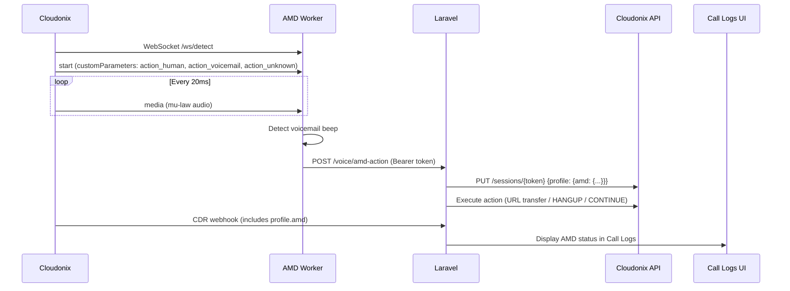
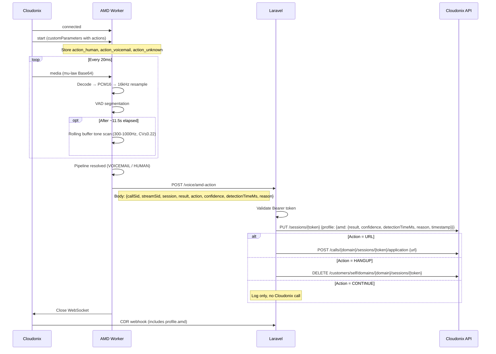

# AMD Worker (Stream-Based Voicemail Detection)

## Overview
Standalone Java/Vert.x 5 microservice that receives real-time audio streams from Cloudonix via `<Start><Stream>` WebSocket, analyzes audio for voicemail beep tones using ML + energy-based detectors, and **posts detection results to Laravel for action execution**. AMD result is stored in the Cloudonix session profile and visible in CDR / Call Logs UI.



## Source Files

### Core
| File | Purpose |
|------|---------|
| `amd-worker/src/main/java/com/cloudonix/opbx/amd/Main.java` | Entry point: configures slf4j log level from env, creates Vert.x, deploys verticle |
| `amd-worker/src/main/java/com/cloudonix/opbx/amd/Config.java` | Environment variable configuration loader |
| `amd-worker/src/main/java/com/cloudonix/opbx/amd/stream/StreamMessage.java` | Cloudonix Stream WebSocket message parser/types with full Javadoc per Cloudonix docs |
| `amd-worker/src/main/java/com/cloudonix/opbx/amd/stream/StreamSession.java` | Per-stream session state: VAD, pipeline, timeout timer, rolling buffer (capped at 5s), action options |
| `amd-worker/src/main/java/com/cloudonix/opbx/amd/stream/StreamHandler.java` | WebSocket lifecycle, audio routing, tone detection fallback, action callback POST |
| `amd-worker/src/main/java/com/cloudonix/opbx/amd/worker/AmdWorkerVerticle.java` | Verticle: starts WS + HTTP servers, wires detectors |

### Audio Processing
| File | Purpose |
|------|---------|
| `amd-worker/src/main/java/com/cloudonix/opbx/amd/audio/AudioDecoder.java` | µ-law to PCM 16-bit + float64; Base64 size limit (1 MiB) |
| `amd-worker/src/main/java/com/cloudonix/opbx/amd/audio/AudioResampler.java` | Linear resampler (8kHz→16kHz) |
| `amd-worker/src/main/java/com/cloudonix/opbx/amd/audio/EnergyVad.java` | Energy-based VAD with configurable clip durations |
| `amd-worker/src/main/java/com/cloudonix/opbx/amd/audio/AudioMath.java` | Shared audio math utilities (RMS, energy) |
| `amd-worker/src/main/java/com/cloudonix/opbx/amd/audio/AudioDumper.java` | Optional WAV dump with path traversal protection |

### Detection
| File | Purpose |
|------|---------|
| `amd-worker/src/main/java/com/cloudonix/opbx/amd/detector/BeepMlDetector.java` | ONNX-based ML beep detector |
| `amd-worker/src/main/java/com/cloudonix/opbx/amd/detector/ToneEnergyDetector.java` | Energy-based tone detector (300-1000Hz, 400ms window, CV≤0.22, ratio≥10.0) |
| `amd-worker/src/main/java/com/cloudonix/opbx/amd/detector/DetectionPipeline.java` | Pluggable pipeline: async ML + sync fallback |
| `amd-worker/src/main/java/com/cloudonix/opbx/amd/detector/DetectionResult.java` | Immutable result record |
| `amd-worker/src/main/java/com/cloudonix/opbx/amd/detector/ResultType.java` | VOICEMAIL, HUMAN, UNKNOWN |

### Feature Extraction
| File | Purpose |
|------|---------|
| `amd-worker/src/main/java/com/cloudonix/opbx/amd/feature/MfccExtractor.java` | MFCC extraction (40 coeffs) |
| `amd-worker/src/main/java/com/cloudonix/opbx/amd/feature/EnergyAnalyzer.java` | FFT energy band analysis |

### Supporting
| File | Purpose |
|------|---------|
| `amd-worker/src/main/java/com/cloudonix/opbx/amd/model/OnnxModel.java` | ONNX Runtime loader + inference |
| `amd-worker/src/main/java/com/cloudonix/opbx/amd/metrics/MetricsService.java` | In-memory metrics tracking |

### Offline Test Tools
| File | Purpose |
|------|---------|
| `amd-worker/src/test/java/com/cloudonix/opbx/amd/detector/OfflineToneTest.java` | Validate detector params against saved WAV dumps |
| `amd-worker/src/test/java/com/cloudonix/opbx/amd/detector/AnalyzeAllBeeps.java` | Analyze beep characteristics across all dumps |
| `amd-worker/src/test/java/com/cloudonix/opbx/amd/detector/CompareBeepCharacteristics.java` | Compare real beep vs false positive |
| `amd-worker/src/test/java/com/cloudonix/opbx/amd/detector/AnalyzeFalsePositive.java` | Deep-dive false positive analysis |

## Infrastructure

| Component | Config |
|-----------|--------|
| Nginx proxy | `location /ws/amd/` → `amd-worker:8082/ws/` (WebSocket upgrade, 120s timeout) |
| Docker service | `amd-worker` in `docker-compose.yml`, no external ports |
| Health endpoint | `GET :8083/health` |
| WebSocket endpoint | `ws://amd-worker:8082/ws/detect` (internal), exposed via `wss://{public}/ws/amd/detect` |
| Callback endpoint | `http://nginx/api/voice/amd-action` (internal Docker network) |

## Environment Variables

| Variable | Default | Description |
|----------|---------|-------------|
| `AMD_WEBSOCKET_PORT` | `8082` | WebSocket listener port |
| `AMD_HTTP_PORT` | `8083` | Health/metrics HTTP port |
| `AMD_MODEL_PATH` | `./models/beep_detector.onnx` | ONNX model file path |
| `AMD_MAX_CONCURRENT_STREAMS` | `100` | Max simultaneous streams |
| `AMD_DEFAULT_TIMEOUT_SECONDS` | `30` | Detection timeout (was 45s) |
| `AMD_LOG_LEVEL` | `info` | Logging level (slf4j-simple) |
| `AMD_DETECTORS` | `beep_ml,tone_energy` | Enabled detectors |
| `AMD_DUMP_AUDIO` | `false` | Debug: dump each stream to a WAV file |
| `AMD_DUMP_AUDIO_PATH` | `/tmp/amd-dumps` | Directory for debug WAV files |
| `AMD_ACTION_CALLBACK_URL` | `http://nginx/api/voice/amd-action` | Laravel callback URL |
| `AMD_WORKER_API_TOKEN` | *(empty)* | Bearer token for callback auth |

## Action Options (from `start.customParameters`)

Cloudonix passes action configuration via `<Parameter>` elements in the CXML `<Stream>` verb:

```xml
<Stream url="wss://.../ws/amd/detect" track="outbound">
    <Parameter name="action_voicemail" value="HANGUP" />
    <Parameter name="action_human" value="https://example.com/human-handler" />
    <Parameter name="action_unknown" value="CONTINUE" />
</Stream>
```

Available values per action:
- **URL** (`https://...`) — Switch voice application via Cloudonix API
- **`HANGUP`** — Disconnect session via Cloudonix API
- **`CONTINUE`** — Close WebSocket, take no further action

Default behavior (when no options provided):
- Voicemail detected → `HANGUP`
- Human or Unknown → `CONTINUE`

## Call Flow (Detailed)



## Security

| Layer | Protection |
|-------|------------|
| **WAV dump filenames** | Path traversal blocked via `Path.startsWith()` check |
| **Base64 payload size** | Rejected if decoded size > 1 MiB |
| **Duplicate streams** | `putIfAbsent` atomic check — first connection wins |
| **Callback auth** | `Authorization: Bearer {AMD_WORKER_API_TOKEN}` (constant-time comparison in Laravel) |
| **Rolling buffer** | Capped at 5 seconds (~80 KB per stream) |

## Key Fixes & Safety Measures
- **`AtomicBoolean` `resolved` flag** prevents race conditions on concurrent detector results
- **`OnnxTensor` try-with-resources** ensures tensor memory is released after inference
- **`ws.closeHandler`** triggers cleanup to remove stale session mappings
- **Duplicate stream rejection** via `ConcurrentHashMap.putIfAbsent()`
- **Dynamic sample rate** read from `start.mediaFormat.sampleRate`

## Console Logging

The worker logs key events at `INFO` level:

| Log line | What it means |
|----------|---------------|
| `RAW: {"event":"start",...}` | Raw JSON of non-media events |
| `Stream started call_sid=...` | New stream opened with action options |
| `Receiving audio call_sid=...` | Audio flowing (throttled to once per ~5s) |
| `Tone detected in rolling buffer...` | ToneEnergyDetector found a match |
| `DECISION: VOICEMAIL call_sid=...` | Final detection result |
| `Sending AMD action callback to...` | About to POST result to Laravel |
| `AMD action callback sent status=...` | Callback succeeded |
| `AMD action callback failed error=...` | Callback failed (logged, not fatal) |

## Build & Run
```bash
cd amd-worker
mvn package -DskipTests -B          # Build shaded JAR
docker compose up -d amd-worker      # Run via Docker Compose
```

## Testing

### Offline Validation
```bash
cd amd-worker
mvn test-compile
mvn -Dexec.mainClass="com.cloudonix.opbx.amd.detector.OfflineToneTest" -Dexec.classpathScope=test exec:java
```

### Live Test
Watch logs during a call:
```bash
docker compose logs -f amd-worker
```

Look for:
```
DECISION: VOICEMAIL ... detector=tone_energy ...
Sending AMD action callback to nginx:80/api/voice/amd-action ...
AMD action callback sent status=200
```

## Dependencies
- Cloudonix `<Start><Stream>` CXML verb for stream initiation
- Nginx WebSocket proxy (`/ws/amd/`)
- Vert.x 5.0.10 (WebSocket + HTTP client/server)
- Jackson 2.19.0 (JSON parsing)
- ONNX Runtime 1.22.0 (ML inference)
- JTransforms 3.1 (FFT for MFCC + energy analysis)
- slf4j-simple 2.0.16 (logging)
