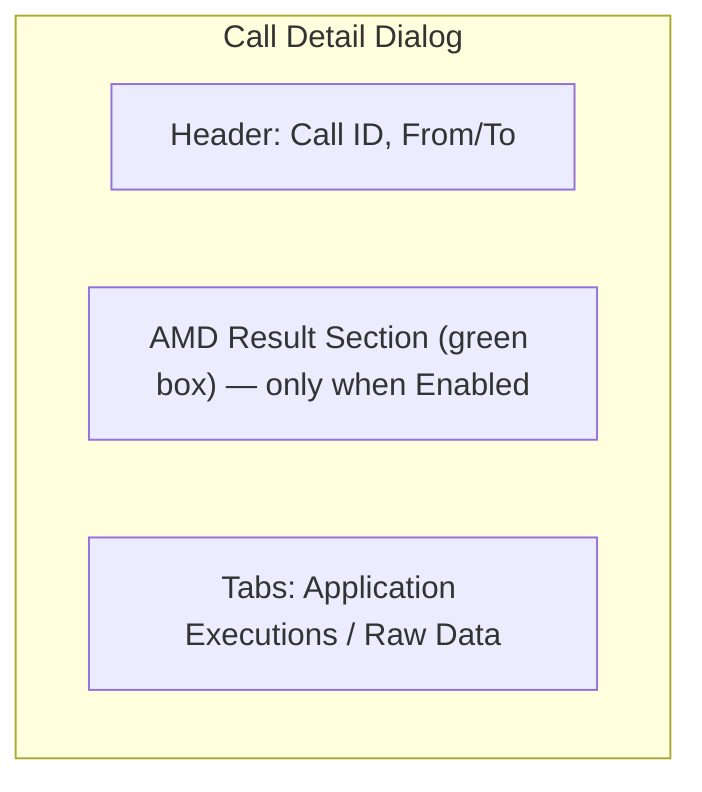

# Call Logs (Frontend)

## Overview
Call history page powered by the **Call Detail Records (CDR)** API. Displays a sortable/filterable table of all calls with disposition, duration, and **AMD (Answering Machine Detection) status**.

## Source Files
| File | Purpose |
|------|---------|
| `frontend/src/pages/CallLogs.tsx` | Main page: CDR table, filters, detail dialog with AMD result section, auto-refresh with timer |
| `frontend/src/services/cdr.service.ts` | CDR API client |
| `frontend/src/types/api.types.ts` | `CallDetailRecord` interface (includes `amd_status`) |

## Call Detail Record Type

```typescript
export interface CallDetailRecord {
  id: number;
  session_timestamp: string;
  from: string;
  to: string;
  disposition: string;
  duration: number;
  duration_formatted: string;
  billsec: number;
  billsec_formatted: string;
  call_id: string;
  amd_status: string;  // "Enabled::voicemail" | "Enabled::human" | "Enabled::unknown" | "Disabled"
  raw_cdr?: Record<string, unknown>;
  // ... other fields
}
```

## Table Columns

| Column | Description |
|--------|-------------|
| From | Caller number (formatted) |
| To | Callee number (formatted) |
| Session Time | Call timestamp |
| Disposition | Call outcome (ANSWER, BUSY, FAILED, etc.) with color badge |
| **AMD Status** | `Enabled::{result}` (green badge) or `Disabled` (gray badge) |
| Duration | Total call duration (MM:SS) |
| Connected Time | Billable seconds (MM:SS) |

## Detail Dialog ("Call Detail Record")



### AMD Result Section (shown only when `amd_status` starts with "Enabled")

Displays:
- **Result**: `voicemail`, `human`, or `unknown`
- **Confidence**: Percentage (e.g. `90%`)
- **Detection Time**: Milliseconds (e.g. `13487ms`)
- **Timestamp**: When the detection occurred
- **Reason**: Detector explanation string

Data source: `raw_cdr.session.profile.amd`

### Application Executions Tab
Shows voice application executions from `raw_cdr.session.profile.application` with URL, timestamp, and CXML source (syntax-highlighted).

### Raw Data Tab
JSON viewer for the complete `raw_cdr` payload.

## Auto-Refresh
- Configurable refresh interval: Manual, 10s, 30s, 1m, 5m (default: 30s)
- `RefreshTimer` component shows progress bar + countdown to next refresh
- Refresh button animates during fetch

## Related Modules
- [Call Detail Records](call-detail-records.md) - Backend CDR processing
- [AMD Worker](amd-worker.md) - Detection service that writes AMD result to session profile
