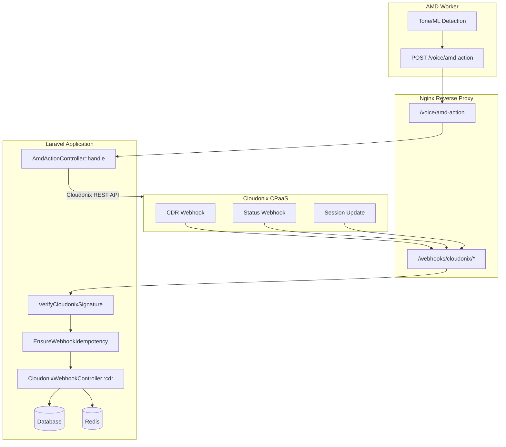

# Webhook Processing

## ⚠️ CRITICAL SECURITY UPDATE (2026-04-11)

The webhook authentication model was **completely rewritten** on 2026-04-11.
See [Call Notifications](call-notifications.md) for the detailed warning.

### Key Changes:
1. **Unified Authentication**: session-update AND cdr now use same auth flow
2. **Conditional Bearer Token**: Required only if `domain_requests_api_key` configured
3. **OrganizationScope Bypass**: ALL queries in webhook handlers must use bypass
4. **Status Filtering Expanded**: All notification events now supported

**See `docs/WEBHOOK-AUTHENTICATION.md` for complete security model.**

---

## Overview
Handles inbound webhooks from Cloudonix CPaaS for call events (initiated, status, session-update, CDR) and auto-dialer events. Three-layer security: signature verification, idempotency deduplication, and rate limiting.

**NEW (2026-04-18)**: AMD Action callback endpoint — receives detection results from the AMD worker and executes Cloudonix actions (switch voice application / hangup / continue).

## Source Files

### Controllers
| File | Purpose | Status |
|------|---------|--------|
| `app/Http/Controllers/Webhooks/CloudonixWebhookController.php` | Main webhook hub (~800 lines) | ✅ REWRITTEN 2026-04-11 |
| `app/Http/Controllers/Webhooks/AutoDialerWebhookController.php` | Auto-dialer call status/AMD (106 lines) | ✅ STABLE |
| `app/Http/Controllers/Webhooks/DialerWebhookProxyController.php` | Cloudonix-to-dialer proxy + CAC decrement (437 lines) | ✅ STABLE |
| **`app/Http/Controllers/Voice/AmdActionController.php`** | **AMD action execution — NEW 2026-04-18** | 🆕 NEW |

### Middleware
| File | Purpose | Status |
|------|---------|--------|
| `app/Http/Middleware/VerifyCloudonixSignature.php` | Unified webhook auth (~200 lines) | ✅ REWRITTEN 2026-04-11 |
| `app/Http/Middleware/EnsureWebhookIdempotency.php` | Deduplication + replay protection (244 lines) | ✅ STABLE |
| `app/Http/Middleware/VerifyVoiceWebhookAuth.php` | Voice routing auth (223 lines) | ✅ STABLE |

### Supporting
| File | Purpose |
|------|---------|
| `app/Jobs/ProcessCDRJob.php` | Async CDR processing |
| `app/Jobs/ProcessInboundCallJob.php` | Async inbound call processing |

## Webhook Routes (routes/webhooks.php)

### Cloudonix Webhooks
| Method | URI | Controller | Middleware |
|--------|-----|-----------|-----------|
| POST | `/webhooks/cloudonix/call-initiated` | CloudonixWebhookController@callInitiated | `webhook.signature`, `webhook.idempotency` |
| POST | `/webhooks/cloudonix/call-status` | CloudonixWebhookController@callStatus | Same |
| POST | `/webhooks/cloudonix/cdr` | CloudonixWebhookController@cdr | Same |
| POST | `/webhooks/cloudonix/session-update` | CloudonixWebhookController@sessionUpdate | `webhook.signature` only (high-velocity) |

### Auto-Dialer Webhooks
| Method | URI | Controller | Middleware |
|--------|-----|-----------|-----------|
| POST | `/webhooks/auto-dialer/call-status` | AutoDialerWebhookController@callStatus | `webhook.signature`, `webhook.idempotency` |
| POST | `/webhooks/auto-dialer/amd-result` | AutoDialerWebhookController@amdResult | Same |
| POST | `/webhooks/cloudonix/dialer` | DialerWebhookProxyController@handleCloudonixWebhook | Same |

### AMD Action (Voice Routing Group)
| Method | URI | Controller | Auth |
|--------|-----|-----------|------|
| POST | `/voice/amd-action` | **AmdActionController@handle** | `Authorization: Bearer {AMD_WORKER_API_TOKEN}` |

## AMD Action Controller (AmdActionController) — NEW 2026-04-18

Receives AMD detection results from the AMD worker and executes the configured action.

### Authentication
Validates `Authorization: Bearer {AMD_WORKER_API_TOKEN}` against `config('services.amd_worker.api_token')` using `hash_equals()` (constant-time comparison).

### Request Body
```json
{
  "callSid": "...",
  "streamSid": "...",
  "session": "...",
  "result": "voicemail|human|unknown",
  "action": "https://...|HANGUP|CONTINUE",
  "confidence": 0.9,
  "detectionTimeMs": 13487,
  "reason": "Tone detected in 300-1000Hz for 400ms..."
}
```

### Processing Flow
1. **Validate Bearer token**
2. **Update session profile** via Cloudonix API:
   ```
   PUT /customers/self/domains/{domain-id}/sessions/{token}
   Body: { "profile": { "amd": { "result", "confidence", "detectionTimeMs", "reason", "timestamp" } } }
   ```
3. **Execute action**:
   - **URL** → `POST /calls/{domain-id}/sessions/{token}/application` with `{url}`
   - **HANGUP** → `DELETE /customers/self/domains/{domain-id}/sessions/{token}`
   - **CONTINUE** → Log only, no Cloudonix call

### CloudonixClient Methods Used
- `updateSessionProfile(sessionToken, profile)` — NEW 2026-04-18
- `switchVoiceApplication(sessionToken, url)` — NEW 2026-04-18
- `disconnectSession(sessionToken)` — Existing

## Signature Verification (VerifyCloudonixSignature) - REWRITTEN 2026-04-11

### Unified Authentication Flow (session-update AND cdr):
1. **Extract domain** from payload: `domain`, `owner.domain.name`, or `owner.domain.uuid`
2. **Match domain** to organization via CloudonixSettings
3. **Authenticate** based on organization's configuration:
   - If `domain_requests_api_key` set → Bearer token REQUIRED and MUST match
   - If no key set → Bearer token OPTIONAL (backward compatible)

### Security Properties:
- Timing-safe comparison using `hash_equals()`
- Consistent 401 responses (unknown domain returns 401, not 404)
- IP logging for all authentication attempts

### Voice Webhook Auth (VerifyVoiceWebhookAuth) - Unchanged
- Extracts Bearer token + `Domain` from JSON body
- Verifies against CloudonixSettings
- Returns **CXML** (not JSON) on error: `<Say>Unauthorized</Say><Hangup/>`

## Idempotency (EnsureWebhookIdempotency)
- **Replay protection**: Rejects timestamps >5min old (except CDR), >1min future
- **Deduplication**: Redis key `idem:webhook:{key}`, 24h TTL
- **Key generation priority**: (1) `X-Idempotency-Key` header, (2) SHA-256 of `call_id + event_type`, (3) SHA-256 of full payload
- **Response caching**: Cached if <100KB; metadata-only for larger responses

## CloudonixWebhookController Processing

### callInitiated (line 55)
Normalizes phone numbers to E.164, identifies org, dispatches `ProcessInboundCallJob` (async).

### sessionUpdate (line 200) - REWRITTEN 2026-04-11
⚠️ **CRITICAL**: Uses `OrganizationScope::bypass()` for ALL model queries.

**Status Filtering** (UPDATED - now supports all notification events):
- `new`, `initiated`, `created` → 'new' event
- `ringing`, `ring`, `progress` → 'ringing' event
- `connected`, `connect` → 'connected' event
- `answer`, `answered`, `active` → 'answered' event
- `busy` → 'busy' event
- `cancel`, `cancelled`, `canceled` → 'cancel' event
- `failed`, `fail`, `error` → 'failed' event
- `congestion`, `congested` → 'congestion' event

Creates SessionUpdate in DB. **Triggers call notifications** via `triggerCallNotification()` which:
- Uses `OrganizationScope::bypass()` for settings lookup
- Uses `OrganizationScope::bypass()` for previous status query
- Calls `WebhookDispatcher::dispatch()`

### cdr (line 334) - REWRITTEN 2026-04-11
⚠️ **CRITICAL**: Now triggers call notifications (previously did not).

1. Creates `CallDetailRecord` via `createFromWebhook()`
2. Backfills CallLog (legacy)
3. Creates final SessionUpdate via `createSessionUpdateFromCDR()`
4. **NEW: Triggers call notification** via `triggerCallNotification()`
5. Handles auto-dialer CDR via `processAutoDialerCDR()`:
   - Reads session token from **`session.token`** (nested in CDR payload)
   - Wrapped in **`OrganizationScope::bypass()`**
   - Updates AutoDialerCallSession: status, disposition, duration, billsec, completed_at
   - Updates destination: status, last_disposition
   - Updates campaign: increment completed_calls, decrement pending_calls
   - **Decrements Redis CAC counter** via `dialer` connection (prefix-free)
   - Publishes CDR event to Redis Pub/Sub channel `cdr:completed`

## DialerWebhookProxyController (Cloudonix -> Dialer)
More sophisticated auto-dialer webhook handler operating within `OrganizationScope::bypass()`:
- Reads session token from **`session.token`** (nested, not `session_token`)
- Maps event types: `call-initiated`, `call-answered`, `call-completed`, `call-failed`, `amd-completed`
- **Decrements Redis CAC counter** via `dialer` connection (prefix-free) on call completion/failure/busy/no-answer
- Implements retry strategy: retryable (busy/no-answer/cancelled) with exponential backoff up to max_dial_attempts
- Non-retryable (failed/congestion) -> immediate FAILED

### Retry Backoff
`5 * 2^(attempt-1)` minutes, capped at 60 minutes.

## Data Flow


## Related Modules
- [Voice Routing](voice-routing-engine.md) - Voice webhooks trigger CXML routing
- [Call Detail Records](call-detail-records.md) - CDR webhooks create records
- [Live Calls](live-calls.md) - Session updates drive live monitoring
- [Call Notifications](call-notifications.md) - **REWRITTEN 2026-04-11 - CRITICAL MODULE**
- [Auto Dialer](auto-dialer-campaigns.md) - Dialer webhooks update campaign stats
- [Dialer Worker](dialer-worker.md) - CDR events published to Redis
- [AMD Worker](amd-worker.md) - 🆕 NEW — Posts detection results to `/voice/amd-action`
